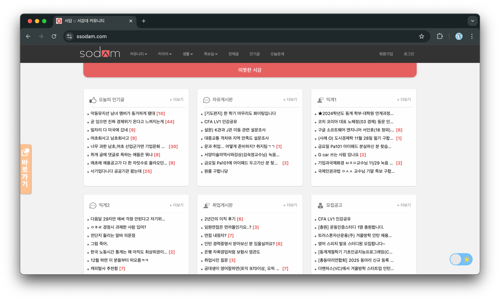
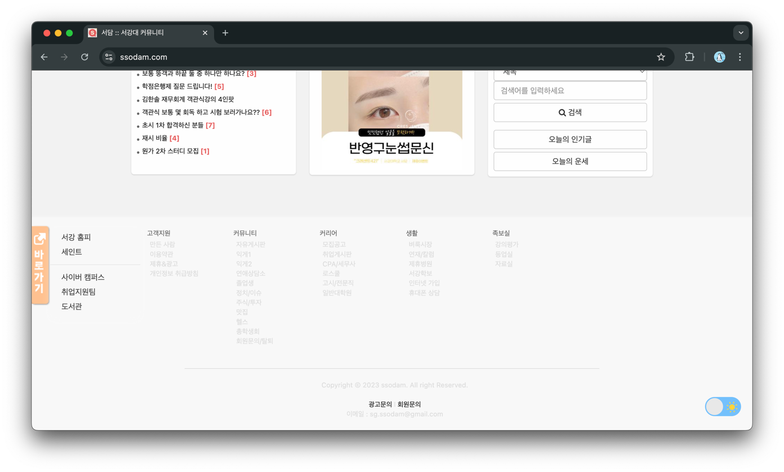

# 서담 
## 벤치마킹 

### 카테고리 
- enum 형식으로 만든 다음, 프론트가 선택 (x)
    * 불러오기 힘듬, ex : 매번 enum 별로 분리

- 일단 테이블 하나는 아닌거 같다
- 복수의 테이블로 운영, 
    * 자유게시판, 취업게시판, 앨범 
- 문제 : 메인 화면은, 매번 쿼리를 3번 해야함(동시에) 

### 검색 
- 데이터베이스에서 인덱스를 통해 하나하나 비교? 
    * 어떤 방식이 최적의 개발 방안일까,,