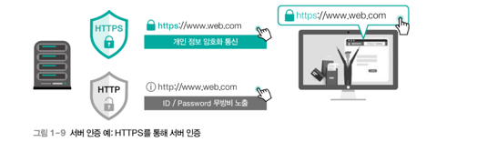
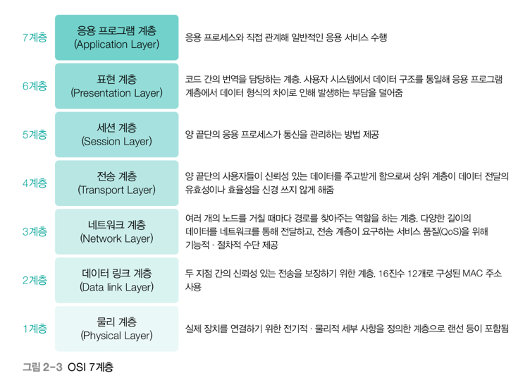

# 네트워크 해킹&보안

## 네트워크 이론 (1~2)

- 정보 보안의 3대 요소로 [기밀성 / 무결성 / 가용성]
- + 필자는 여기에 "서버 인증" 그리고 "클라이언트 인증" 추가
+ 결국 네트워크라는 것은, 나와 너를 이어주는 하나의 매개체이다.
+ 이때, 내가 너에게 하는 말을 다른 사람이 들어서는 안되기에 기밀성이 생겨났고
+ 내가 너에게 하는 말이 변경되거나 해서는 안되기에 무결성이 중요하며
+ 그 정보(말)를 사용할 수 있어야만 하기에 가용성이 강요된다.

### 기밀성 : 인가(허용)된 사용자만 접근 할 수 있다.
- + 방화벽이나, 패스워드 등으로 보호
+ + 해치는 공격 : 스니핑 등으로 탈취 (무작위로 패킷 읽어드림)

### 무결성 : 적절한 권한을 가진 사람만, 정보 변경이 가능하다.
- + 대한민국 화폐 발행은 아무나 할 수 없다.
+ + 개인정보 수정은 해당 사용자만 가능해야 한다.
+ + 해치는 공격 : 세션 하이재킹 => 로그인 된 상태를 가로채는 것

### 가용성 : 필요한 시점에서 정보 자산에 대한 접근이 가능한 것
- => '필요하면 언제든지, 서버와 클라이언트가 데이터를 주고 받을 수 있음'
- 해치는 공격 : DoS (서비스 거부 공격)

### 서버 인증&클라이언트 인증 
- (서버) [해당 서버가 올바른 서버인지]
- 클라이언트가 올바른 서버로 접근하는가 
- + DNS 스푸핑, 서버 파밍(가짜 사이트로 이동시키고 정보 탈취)
+ + => http 경우, 경고창 보여주며 위험하다고 알리는 정도 https(SSL)은 안전

- (클라이언트) [서버에 접근하는 클라이언트가 정당한 클라이언트인지]
- 아이디와 비밀번호를 통해 접근하는 방법

### =================================================
### 네트워크 계층구조 이해

- 01 프로토콜 
- + [컴퓨터와 컴퓨터 사이에세 메시지를 전달하는 과정] -톰마릴
- + ex: 한국&아랍 대통령이 대화를 위해 영어를 사용 => 영어(프로토콜)

- 02 네트워크 계층

## 네트워크 정보 수집 (3~5)

## 네트워크 해킹 (6~11)

## 네크워크 보안 (12~14)