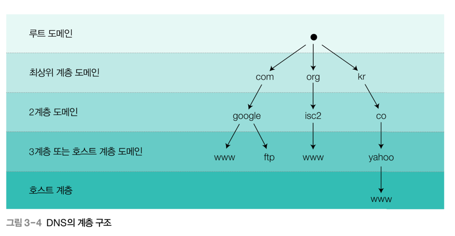

# 네트워크 해킹2

## whois (정보 수집)
- DNS 서버는 전 셰계 13계 존재
- (whois 를 통해 소유자 정보를 알아 낼 수 있음)
- DNS 사용 이전에는, host 라는 개념을 사용

- DNS 계 (뒤에서부터 . == root -> 국가코드 kr -> google -> www )
- nslookup 명령어 조회결과 (실패 -> 성공 : 서강대 도서관)

- Address : 163.239.3.83 으로 접속하면, ssl 적용되지 않고 사이트로 이동 
- 해커의 경우, 이러한 DNS 정보 조회시 (주 DNS 와 <-> 부 DNS 사이를 노린다)

## IP 주소 추적 

- 공격자가 ip 주소를 숨기거나 위조하는 방법은 다양하다
- ex : 역추적을 완료하였지만, 경유 시스템일 가능성 높음 
- + 추적은 위치적인 문제나 정치적인 문제가 가로막는 경우 다수
- => 제 3국인 경우, "로그를 살펴볼 권한이 없음"

### 핵심
- 01: 모든 패킷에서는 "출발지"와 "목적지"가 존재함
- 02: IP 추적의 기본은, 출발지의 주소를 확인하는게 시작 
- 03: IP 를 알아낸다면, 상대의 위치 또한 추적할 수 있다.

### 문제상황

- 01: NAT(Network Address Translation)
- => 다수의 사설 ip를, 하나의 공인 ip 로 전환하는 기술 
- : 이러면 패킷의 출발지를 알 수 없음 
- 02: email 이나 SNS 등 메신저 서비스
- => 서비스를 거치면서 ip 주소가 변함 

### 해결 기법
- 방법1, 이메일 추적 
- => 메일 헤더를 분석해 발신자 서버 ip를 확보한다.
- 메일이란, 처음부터 완성된 형태가 아니라 전송 과정을 거치면서 변함
- 송신자는 내용을 작성하고, 이후 서비스를 거치면서 (추상화) 여러 내용이 추가로 붙게됨

- 방법2, p2p(person to person)
- ex: 카카오톡, 네이트온, 스카이프 같은 메신저

- 텍스트 교환의 경우, 사용자의 ip가 노출되지는 않지만 
- => 파일의 경우 이야기가 달라진다. 
- : 패킷을 분석하거나 통신 중에 성립되는 네트워크 세션 확인 -> ip
- 따라서 최근에는 (b)의 경우에서 (a)의 경우로 바뀌고 있음

- 방법3, 게시판 
- 웹 서버에 글을 쓸때, 기본적으로 글쓴이의 ip 가 기록되며, 
- 이를 웹 서버 상에서도 로그로 확인이 가능하다
- tracerout 으로 ip 추적 
- + 패킷이 목적지까지 거쳐가는 라우터의 ip를 확인 할 수 있음
- + 경로가 불규칙하지 않고, 고정되어있다면 -> 역추적일수도 있음

