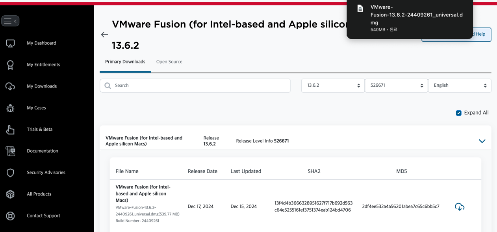
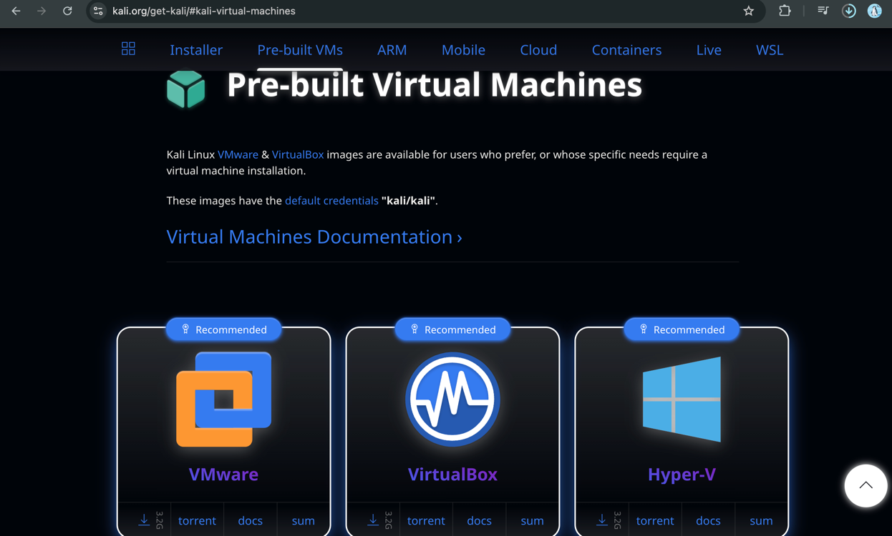
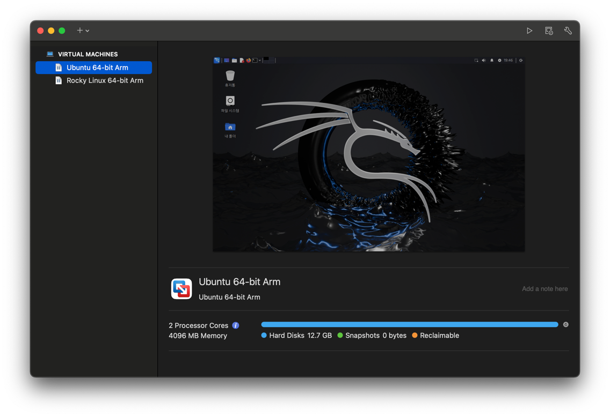

# 모의해킹 포트폴리오 구현

## VMware 설치
-> 브로드컴 회원가입 -> 설치(맥은 fusion, 나머진 pro)



## Kali-linux 설치


=> 맥북은 installer => 애플실리콘



# Kali Linux에 필요한 도구 설치 가이드


---

## 1. Kali Linux 기본 업데이트


```bash
sudo apt update && sudo apt upgrade -y

2. 주요 도구 설치

a. Kali Linux 메타패키지 설치

Kali는 메타패키지를 제공하며, 각 메타패키지에는 특정 유형의 도구가 포함되어 있습니다.

sudo apt install kali-tools-top10 -y

포함된 도구:
	•	Nmap: 네트워크 스캔
	•	Wireshark: 패킷 캡처
	•	Metasploit Framework: 익스플로잇 개발 및 실행
	•	John the Ripper: 패스워드 크래킹
	•	Burp Suite: 웹 취약점 분석
	•	Hydra: 크래킹 툴

b. 추가 도구 설치

1. OWASP ZAP (웹 취약점 분석)

sudo apt install zaproxy -y


2. Nikto (웹 서버 취약점 분석)

sudo apt install nikto -y


3. Gobuster (디렉토리/파일 탐색)

sudo apt install gobuster -y


4. SQLmap (SQL 인젝션 자동화)

sudo apt install sqlmap -y


5. Dirbuster (디렉토리 및 파일 탐색 GUI 도구)

sudo apt install dirbuster -y


6. Hashcat (고속 패스워드 크래킹)

sudo apt install hashcat -y


7. Aircrack-ng (무선 네트워크 공격)

sudo apt install aircrack-ng -y


8. Netcat (네트워크 연결 테스트 및 스캔)

sudo apt install netcat -y
```

## 2. 칼리 리눅스 -> AWS 공격

### AWS에서 칼리 리눅스를 통한 해킹 시도 로그 확인 방법 및 공격 종류

## 1. 로그 파일 위치 및 확인 방법

1.1 /var/log/messages

시스템의 다양한 메시지와 경고가 기록됩니다. 칼리 리눅스를 사용한 해킹 시도와 관련된 이벤트가 포함될 수 있습니다. 예를 들어, 비정상적인 트래픽이나 네트워크 오류가 기록됩니다.

sudo cat /var/log/messages | grep -i "firewall"

1.2 /var/log/secure

SSH 로그인 시도 및 인증 관련 로그가 기록됩니다. 칼리 리눅스와 같은 도구를 사용하여 무차별 대입 공격(Brute Force Attack)이나 포트 스캔을 시도할 때 관련된 로그를 확인할 수 있습니다.

sudo cat /var/log/secure | grep "Failed password"

1.3 /var/log/firewalld

칼리 리눅스에서 발생한 공격을 차단하는 방화벽 로그입니다. 공격이 시도되었을 때 방화벽에서 이를 차단한 로그를 확인할 수 있습니다.

sudo cat /var/log/firewalld

1.4 /var/log/audit/audit.log

auditd가 활성화되어 있으면 시스템의 보안 이벤트가 기록됩니다. 칼리 리눅스를 사용한 공격 시도, 네트워크 연결, 비정상적인 파일 접근 등을 확인할 수 있습니다.

sudo cat /var/log/audit/audit.log | grep "network"

1.5 /var/log/nginx/access.log 및 /var/log/nginx/error.log

웹 서버를 대상으로 하는 공격이 발생하면 웹 서버 로그에 기록됩니다. 칼리 리눅스를 사용하여 웹 서버에 대한 SQL 인젝션, 크로스 사이트 스크립팅(XSS) 공격 등이 시도될 수 있습니다.

sudo cat /var/log/nginx/access.log | grep -i "404"
sudo cat /var/log/nginx/error.log | grep -i "error"

1.6 /var/log/syslog (Ubuntu 계열)

Ubuntu 계열에서는 시스템 및 네트워크 관련 로그가 syslog에 기록됩니다. 칼리 리눅스와 같은 도구에서 발생한 포트 스캔이나 네트워크 공격 시도가 기록될 수 있습니다.

sudo cat /var/log/syslog | grep -i "port scan"

1.7 /var/log/kern.log

커널 관련 로그로, 시스템의 네트워크 트래픽 및 방화벽에서 차단한 패킷이 기록됩니다. 칼리 리눅스에서 발생한 공격이 차단된 경우 관련된 기록을 확인할 수 있습니다.

sudo cat /var/log/kern.log | grep -i "drop"

## 2. 확인할 수 있는 공격 종류

2.1 포트 스캔 (Port Scanning)

칼리 리눅스에서는 nmap 등의 도구를 사용하여 네트워크 포트를 스캔할 수 있습니다. 포트 스캔 시도는 방화벽에 의해 차단될 수 있으며, 이를 확인할 수 있는 로그가 firewalld나 syslog, messages에 기록됩니다.
•	확인 방법: /var/log/firewalld, /var/log/messages, /var/log/syslog

2.2 SSH 무차별 대입 공격 (SSH Brute Force Attack)

칼리 리눅스를 사용하여 SSH 로그인 시도를 여러 번 하는 무차별 대입 공격이 발생할 수 있습니다. 실패한 로그인 시도는 /var/log/secure에 기록됩니다.
•	확인 방법: /var/log/secure (예: Failed password 검색)

2.3 웹 애플리케이션 공격 (Web Application Attacks)

칼리 리눅스에서는 Burp Suite나 sqlmap 등의 도구를 사용하여 웹 애플리케이션을 대상으로 SQL 인젝션, 크로스 사이트 스크립팅(XSS) 공격을 시도할 수 있습니다. 이 공격들은 웹 서버의 로그에 기록됩니다.
•	확인 방법: /var/log/nginx/access.log, /var/log/nginx/error.log

2.4 서비스 거부 공격 (Denial of Service, DoS)

칼리 리눅스에서 hping3, LOIC 등의 도구를 사용하여 서버를 대상으로 DoS 공격을 시도할 수 있습니다. 공격이 감지되면 네트워크 트래픽과 관련된 로그에 기록될 수 있습니다.
•	확인 방법: /var/log/messages, /var/log/syslog

2.5 스니핑 공격 (Sniffing)

칼리 리눅스에서 Wireshark, tcpdump 등의 도구를 사용하여 네트워크 트래픽을 감청할 수 있습니다. 네트워크 관련 로그에서 의심스러운 트래픽 패턴을 찾을 수 있습니다.
•	확인 방법: /var/log/messages, /var/log/syslog

2.6 취약점 스캐닝 (Vulnerability Scanning)

칼리 리눅스의 Nessus, OpenVAS 등의 도구를 사용하여 시스템의 취약점을 스캔하는 공격이 있을 수 있습니다. 스캔 도중 발생한 로그를 확인할 수 있습니다.
•	확인 방법: /var/log/messages, /var/log/audit/audit.log

2.7 스푸핑 공격 (Spoofing)

칼리 리눅스를 사용하여 ARP 스푸핑, IP 스푸핑 등을 시도할 수 있습니다. 스푸핑 공격에 대한 로그는 네트워크 트래픽과 관련된 로그에서 확인할 수 있습니다.
•	확인 방법: /var/log/messages, /var/log/syslog, /var/log/kern.log

3. 추가적인 방법
   •	fail2ban: fail2ban은 무차별 대입 공격을 차단하는 도구로, 이 도구를 통해 의심스러운 로그인 시도나 공격을 자동으로 차단하고 관련 로그를 기록할 수 있습니다.

sudo cat /var/log/fail2ban.log


	•	AWS CloudTrail: AWS에서 발생한 API 호출 및 로그를 추적할 수 있는 서비스입니다. 칼리 리눅스에서 공격이 발생하면 해당 공격이 API 호출을 통해 발생했는지 확인할 수 있습니다.
	•	CloudTrail에서 관련 로그를 확인하려면 AWS Management Console을 통해 접근할 수 있습니다.


