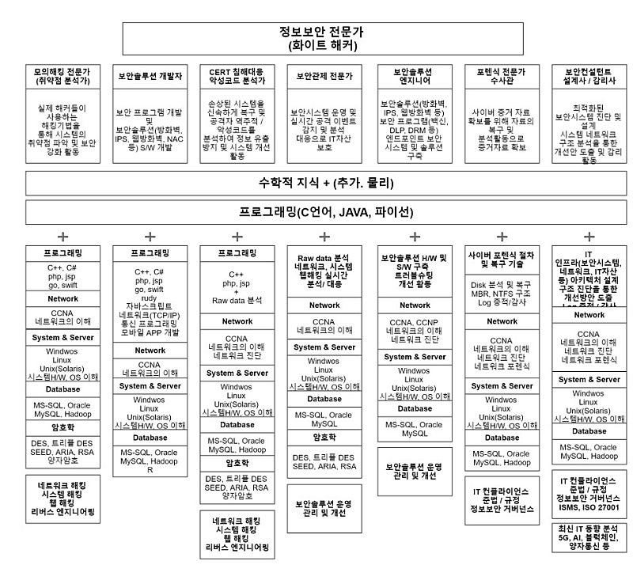
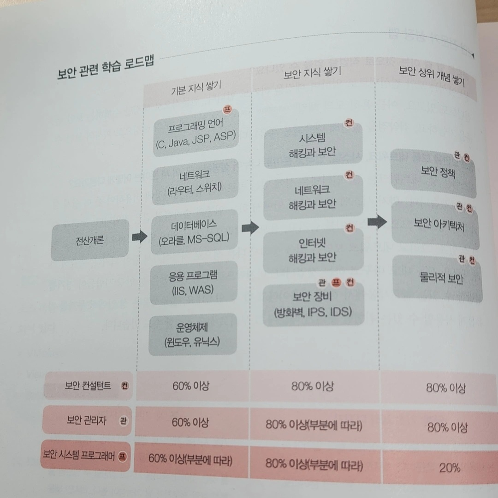

# 사이버수사대 준비

(보안쟁이)

## 정보보안 
- 정보 보안 개론 (양대일)
    * 01 역사, 보안의 요소, 법
    * 02 시스템 보안(계정, 세션, 접근제어, 권한&로그 관리, 취약점)
    * 03 네트워크 보안(OSI7, DoS, DDoS, 스니핑, 스푸핑, 하이재킹)
    * 04 Web 보안 
    * 05 코드보안(메모리구조, 버퍼오버플로 공격, 포맷 스트링 공격, 메모리 해킹)
    * 06 악성 코드(바이러스, 웜, 트로이 목마, 악성코드 탐지)
    * 07 모바일과 IoT 보안 
    * 08 암호학(DES, AES, SEED, ARIA, <-> RSA, 해시)
    * 09 전자상거래 보안 
    * 10 보안시스템 (방화벽, 침입탐지, 침입방지, 통제 및 감시장비)
    * 11 침해 대응과 포렌식 
    * 12 사회공학
    * 13 보안관리 (보안 프레임워크, 보안조직, 내부 통제)

### 1. 네트워크 해킹과 보안(양대일)

- 01 네트워크 시작, 네트워크 보안 5대 요소
- 02 네트워크 이해 (OSI 7계층)
- 03 Whois 서버와 DNS 조사 
- 04 IP 주소 추적
- 05 목록화 (운영체제 탐지, 방화벽 탐지, SNMP)
- 06 스니핑
- 07 스푸핑 
- 08 터널링 
- 09 세션 하이재킹 
- 10 무선 랜 보안 
- 11 DoS와 DDoS 공격 
- 12 방화벽 
- 13 네트워크 장비의 보안 설정 
- 14 침입 탐지 및 모니터링 

### 2. 시스템 해킹과 보안 (양대일)

* Part 01 시스템 해킹  기초 지식
- 01 운영체제 이해 (윈도우/리눅스)
- 02 80x86 시스템의 이해(cpu, memory, 어셈블리어)
- 03 계정과 권한 (각 운영체제 별)
 * Part 02 시스템 해킹  
- 04 패스워드 크래킹
- 05 리버스 엔지니어링 (구조 분석)
- 06 레이스 컨디션 (프로그램 끼어넣기)
- 07 버퍼 오버플로 
- 08 포맷 스트링 
- 09 백도어 
* Part 03 운영체제 보안 
- 10 윈도우 시스템 보안 설정 
- 11 리눅스 시스템 보안 설정
- 12 침해사고와 로그(메모리 덤프, 이미지 확보, 추적, 로그분석)

### 3. 인터넷 해킹과 보안(web :김경곤)

- 01 인터넷과 웹의 이해 
- 02 웹 해킹의 기초 (OWASP TOP 10)
- 03 인증 기술과 접근 통제 
- 04 SQL 인젝션 공격 
- 05 XSS 공격 
- 06 소스코드 취약점 분석 
- 07 웹 해커의 도구 
- 08 SNS 보안 위협 
- 09 웹 보안과 웹 서버 보안 
- 10 보안 정책, 조직, 솔루션 
- 11 모바일 보안 
- 12 콘텐츠 관리 시스템 보안 
- 13 사이버 안보 
- 14 랜섬웨어와 최신 보안 이슈 

=> 한빛 아카데미, 양대일 (시스템 해킹과 보안/ 네트워크, 해킹과 보안 추천)

## 보안 전문가 성장 맵
- 보안 컨설턴트, 중에서 전문적으로 해킹만 수행 -> 모의 해킹 
    * 이를 통해, 회사의 보안 수준을 가늠하고 취약점 발견해 대응책 세움

- 정보보안을 보통 [네트워크], [시스템], [인터넷] 으로 나누어 설명한다.
    * 시스템은 성
    * 네트워크는 길
    * 인터넷은 성에 있는 콜로세움 같은 경기장 
- 시스템 보안은 성안에서 하는 일종의 숨바꼭질 
    * 누군가 숨겨놓은 정보를 모으고, 스파이를 숨기고, 싸움
- 네트워크 보안은 길을 통해  다른 성으로 쳐들어가 왕이 되거나, 길을 바꿈
- 인터넷 보안은 성 안팎 사람들이 콜로세움에서 하는 싸움
    * 무기를 들고 있기에, 그 무기로 성을 점령할 수 있다. -> web&system

### 엘라스틱 스택
- 네 가지 핵심 제품으로 구성됨
- 01 엘라스틱 서치 : 전문 검색 엔진이자 다목적 데이터 저장소
- 02 키바나 : 엘라스틱 서치용 사용자 인터페이스
- 03 비츠 : 다양한 소스 시스템에서 데이터 수집하고 전송 
- 04 로그 스태시 : 다양한 소스 데이터를 가공하고 수집 
- 쓰는 이유, 로그 분석 (보안)

