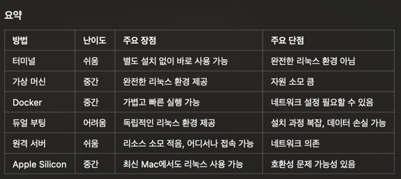

# Docker for Kali+Fossil+Xwiki


## 01. In Mac, for Kali-Linux



1. 가상 머신 설치

- Mac에서 가상 머신 소프트웨어를 사용해 리눅스를 실행할 수 있습니다.
    * VirtualBox: 무료.
    * VMware Fusion: 유료(개인용 무료 버전 제공).
    * Parallels Desktop: macOS에 최적화된 유료 소프트웨어.

2. Docker 사용 
- https://www.docker.com/products/docker-desktop/ 
- Docker 이미지를 다운로드하여 칼리 리눅스 컨테이너 실행.
- 도커 이미지가 실행되면 생성되는 구현체가 컨테이너
- 컨테이너를 통해 프로세스를 관리하고 한꺼번에 관리하는게 컴포즈&쿠버네티스

3. 리눅스 듀얼 부팅
4. 리눅스 원격 서버 접속
    * SSH 클라이언트를 사용하여 리눅스 서버에 접속
    * => Mobaexterm, putty 등

### => 도커 선택, 칼리 리눅스 환경 구성
- Docker Image: 다운로드
  ```bash
  docker pull kalilinux/kali-rolling
  ```
- 컨테이너 실행: 도커 내부에 있는 칼리 리눅스 접속
  ```bash
  docker run -it kalilinux/kali-rolling /bin/bash
  ```
  
- 필요한 도구들 추가 설치(정보수집&취약점 스캔)
  ```bash
  apt update && apt install -y net-tools
  apt install -y dnsutils
  apt install -y dnsenum
  ```
- 저장하지 않으면, 도커 exit 후 가동시 변경사항 사라짐
- 칼리 리눅스 말고도, 사용되는 도구들 다양함
- 칼리 리눅스에서 사용하는 명령어 역시 다양함

## In Mac, for Fossil deploy
1. Spring Boot 프로젝트 준비
- 프로젝트가 실행되면 아래 명령어로 JAR 파일을 생성합니다.
- ./gradlew clean build
- 생성된 JAR 파일은 target/ (Maven) 또는 build/libs/ (Gradle) 디렉터리에 위치

2. Dockerfile 작성
- 프로젝트 루트 디렉터리에 Dockerfile을 생성합니다.
```bash
  # Base image 선택 (OpenJDK 사용)
FROM openjdk:17-jdk-slim

# 작업 디렉터리 설정
WORKDIR /app

# JAR 파일을 컨테이너로 복사
COPY target/your-application.jar app.jar

# 컨테이너에서 실행할 명령어
ENTRYPOINT ["java", "-jar", "app.jar"]
	•	your-application.jar는 생성된 JAR 파일 이름으로 변경하세요.
	•	Java 버전은 프로젝트에 맞게 선택합니다.
 ```

3. Docker 이미지 빌드
- 터미널에서 프로젝트 디렉터리로 이동한 후, Docker 이미지를 빌드합니다.
- $ docker build -t springboot-app .
    * 	-t springboot-app: 이미지 이름을 springboot-app으로 설정합니다.
    * 	.: 현재 디렉터리에 있는 Dockerfile을 사용합니다.

4. Docker 컨테이너 실행
- 이미지를 기반으로 컨테이너를 실행합니다.
    * docker run -d -p 8080:8080 --name springboot-container springboot-app
    * 	  •	-d: 백그라운드에서 실행.
    *     •	-p 8080:8080: 호스트의 포트 8080을 컨테이너의 포트 8080에 매핑.
    *     •	--name springboot-container: 컨테이너 이름 설정.
    *     •	springboot-app: 빌드한 Docker 이미지 이름.

5. 실행 확인
- 브라우저에서 http://localhost:8080으로 접근하여 애플리케이션이 정상적으로 동작하는지 확인
    * 온프레미스 환경(다들 자사 서버) 기반이기에 (클라우드로 전환 중 이라도)
    * AWS 를 다루는 기술보다, 도커가 더 중요시 되네 (특이: 솔루션 제공이라서)
    * 설치 되는 환경은 AWS가 아니라, 자사 클라우드(sds,cns), 아자르 등 다양함

## In Mac, for Xwiki
