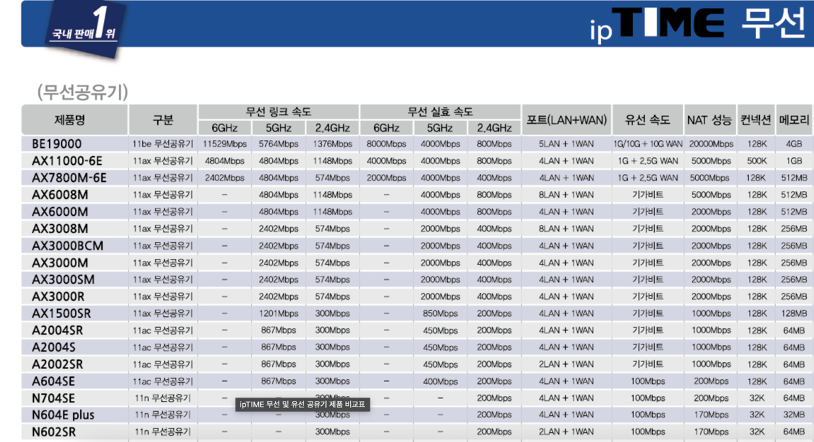

## 네트워크 엔지니어링

## 문제상황

- 기존에 사용중인 kt 공유기 속도 300Mbps
- 추가로 설치한 ipTime 50Mbps 미만 (A604SE)



    * 원래 느린게 아니라, 어떠한 원인으로 느려진 것이라 판단 *

- 또한 집에 설치되어 있는 "네트워크 흐름"이 이상함
    * 모뎀 -> 라우터(공유기) -> 단말 구성이 아니라
    * 모뎀 -> 스위치(허브) -> 라우터(공유기) & 기가지니 구성임

- 추론 가능한 부분은, 스위치가 증폭기의 역할을 한다?
    * 그렇다고 해도, iptime 공유기 속도가 안나오는 이유는??

## 원인분석
	1.	스위치 연결로 인한 병목 현상:
	2.	iptime 공유기의 WAN/LAN 포트 설정:
	3.	케이블 품질 문제:
            => Cat5 이하의 케이블일 경우 속도 제한
	4.	iptime 설정 문제:

## 해결방안
- 모든 기기를 off, 모뎀과 ipTime 직접 연결 -> 90Mbps
- 모든 기기를 off, 모뎀과 kt 공유기(라우터) 직접 연결 
    * -> 똑같이 90Mbps 찍힘
- 정답1 : [ 허브(스위치)는 네트워크 속도 증폭기 -> 300Mbps ]
- 정답2 : [ 모뎀 자체의 속도가 느림, 어떠한 공유기든 90Mbps] 
    * 회사 공유기도 80Mbps 였으니, 이게 평균치 일 수도 있다.

## 결론 

- 관리비로 지불하는 인터넷 기본 속도는 [90Mbps]
- 통신사 (KT,LG) 허브(스위치)를 통해 이를 증폭 [300Mbps] 
    * 어떠한 공유기든 증폭하지 않으면 90Mbps 나오는 걸 확인

- => 모뎀에서 인터넷 선을 하나 더 따, ipTime 에 연결
    * 속도가 90인 이유는 ISP 측 문제 (아파트)
- => kt 허브를 거치면, 속도가 느려지는 현상은 유선문의가 필요
    * KT 장비 우선 동작 & 비-KT 장비(ipTime) 제한

### 논의

1. kt 공유기(라우터)는 허브(kt)를 거치면 90->300Mbps 
2. ipTime 공유기는 허브(kt)를 거치면 90 -> 50Mbps
    * 허브가 아닌, kt 공유기를 거쳐도 똑같은 50Mbps

- 두 공유기가 다른 결과를 가져온 이유는 무엇일까?
    * 증폭 대상 : 인증 혹은 인가 작업을 통해 증폭 대상을 한정하는가?
    * 증폭 방법 : 어떤식으로 허브를 통해 인터넷 속도를 증폭시키는가?
    * 감소 원인 : ipTime 의 인터넷 속도가 감소된 원인은 무엇인가?

### reference (인공지능)
```bash

문제 상황과 결론에 따른 분석 및 추가 조사

원인 분석

1. 스위치/허브를 통한 속도 증폭
	•	KT에서 제공하는 허브(스위치)가 단순 네트워크 분배 장치가 아니라, 속도 증폭 기능을 수행하는 것으로 보입니다.
	•	이 과정에서 특정 기기(공유기 또는 단말)에 대해 속도 증폭 대상 인증/인가가 이루어질 가능성이 있습니다.
	•	즉, KT 허브는 KT 공유기를 우선적으로 최적화하도록 설계되었을 수 있습니다.

2. iptime 공유기 속도 저하 원인
	•	iptime 공유기가 허브(스위치)를 거쳐도 속도가 증가하지 않고 오히려 감소하는 이유는 아래와 같을 수 있습니다:
	•	속도 협상 실패: 허브와 iptime 간의 속도 협상이 제대로 이루어지지 않아 100Mbps 이하로 제한될 가능성.
	•	허브의 인증 한계: KT 허브가 비-KT 장비(iptime 공유기)를 비우선적으로 처리하거나, 속도 증폭을 지원하지 않을 가능성.
	•	iptime 자체 설정 문제: WAN 포트 속도나 MTU(Maximum Transmission Unit) 설정 등이 허브와의 호환성을 제한할 수 있음.
	•	iptime의 WAN 포트 성능 제한: A604SE 모델이 고성능 기가비트 장비가 아니라면, 허브의 증폭 기능을 온전히 활용하지 못할 가능성.

3. 모뎀 자체의 속도 제한
	•	KT 모뎀이 기본적으로 90Mbps로 제한된 인터넷 대역폭을 제공하는 것으로 보입니다.
	•	이는 KT 허브가 속도를 증폭하지 않는 경우 모든 기기에서 동일하게 나타납니다.
	•	허브가 90Mbps를 300Mbps로 증폭할 때, 특정 조건(KT 공유기와의 호환성 등)이 영향을 미칠 수 있습니다.

해결 방안

1. iptime 속도 문제 해결
	•	WAN/LAN 속도 확인 및 설정 변경:
	•	iptime 공유기 관리자 페이지에서 WAN 포트 연결 상태를 확인합니다. (100Mbps/1000Mbps)
	•	WAN 포트 속도를 “자동”이 아닌 “1000Mbps”로 수동 설정해 보세요.
	•	MTU 값 조정:
	•	MTU 값을 1492 또는 1500으로 설정해 KT 허브와의 호환성을 테스트합니다.
	•	펌웨어 업데이트:
	•	iptime 공유기의 펌웨어를 최신 버전으로 업데이트하여 속도 협상 문제를 해결할 수 있습니다.

2. KT 허브의 증폭 원리 파악
	•	KT 허브가 속도를 증폭하는 방법:
	•	KT 허브가 단순 스위치가 아니라, QoS(Quality of Service)나 특정 트래픽 가속 기능을 내장한 장비일 가능성이 높습니다.
	•	KT 허브가 속도를 증폭할 대상을 KT 공유기로 제한하도록 설정되어 있을 수 있습니다.
	•	허브의 인증 프로세스 확인:
	•	허브가 MAC 주소, 장치 유형, 또는 KT 제공 장비 여부를 기준으로 증폭 대상을 제한하는지 확인이 필요합니다.

3. 모뎀 속도 문제 해결
	•	ISP에 문의:
	•	모뎀 자체가 90Mbps로 제한된 상태라면, ISP(KT)에 문의하여 대역폭 증설(업그레이드)을 요청합니다.
	•	일부 기본 요금제는 제한된 속도를 제공하며, 고속 인터넷 서비스가 별도 옵션일 수 있습니다.

4. 네트워크 구성 최적화
	•	구성 변경:
	•	기존의 복잡한 네트워크 흐름(모뎀 -> 허브 -> 공유기)을 단순화하거나 최적화합니다.
	•	최적 구성:

모뎀 -> KT 허브 -> KT 공유기 -> 단말 (기가지니 포함)
             |
             -> iptime 공유기 (서브 네트워크 용도)


	•	iptime 공유기를 서브 네트워크 용도로 활용하거나, 주요 단말기에는 KT 공유기를 통해 연결합니다.

추가 조사 제안
	1.	KT 허브의 속도 증폭 원리:
	•	허브가 속도를 증폭하는 과정에서 MAC 주소, 장치 모델, 또는 KT 인증 여부를 기반으로 동작할 가능성을 조사합니다.
	•	허브와 iptime 간의 속도 협상 로그를 확인할 수 있다면 더 정확한 원인 분석이 가능합니다.
	2.	iptime 속도 감소 원인:
	•	iptime WAN 포트의 연결 속도와 허브와의 협상 상태를 구체적으로 확인합니다.
	•	다른 비-KT 공유기를 사용하여 동일한 현상이 발생하는지 테스트해 봅니다.
	3.	KT 모뎀 속도 제한 확인:
	•	KT 모뎀 자체가 대역폭을 90Mbps로 제한하는 것이 확실하다면, ISP에 이를 문의하거나 요금제를 확인해야 합니다.

결론
	•	KT 허브가 네트워크 속도를 증폭하는 데 있어 KT 장비에 우선적으로 동작하거나, 비-KT 장비(iptime)를 제한하는 것이 주요 원인일 가능성이 높습니다.
	•	모뎀 자체의 속도가 90Mbps로 제한되어 있으므로, 근본적인 해결을 위해 ISP와의 논의가 필요합니다.
	•	iptime 공유기의 설정 조정을 통해 허브와의 호환성을 개선할 수 있는지 추가적으로 테스트해야 합니다.

```
