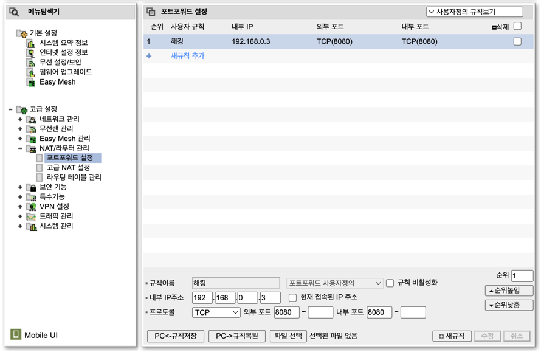
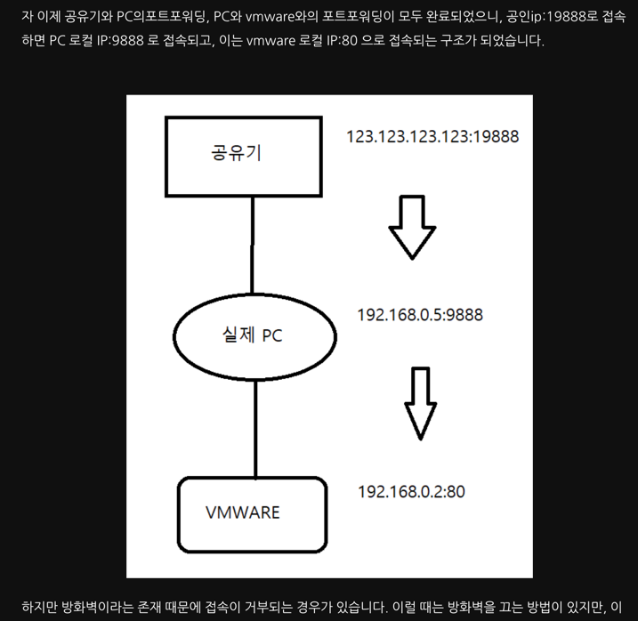

# 포트포워딩 & 서버구축환경
# 모의해킹 포트폴리오 (진행)


- 기획(어떤식으로 할지 구상) -> 진행(환경세팅, 취약점 분석 및 공격 시도) -> 보고서 작성

## 01. 방어자 환경 조성
- window (vmware, 우분투 리눅스)

```bash

# 시스템 업데이트
sudo apt update  

# JDK 설치
sudo apt install openjdk-17-jdk -y

# Git 설치
sudo apt install git -y

# 프로젝트 클론
git clone https://github.com/adorahelen/FossilFuel  

# 프로젝트 빌드 및 실행
cd FossilFuel  
chmod u+x gradlew  
./gradlew build  
java -jar build/libs/SpringBootBlog-0.0.1-SNAPSHOT.jar


아래의 작업들을 진행하였지만, 접근은 커녕 핑도 안찍힘
 -> 원인은 포트포워딩 미설정

# 방화벽 해제
sudo ufw disable

# iptables 설정 초기화
sudo iptables -F
sudo iptables -X
sudo iptables -t nat -F
sudo iptables -t nat -X

# iptables 규칙 확인
sudo iptables -L -n
```

## 02. 공격자 접근 시도
```bash
# Ping 테스트
Ping 192.xxx.xxx.xxx

# Traceroute 테스트
traceroute 192.xxx.xxx.xxx

# Curl 테스트 (웹 서버 연결 확인)
curl http://192.xxx.xxx.xxx:8080

* 실패, 성공하면 ping 의 경우 패킷 송신/응답이 와야하고
* curl 은 html 내용이 찍혀야 함

=> 이유 : 위 ip는 공인 ip가 아닌 사설 ip
```

## 03. 실패
### 원인: curl ifconfig.me 와 ifconfig 는 다르다.

`curl ifconfig.me`로 공인 IP 주소를 확인했어야 함

### 1. curl ifconfig.me

- 이 명령어는 외부 웹 서비스를 사용하여 공인 IP 주소를 확인합니다.
- `ifconfig.me`는 외부 서버에서 요청을 받아, 요청을 보낸 장치의 공인 IP 주소를 반환합니다.
- 주로 인터넷에 연결된 장치의 공인 IP 주소를 확인할 때 사용됩니다.
- 예를 들어, 가정용 라우터 뒤에 있는 장치가 인터넷에 연결되어 있을 때, 이 명령어는 라우터의 공인 IP 주소를 반환합니다.

### 2. ifconfig

- `ifconfig`는 시스템에 설정된 로컬 네트워크 인터페이스의 상태와 정보를 보여줍니다.
- 로컬 네트워크 카드에 할당된 사설 IP 주소(예: 192.168.x.x, 10.x.x.x 등)와 관련된 정보를 확인할 수 있습니다.
- 이 명령어는 로컬 네트워크에서 사용되는 IP 주소를 확인하는 데 유용합니다.

### 결론

- **curl ifconfig.me**: 공인 IP 주소를 확인하는 데 사용됩니다.
- **ifconfig**: 로컬 네트워크의 IP 주소와 네트워크 인터페이스의 상태를 확인하는 데 사용됩니다.
- 포트포워딩 미적용, 공인 IP 주소가 아닌 로컬 IP 주소를 바라보고 있었음
  * 공인 IP 주소 확인 - 포트포워딩 적용 (ex: 8080포트를 열어준다)
  * 공안 IP 주소 + :8080 붙이고 접근 -> 로컬 서버(web site)로 접속(192.168.~)됨

  
## 04. 포트 포워딩 적용
- http://192.168.0.1/sess-bin/login.cgi? 
  * iptime 안쓰면 접속 되지 않음 
  * 접속 후 로그인시 admin 으로 설정한 id/pw 입력

- 톱니바퀴 (관리도구) 클릭 > 메뉴탐색기 > 고급설정 > NAT/라우터 관리 > 포트포워드설정
  * 규칙이름 (이름), 내부 IP주소(외부와 매핑시킬 내부주소) 

- 내부 포트 & 외부 포트
  * 외부 포트는 상대방이 어느포트로 접속하게 할지 (if 8080, 외부ip:8080, else 80, 외부ip 끝)
  * 내부 포트는, 스프링부트=> 8080 명시 (if 리엑트=> 5000 명시)



#### 공유기 외부 IP 주소: 

- 포트 포워딩 설정 후 외부에서 접속하려면 이 외부 IP 주소를 사용합니다.
  * (IP 주소가 동적으로 바뀔 수 있으니, 고정 IP 또는 DDNS를 사용하는 것도 고려)
  * DNS를 통해 취약점 분석을 진행하면, 외부 IP 주소는 금방 알 수 있음 
  * => 핵심은 "포트를 닫아 놓는 것" 그리고 "특정한 포트만 열어두는 것"


#### 공유기 내부 IP 주소: 
-  내부 네트워크에 연결된 기기들이 이 주소를 통해 공유기와 통신
- 공유기가 내부 네트워크에 연결된 기기들에 IP 주소를 자동으로 할당 (DHCP)

### vmware 가상환경 (STOP)
- 외부에서 가상머신으로 접근하려면 포트 포워딩을 설정
  * 맥 -> 윈도우(1차 포트포워딩) ->  [윈도우 내부 우분투 리눅스 (2차 포트포워딩)]
  * A공유기 -> B공유기 -> 호스트에서 버츄얼로
- 즉 2중 포트포워딩 필요




# === TMI ===
## 서버환경차이
### 온프레미스(IDE, window, linux), 클라우드(AWS) 

```markdown
# IDE vs 리눅스/윈도우 환경 vs AWS 환경에서 서버 실행

---

## 1. IDE에서 서버 실행

### 장점
- **개발 편의성**: 프로젝트 설정, 디버깅, 코드 편집을 통합적으로 제공하므로 개발 중에는 빠르고 효율적입니다.
- **자동 관리**: 종속성(Dependencies), 빌드 스크립트, 런타임 설정 등을 IDE가 자동으로 관리합니다.
- **디버깅 가능**: 중단점(Breakpoints)을 설정하여 실행 흐름을 쉽게 추적할 수 있습니다.
- **즉시 수정 가능**: 코드 변경 후 재실행하거나 Hot Swap(지원 IDE에 따라 가능)으로 반영할 수 있습니다.

### 단점
- **환경 의존성**: 개발 환경(IDE 설정 및 운영 체제)에 의존하므로, 실제 서버 환경과 다를 수 있습니다.
- **배포 불가**: 프로덕션 환경에 적합하지 않습니다.

---

## 2. 리눅스 서버에서 실행

### 장점
- **실제 배포 환경 재현**: 운영 환경과 유사하게 테스트할 수 있습니다.
- **독립 실행 가능**: IDE 없이도 실행 가능하며, 다양한 서버에서 동일한 방식으로 실행할 수 있습니다.
- **효율적 자원 관리**: 리눅스 서버는 경량화된 운영 체제로 자원을 효율적으로 사용할 수 있습니다.
- **자동화 용이**: CI/CD 도구와 스크립트를 활용하여 자동 배포 가능.

### 단점
- **수동 작업 필요**: 종속성 설치, 빌드, 실행 과정을 수동으로 관리해야 할 수 있습니다.
- **디버깅 어려움**: 로그 기반으로 디버깅해야 하므로 IDE만큼 직관적이지 않습니다.
- **환경 설정 복잡성**: Java, Gradle, Git 등의 도구와 환경 변수를 직접 설정해야 합니다.

---

## 3. Windows에서 서버 실행

Windows에서도 리눅스와 유사한 방식으로 서버를 실행할 수 있습니다.
=> 안해봄, cmd 에서는 명령어가 안 읽히는거 같고 / powershell?

### 실행 방식
```bash
# 필수 소프트웨어 설치
1. JDK: Oracle JDK 또는 OpenJDK 설치
2. Git: Git for Windows 설치

# 프로젝트 빌드 및 실행
git clone https://github.com/adorahelen/FossilFuel
gradlew.bat build
java -jar SpringBootBlog-0.0.1-SNAPSHOT.jar
```

### 장점
- **유사한 프로세스**: 리눅스 환경과 비슷한 방식으로 실행할 수 있어 학습 및 테스트에 적합.
- **GUI 도구 활용**: Windows의 익숙한 GUI 및 도구를 활용 가능.

### 단점
- **운영 환경 차이**: Windows는 프로덕션 환경으로 사용되는 경우가 드물어, 운영 환경과 다를 가능성이 높습니다.
- **파일 경로 및 권한 문제**: 경로 포맷이나 파일 락 문제 등 리눅스보다 자주 발생.

---

## 4. AWS(클라우드 호스팅) 환경에서 서버 실행

### 로컬 환경과의 차이점

| 항목 | 로컬 환경 | AWS(클라우드 호스팅) |
| --- | --- | --- |
| 네트워크 접근성 | 내부 네트워크에서만 접근 가능 | 공인 IP 제공, 외부 접근 가능 |
| 포트 포워딩 | 필수 (라우터에서 8080 포트 열기) | 불필요 (보안 그룹 설정으로 포트 허용 가능) |
| 운영 체제 환경 | 개발자가 직접 설정 | Amazon Linux, Ubuntu 등 다양한 운영 체제 선택 가능 |
| 서버 가용성 | 로컬 머신 가동 시간에 의존 | 24/7 가동 가능 |
| 배포 및 확장성 | 제한적, 수동 설정 필요 | Auto Scaling, Load Balancer 등 자동 확장 가능 |
| IP 주소 | 로컬 네트워크의 내부 IP 사용 | 고정된 공인 IP(Elastic IP) 또는 동적 IP 제공 |
| 보안 | 로컬 방화벽 및 네트워크 설정 필요 | AWS 보안 그룹, IAM 역할, VPC 등 활용 가능 |
| 운영 비용 | 전기 및 하드웨어 비용 발생 | 사용량 기반 요금(시간 단위 과금, 무료 티어 사용 가능) |

### AWS에서 서버 실행

#### 명령어
```bash
# 필수 소프트웨어 설치
sudo apt update  
sudo apt install openjdk-17-jdk git -y  

# 프로젝트 다운로드 및 실행
git clone https://github.com/adorahelen/FossilFuel  
cd FossilFuel  
chmod u+x gradlew  
./gradlew build  
java -jar build/libs/SpringBootBlog-0.0.1-SNAPSHOT.jar
```

### 보안 그룹 설정

AWS 보안 그룹에서 포트 8080을 열어 외부 접근을 허용합니다:
- **유형**: HTTP
- **프로토콜**: TCP
- **포트 범위**: 8080
- **소스**: 0.0.0.0/0 (테스트용)

### 접속 방법

웹 브라우저에서 `http://<EC2-공인-IP>:8080`으로 접근하면 서버에 접속할 수 있습니다.
=> 현재 ROUTE53 & 가비아 도메인 구매를 통해 DNS 적용

---

## 5. 요약

| 항목 | IDE 실행 | 리눅스 서버 실행 | AWS 서버 실행 |
| --- | --- | --- | --- |
| 편리함 | 개발 중에는 가장 편리 | 수동 설정 필요 | 포트 설정 후 바로 접근 가능 |
| 환경 의존성 | IDE 및 OS에 의존 | 실제 운영 환경과 유사 | 실제 운영 환경 그대로 반영 |
| 배포 적합성 | 배포에 적합하지 않음 | 배포 환경 그대로 사용 가능 | 배포에 최적화 |
| 디버깅 가능성 | 고급 디버깅 도구 제공 | 로그 기반 디버깅 필요 | 로그 기반 디버깅 필요 |

---

## 6. 결론
- **개발 단계**: IDE 사용이 효율적입니다.
- **테스트 및 배포 단계**: 리눅스 또는 AWS 서버 환경에서 실행하는 것이 적합합니다.
- **Windows**: 학습 및 개발용으로는 적합하지만, 배포 환경으로는 리눅스나 클라우드 플랫폼이 선호됩니다.
```

