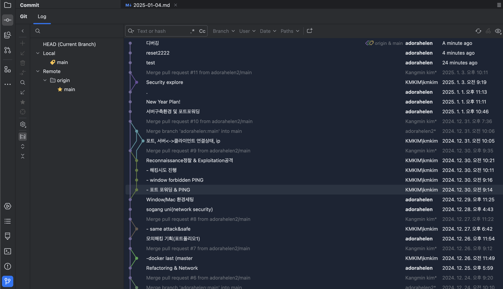

# 깃허브 에러 

문제 요약:
1.	RPC 실패 및 HTTP 400 에러:
•	“RPC failed; HTTP 400 curl 22 The requested URL returned error: 400”
•	이는 주로 Git에서 큰 파일 또는 너무 많은 데이터를 동시에 전송하려 할 때 발생합니다. 또한 네트워크 연결 문제나 GitHub 저장소 설정 문제일 수도 있습니다.
2.	인증 실패:
•	“remote: No anonymous write access. fatal: Authentication failed”
•	저장소에 대한 인증이 실패했습니다. 이는 GitHub 자격 증명이 잘못되었거나, HTTPS 대신 SSH를 사용해야 하는 경우에 발생할 수 있습니다.

## 해결 
- 특정 날짜로 리셋
- 사진 파일 4개 삭제 
- 아직도 원인을 모르겠음 
  * 집 -> 서강대 네트워크 문제? 
  * 제트브레인/깃허브 토큰 만료일 3월이라서 해당사항 x