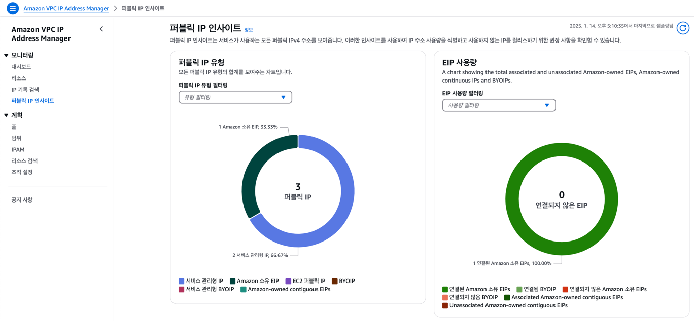

## 01. AWS-VPC vs 네트워크(모공허)

#### 1. VPC는 집 전체의 네트워크
- **AWS의 VPC**: VPC는 하나의 큰 가상 네트워크
- **일반 네트워크**: 집에 설치된 인터넷 환경
    - ISP(Internet Service Provider)에서 제공하는 인터넷을 모뎀이 받아오고, 이를 통해 집 안의 네트워크가 형성됩니다.
    - 집 전체의 네트워크를 하나의 VPC로 볼 수 있습니다.

#### 2. 서브넷은 방(room) 별 네트워크
- **AWS의 서브넷**: VPC를 작은 네트워크로 나눈 서브넷
    - 각 서브넷은 특정한 IP 대역(예: 192.168.0.0/24)을 가짐
- **일반 네트워크**: 집 안의 네트워크를 방(room)별로 나누는 것과 같습니다.
    - 예를 들어, 공유기에 연결된 허브가 각각의 방에 네트워크를 분배합니다.
    - 방 1: 192.168.0.x
    - 방 2: 192.168.1.x
    - 이처럼 방마다 네트워크를 분리하여 관리할 수 있습니다.

#### 3. 퍼블릭 서브넷은 공유기 밖의 인터넷과 연결된 방 (포트포워딩)
- **AWS 퍼블릭 서브넷**: 인터넷 게이트웨이를 통해 외부(인터넷)와 연결된 서브넷입니다.
    - 서브넷 안의 리소스는 퍼블릭 IP를 가지며, 인터넷에서 직접 접근할 수 있습니다.
- **일반 네트워크**: 공유기를 통해 외부 인터넷과 연결된 네트워크입니다.
    - 예를 들어, 공유기에서 포트 포워딩을 설정하면 특정 방(서브넷)에 있는 기기(예: 웹 서버)에 외부에서 접근할 수 있습니다.
    - 방 1(퍼블릭 서브넷): 웹 서버를 운영하는 방 → 외부에서 접속 가능.

#### 4. 프라이빗 서브넷은 외부와 단절된 방 (인트라넷)
- **AWS 프라이빗 서브넷**: 인터넷 게이트웨이와 연결되지 않아 외부에서 접근할 수 없는 서브넷입니다.
    - 서브넷 안의 리소스는 퍼블릭 IP가 없으며, 외부 접근은 NAT 게이트웨이나 프록시 서버를 통해서만 가능합니다.
- **일반 네트워크**: 외부와 직접 연결되지 않은 방입니다.
    - 예를 들어, 공유기에서 포트 포워딩을 설정하지 않은 방(서브넷)입니다.
    - 방 2(프라이빗 서브넷): 데이터베이스 서버를 운영하는 방 → 외부에서 직접 접속 불가.
    - 단, 이 방의 기기가 인터넷에 접근해야 한다면 공유기(NAT 게이트웨이)를 통해 간접적으로 인터넷에 접속할 수 있습니다.

#### 5. NAT 게이트웨이는 공유기의 NAT 기능
- **AWS의 NAT 게이트웨이**: 프라이빗 서브넷의 리소스가 외부 인터넷에 요청을 보낼 수 있도록 중개합니다.
- **일반 네트워크**: 공유기의 NAT(Network Address Translation) 기능과 동일합니다.
    - 내부 네트워크(예: 192.168.x.x)의 IP를 공유기의 퍼블릭 IP로 변환해 인터넷에 요청을 보냅니다.
    - 방 2의 기기(프라이빗 서브넷)는 공유기를 통해 외부와 통신 가능하지만, 외부에서 방 2의 기기에 직접 접근은 불가능합니다.

#### 6. 요약

| AWS 개념       | 일반 네트워크 환경                  | 설명                                                        |
|----------------|------------------------------------|-------------------------------------------------------------|
| VPC            | 집 전체의 네트워크                 | ISP를 통해 모뎀이 제공하는 전체 네트워크                    |
| 서브넷         | 방(room) 별 네트워크               | 각 방이 별도의 IP 대역을 가지는 것과 유사                   |
| 퍼블릭 서브넷  | 공유기와 직접 연결된 방            | 외부 인터넷에서 직접 접근 가능한 방                         |
| 프라이빗 서브넷| 외부와 단절된 방                   | 외부에서 접근 불가능하며, 내부에서만 사용 가능              |
| NAT 게이트웨이 | 공유기의 NAT 기능                  | 내부 네트워크에서 외부로 나가는 요청을 중개                |

## 02. Public IP != Public Subnet 차이점

Public IP와 Public Subnet은 서로 다른 네트워크 구성 요소

#### 1. Public IP (퍼블릭 IP)
- **정의**: 인터넷에서 고유하게 식별될 수 있는 IP 주소입니다.
- **특징**:
  - 인터넷에서 직접 접근이 가능.
  - 일반적으로 인터넷 게이트웨이(Internet Gateway)를 통해 트래픽을 주고받음.
  - AWS에서는 Elastic IP (EIP) 형태로 고정 퍼블릭 IP를 할당하거나, 동적으로 퍼블릭 IP를 할당할 수 있음.
- **사용 예**: 웹 서버, 로드 밸런서 등 인터넷 사용자에게 노출되어야 하는 리소스에 사용.

#### 2. Public Subnet (퍼블릭 서브넷)
- **정의**: VPC 안에 있는 서브넷 중 인터넷 게이트웨이와 연결되어 외부 인터넷과 통신할 수 있는 서브넷을 의미합니다.
- **특징**:
  - 퍼블릭 서브넷 안의 리소스는 퍼블릭 IP를 가질 수 있으며, 인터넷에 접근 가능.
  - 서브넷의 라우팅 테이블에 인터넷 게이트웨이(IGW)가 설정되어 있어야 함.
  - 리소스에 퍼블릭 IP가 없더라도 NAT Gateway를 통해 간접적으로 인터넷에 접근 가능.
- **사용 예**: 인터넷에서 접근 가능한 리소스를 배치(예: 웹 서버, 로드 밸런서).

#### 차이점 비교

| 항목                | Public IP                          | Public Subnet                                     |
|-------------------|------------------------------------|--------------------------------------------------|
| 정의               | 인터넷에서 식별 가능한 IP 주소     | 인터넷 게이트웨이와 연결된 서브넷                  |
| 역할               | 리소스가 인터넷과 직접 통신 가능하게 함 | 서브넷의 리소스가 인터넷과 통신할 수 있도록 지원    |
| 사용 위치           | EC2, 로드 밸런서 등 개별 리소스에 할당 | VPC 내부에서 네트워크 레벨에서 설정                |
| 인터넷 게이트웨이    | 직접 관련 없음                     | 필수 (라우팅 테이블에 IGW가 있어야 함)              |
| 예시                | 52.78.147.172와 같은 퍼블릭 IP 주소 | 192.168.1.0/24 범위로 정의된 서브넷                |

#### 결론
- **Public IP**는 특정 리소스에 할당되는 고유한 인터넷 주소입니다.
- **Public Subnet**은 VPC 안에서 인터넷과 연결된 네트워크 영역을 의미합니다.
- Public Subnet에 배치된 리소스가 Public IP를 가지면, 인터넷과 직접 통신할 수 있습니다.

## 03. AWS 비용

- ALB(Application Load Balancer)는 애플리케이션 트래픽을 여러 대의 서버에 분산시키는 솔루션입니다.
  * 로드 밸런서라고도 불리며, 트래픽 프록시 역할을 합니다.
  * ALB는 필수적으로 Multi-AZ로 구성 => Public IP 2개 먹음

- Public ip에 대한 (로드밸런스로 인한 2개의 +) 요금이 vpc 로 잡히는거 같다.
- RDS 역시, 로컬에서 다이렉트로 접근하려면 Public access <- ip 요금 부과
  * 그래서 찾아보던게 EC2-RDS 연결후 ec2 ssh 로 RDS 접근하는 방법(실패한)

### 퍼블릭 IP 없이 HTTPS 적용하기(가능은함, RDS 도)

| 방법                                | 장점                                          | 단점                                             |
|-----------------------------------|---------------------------------------------|------------------------------------------------|
| 프라이빗 서브넷에서 ALB 운영      | 퍼블릭 IP 제거, 내부 네트워크에서만 접근       | 외부 사용자는 직접 접근 불가. DNS 구성 필요       |
| CloudFront 사용                    | 퍼블릭 IP 제거, 전 세계에 HTTPS 제공 가능      | CloudFront 추가 비용 발생                        |
| 프라이빗 서브넷 + NAT Gateway    | 보안 강화, 퍼블릭 IP 최소화                  | ALB는 퍼블릭 서브넷에 유지                       |

- https://velog.io/@dev_hyun/AWS-프리티어인데-돈이나간다-RDS-Public-IPv4