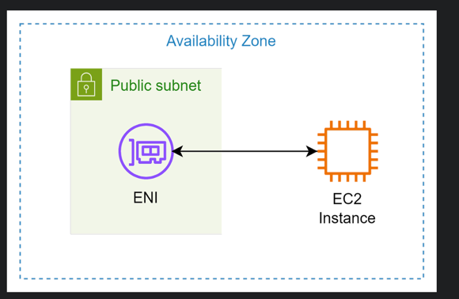
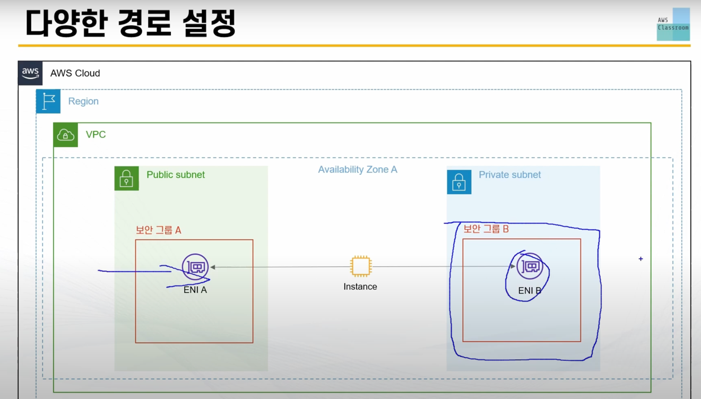
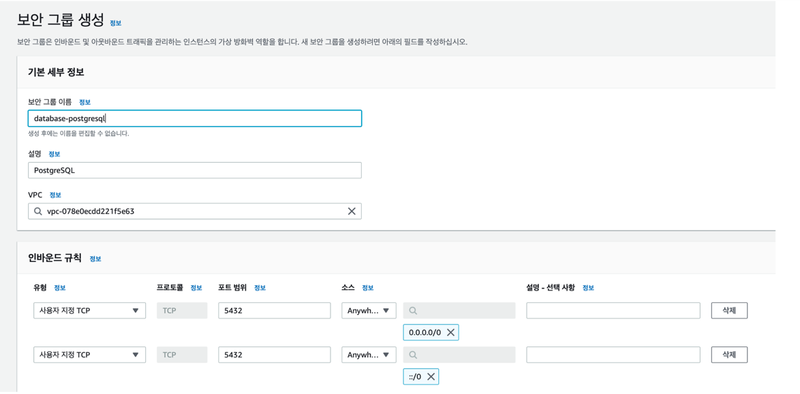

# AWS, RDS 

### 01. ENI 
- ENI (탄력적 네트워크 인터페이스)
- ENI는 EC2 인스턴스가 생성될 때 자동으로 생성된다.
- ENI는 일종의 EC2의 가상의 랜카드(LAN Card) 라고 생각하면 된다.
  * 실질적으로 ENI가 EC2의 서브넷의 위치와 보안그룹의 연결을 담당

- 하나의 인스턴스는 하나의 ENI 에 연결돠어 있어야 한다.
- 하나의 ENI 는 여러개의 인스턴스 & 여러개의 서브네과 보안그룹을 가질 수 있다.

### 02. 보안그룹 설정

- postgreSQL을 사용하기 때문에 포트 범위를 5432번으로 설정 
  * 인바운드 규칙 적용
  

### 03. RDS 설정 

- => 다시 RDS (MySQl) 로 생성
  * 마스터 사용자 이름, 마스터 암호, 엔드포인트 저장

- => 파라미터 그룹 생성 (타임존, 지역설정)

- => 보안그룹 설정 (포트번호 3326)

### 04. 연결 
- 퍼블릭 엑세스 허용 : ip4 발급
  * 인텔리제이에서 rds 잡아서 사용 가능함 : 테스트 성공
- 퍼블릭 엑세스 비허용 : ip4 없음
  * 인텔리제이에서 rds 사용 X
- => aws ec2 & rds 는 같은 vpc 영역 
  * ec2 는 rds 잡아서 사용 가능 : 테스트 성공 (서로 연결 설정 없이)
  * ec2 <-> rds 연결 설정 => ec2에서 rds 접근 가능해야함 

=> 데이터 날아가네??