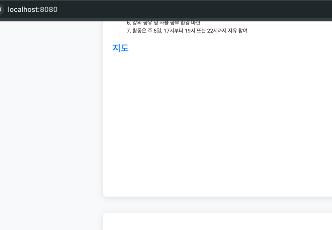
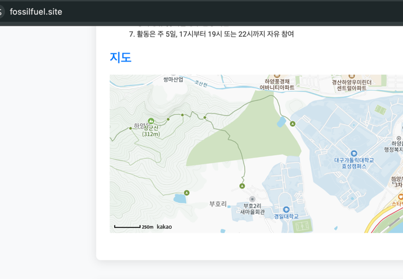
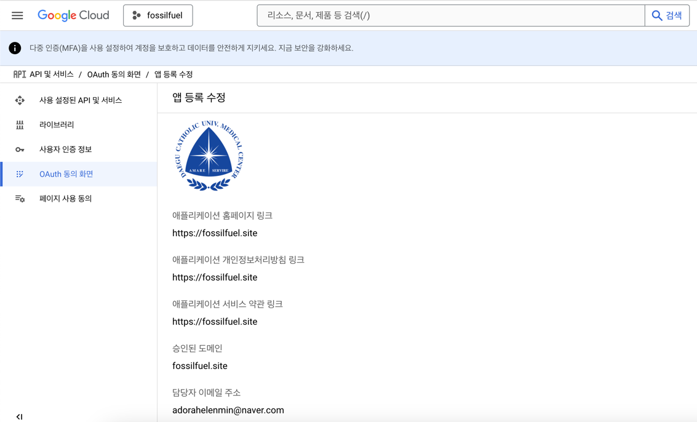

# 트러블 슈팅 


##  01.Key [카카오 & 구글 Oauth2] 
- 카카오 지도 api
  * 카카오 디벨로퍼 > 내 애플리케이션 설정 > 앱설정 > 플랫폼 : WEB (사이트 도메인)
  * url 설정 : locallhost:8080 => http://fossilfuel.site





- 구글 oauth2 api
  * 구글 클라우드 콘솔 접속
  * 프로젝트 생성 > API 및 서비스 > Oauth동의화면 : 외부 선택 
  * 등록 이후 발급된 [클라이언트ID, 클라이언트PW], .yml 파일에 명시 



- 카카오 oauth2 api 
  * 

## 02. Spring Security

    .requestMatchers("/api/token", "/api/upload/**", "/api/login", "/ws/**", "/api/blogs/**", "blogs/", "/new-blog", "/articles").permitAll()

- 명시하지 않아서, 블로그(방명록)작성시 저장되지 않음 (무반응) 

## 03. CORS 

### AWS 환경에서의 출처 차이
- 배포된 환경에서는 클라이언트와 서버가 다른 도메인, 포트, 또는 프로토콜을 사용할 가능성이 높음
  * 클라이언트: `http://example.com`
  * 서버: `http://api.example.com`
- 이 경우, 브라우저는 “교차 출처 요청(cross-origin request)”으로 간주하고 CORS 정책을 적용
  * 서버가 적절한 CORS 헤더를 응답에 포함하지 않으면 브라우저에서 요청을 차단

```bash
(1) 서버에서 CORS 설정 확인
package edu.example.springbootblog.global;

import org.springframework.context.annotation.Configuration;
import org.springframework.web.servlet.config.annotation.CorsRegistry;
import org.springframework.web.servlet.config.annotation.WebMvcConfigurer;

@Configuration
public class WebConfig implements WebMvcConfigurer {
    @Override
    public void addCorsMappings(CorsRegistry registry) {
        registry.addMapping("/api/**")
                .allowedOrigins("https://fossilfuel.site") // 클라이언트 주소를 정확히 명시
                .allowedMethods("GET", "POST", "PUT", "DELETE")
                .allowedHeaders("*") // 모든 헤더 허용
                .allowCredentials(true); // 쿠키 및 인증 정보 허용
    }
}

(2) 클라이언트 요청 수정
fetch('https://fossilfuel.site/api/resource', {
    method: 'GET',
    credentials: 'include'
});
```

### 로컬환경 CORS 예시
- localhost에서 발생하는 CORS 에러 시나리오
  * **React (포트 5000)**와 **Spring Boot (포트 8080)**이 각각 다른 포트에서 실행 
  * React 애플리케이션이 Spring Boot 서버에 API 요청을 보내면 출처가 다르기 때문에 브라우저가(크롬) CORS 정책을 적용

- => 리액트를 사용하지 않고, Spring Boot의 templates 디렉토리에서 Thymeleaf를 사용해 개발을 진행한다면, 
  * CORS(Cross-Origin Resource Sharing) 문제는 발생 X 
  * 이는 클라이언트와 서버가 동일한 출처(Spring Boot)안에서 동작하기 때문

### 로컬환경에서 CORS 발생 원인
- React의 출처(`http://localhost:5000`)와 Spring Boot의 출처(`http://localhost:8080`)가 다릅니다.
- 출처는 프로토콜 + 도메인 + 포트로 구성됩니다.
- 브라우저는 다른 출처로의 요청에 대해 CORS 정책을 적용하며, 서버에서 적절한 CORS 헤더를 제공하지 않으면 요청이 차단됩니다.

# 결론
- Thymeleaf 환경 : 
   * 동일 출처 환경: CORS 문제가 발생하지 않아 설정이 간단
   * 서버 사이드 렌더링(SSR) 이라서 초기 로딩 속도가 빠름 
   * Spring Boot 내부에서 프론트와 백엔드를 모두 처리

- AWS 배포(+로드밸런서), JWT & Oauth2 적용(그 외 와부 api 호출 다수)
  * 위와 같은 상황이라서 CORS가 발생한 것으로 추측 (로그인시 인증 X, 토큰 발급 X)
  * login.js 에서 credentials 가 주석이라 쿠키를 담지 못했음

### + 같은 도메인(https://fossilfuel.site) 에서 발생하는 CORS 
    * 같은 도메인을 사용해도 CORS 가 발생할 수 있는 몇가지 특이 케이스
    * CORS 주체는 '브라우저의 차단', 코드를 잘못짜서 생기는게 아님

- Https & Https
  * 브라우저는 보안 정책상 HTTPS 환경에서 HTTP 요청을 허용하지 않음
  * 만약 프론트엔드에서 HTTPS로 요청을 보내지만 백엔드가 HTTP로 응답하거나 반대로 작동하면, 브라우저에서 CORS 문제가 발생

- CORS 정책 미설정
  * 같은 도메인이어도 CORS 정책이 명시적으로 설정되지 않으면 브라우저에서 일부 요청을 차단할 수 있음