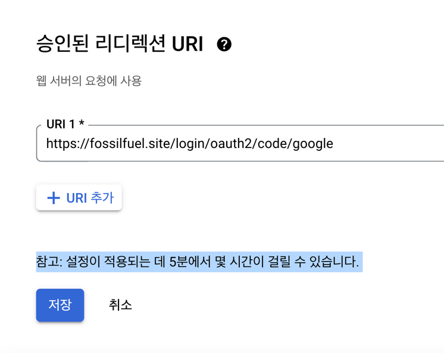

## 트러블 슈팅 

- => 리다이렉트 url 을 만들지 않았다는 에러
  * 아무리 찾아봐도 url 지정하는 부분이 없음

### 원인1 : 클라이언트 ID를 웹이 아닌 데스크톱으로 만들었었음 

### 원인2 : oauth2 라이브러리 사용하는 이상 redirect-uri 불변
  *     implementation 'org.springframework.boot:spring-boot-starter-oauth2-client'

  * 내 맘대로 바꿔서 작성하는게 아닌, 아래와 같이 작성해야만 함
  * https://localhost:8443/login/oauth2/code/kakao
  * https://fossilfuel.site/login/oauth2/code/kakao
  * https://fossilfuel.site/login/oauth2/code/google
  * 앞부분은 바뀔수 있지만, /login/oauth2/code/ ? (뒤는 고정)

  * 승인된 리다이렉션은 Token을 발급받기 전 Code를 발급받을 주소를 명시하는 작업
  * 구글의 경우 localhost 의 경우 .yml 명시 불필요
  * aws 배포판의 경우 .yml 에 명시 필요 

- 리디렉션 URI는 정확히 일치해야 함
  * https://fossilfuel.site/articles
  * https://fossilfuel.site/articles/ 서로 다르게 인식

## 새로운 문제

- 로그아웃 -> 토큰이 사라질 듯 하면서 가끔 안사라짐?
  * http(백엔드) < - > https(프론트) 문제로 짐작
