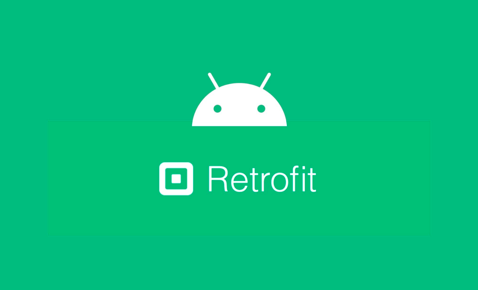

# How to convert Web & App

## Base Spring Boot WEB:
- To Android Application 
- 개발방식 2가지 존재 
  * 하나 : Spring Boot 백엔드를 그대로 유지하면서 안드로이드 앱에서 API를 호출하는 방식 
  * 둘 : 전체 애플리케이션을 네이티브 안드로이드로 재구성

```
1. Spring Boot 백엔드를 유지하면서 안드로이드 앱 개발

#### 구현 방식
- 기존 Spring Boot 서버는 그대로 유지
- 안드로이드 앱에서 REST API 호출 (Retrofit, Volley 등 사용)
- 앱은 단순히 프론트엔드 역할 (데이터 요청, UI 표시)

#### 장점
- ✔ 기존 시스템 활용 → 백엔드 코드를 거의 변경할 필요 없음
- ✔ 유지보수가 용이 → 웹과 모바일에서 같은 API 사용 가능
- ✔ 개발 속도가 빠름 → 안드로이드 앱 개발에 집중할 수 있음

#### 단점
- ✖ 오프라인 기능 구현이 어려움 → 서버 응답이 필요함
- ✖ 앱 내에서 복잡한 로직을 처리하기 어려움 (서버 중심 설계)

2. 전체 애플리케이션을 네이티브 안드로이드로 재구성

#### 구현 방식
- 백엔드 역할을 안드로이드 앱 내부에서 처리
- 로컬 데이터베이스(SQLite, Room) 사용
- 직접 API 서버 없이 앱 내에서 모든 로직을 수행

#### 장점
- ✔ 오프라인 지원이 가능 → 네트워크 없이도 동작 가능
- ✔ 반응 속도가 빠름 → 네트워크 호출이 줄어듦
- ✔ 클라이언트 중심의 기능 확장이 용이

#### 단점
- ✖ 기존 Spring Boot 코드를 다시 작성해야 함
- ✖ 백엔드 기능(인증, 데이터 저장 등)을 앱에서 직접 구현해야 함
- ✖ 유지보수가 어려울 수 있음 (백엔드와 앱이 완전히 분리됨)

### 선택 기준
1️⃣ **백엔드(Spring Boot)를 유지하는 경우**
- 기존 웹 애플리케이션이 있고, API 서버를 유지하면서 안드로이드 앱을 만들고 싶다면
  2️⃣ **네이티브로 전체 개발하는 경우**
- 오프라인 기능이 중요하고, 서버 없이 독립적으로 동작하는 앱을 원한다면

💡 **결론:** 보통은 첫 번째 방법을 많이 선택
안드로이드 앱에서 API만 호출하는 방식이 가장 효율적 (지금처럼 WEB 서버가 별도로 존재하는 경우)
Spring Boot를 유지하면서 안드로이드에서 Retrofit으로 API를 연동하는 게 일반적😃
```

### Class Compare

#### 01. 데이터 저장 
- Web : Domain(Entity)
```
@Entity
public class User 
    @Id
    @GeneratedValue(strategy = GenerationType.IDENTITY)
    private Long id;
    
    private String name;
    private String email;
```

- Android (DTO) : API 호출 형식이라 엔티티 저장 대신 dto 운반 사용
```
data class User(
    val id: Long,
    val name: String,
    val email: String
)
```
#### 02. 데이터 접근
- Web : Domain(Entity)
  * 리포지토리를 통해서 데이터(데이터베이스)에 접근
```
@Repository
public interface UserRepository extends JpaRepository<User, Long> {
    Optional<User> findByEmail(String email);
```

- Android, {Retrofit} 등의 라이브러리를 통해 기 구현되어 있는 서버측 EndPoint 호출
 ```
  안드로이드에서 REST API를 호출하는 방법
  1️⃣ Retrofit: 가장 많이 사용하는 HTTP 클라이언트 라이브러리
  2️⃣ Volley: Google에서 제공하는 네트워크 라이브러리 (속도가 빠름)
  3️⃣ HttpURLConnection: 기본적으로 제공되는 방식 (직접 구현해야 해서 번거로움)
```
- => 리트로핏을 활용하여 REST API를 호출하는 예시


```
(case1)
interface UserApi {
    @GET("users/{email}")
    suspend fun getUserByEmail(@Path("email") email: String): Response<User>
}

class UserRepository(private val api: UserApi) {
    suspend fun getUserByEmail(email: String): User? {
        val response = api.getUserByEmail(email)
        return if (response.isSuccessful) response.body() else null
    }
}

(case2)
public interface ApiService {
    @GET("guestbook/get")
    Call<List<Guestbook>> getGuestbookEntries();

    @POST("guestbook/post")
    Call<Guestbook> addGuestbookEntry(@Body Guestbook entry);
}

: 차이점 (신규 방식 vs 기존 전통 방식)
첫 번째 코드 (UserApi와 UserRepository)는 suspend 키워드를 사용하여 코루틴을 사용. 이는 비동기 호출을 쉽게 처리
  * 코루틴은 Kotlin 언어 레벨에서 지원해주는 경량 스레드 라이브러리
두 번째 코드 (ApiService)는 Call 객체를 사용하여 비동기 호출을 처리. 이는 전통적인 콜백 방식
```

#### 03. Service & ViewModel
- Spring Boot의 Service 계층이 Android에서는 ViewModel과 Repository로 나뉘어짐.
- ViewModel은 UI와 데이터를 연결하는 역할을 함.

#### 04.  Controller vs Activity
- Spring Boot의 Controller가 API를 제공하는 역할이라면,
- Android에서는 Activity(Fragment)가 UI를 담당하고 ViewModel과 연결됨.

#### 05. 요약

| 개념       | Spring Boot        | Android                        |
|------------|---------------------|--------------------------------|
| Entity     | @Entity (JPA)       | data class                     |
| Repository | JpaRepository       | Retrofit API                   |
| Service    | @Service            | ViewModel & Repository         |
| Controller | @RestController     | Activity / Fragment            |
| 데이터베이스 | MySQL, PostgreSQL  | Room (로컬 DB) 또는 REST API 호출 |

- 다음 학습 방향 
  * Retrofit & ViewModel: REST API와 데이터를 주고받는 법 익히기.
  * LiveData & MVVM 패턴: UI와 데이터 바인딩 방식 이해하기.
  * Jetpack Compose: 최신 UI 개발 방식 학습하기.

## UI 건드는 법
```
기본적으로, 웹 애플리케이션에서는 서버에서 HTML을 생성하고 브라우저가 이를 렌더링하는 반면,
 안드로이드 애플리케이션에서는 XML 레이아웃 파일이나 Compose 함수를 사용하여 클라이언트 기기에서 UI를 렌더링
```