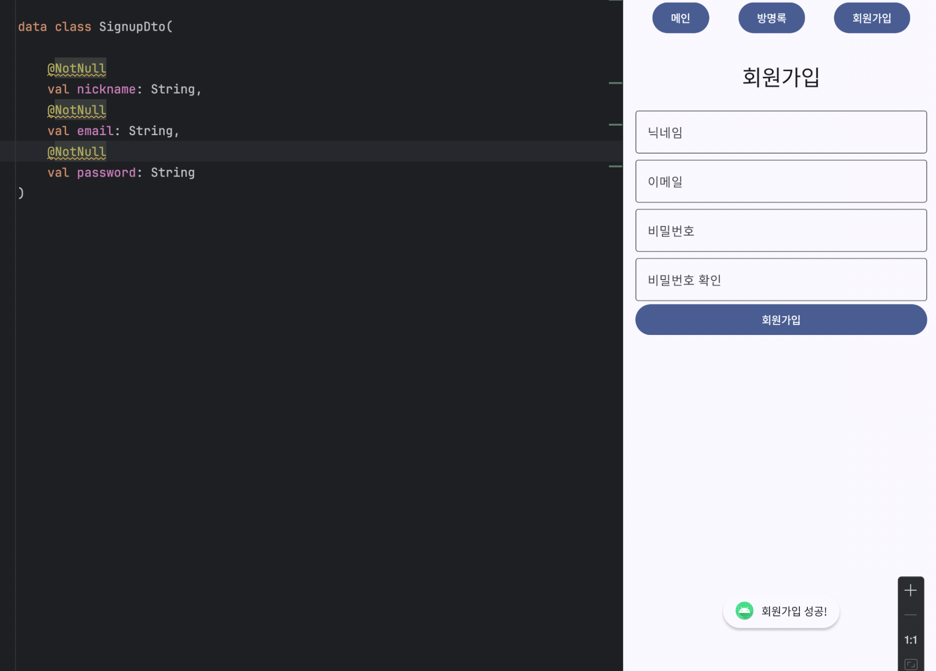
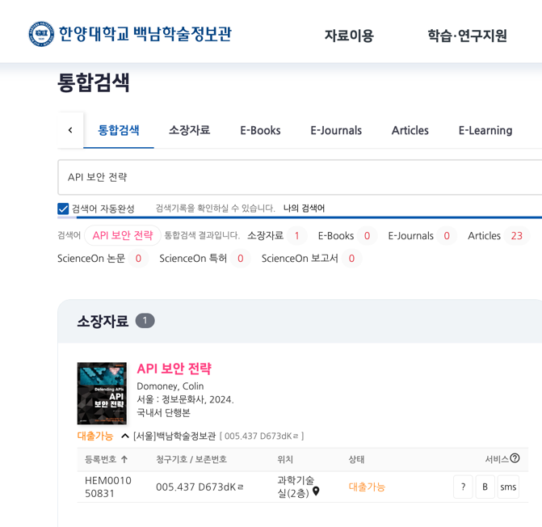

# API 보안 (Back Security)

## 문제 상황 

- 전부 빈칸인데, 회원가입이 정상적으로 진행된다 
- => 웹에서 프론트 '만' Null 검증을 행함
  * UI 를 거치지 않는 App 에서 Null 주입이 되어버림

> 백엔드 코드를 수정하고, NULL 대처를 해주면 간단하다. 하지만,

## 해결 이후 

- 인증과 인가를 거치지 않는 다양한 API 들은 어떠한 방식으로도 위험에 노출 될 수 있다는 걸 생각함
  * 대표적으로 회원가입, 로그인, 방명록 등록, 챗봇호출, 메인페이지 로드
- 이러한 API 에대한 공격이 DDOs라고생각되며, SQL 인젝션 역시 이와같은 허점을 노린느 것일것이다.
  * 그렇다면 인증과 인가 없이 위험을 방어하고 API 보안을 행하는 방법은 어떤것들이 있을까?

### 1. 입력 검증(Input Validation)
- **SQL 인젝션 방지**: 모든 입력 데이터를 검증하여 SQL 인젝션 공격을 방지합니다. Prepared Statements를 사용하여 SQL 쿼리를 작성합니다.
- **크로스 사이트 스크립팅(XSS) 방지**: HTML 또는 JavaScript 코드가 삽입되지 않도록 입력 데이터를 필터링하고 인코딩합니다.
- **입력 길이 제한**: 입력 데이터의 길이를 제한하여 대량의 데이터를 통한 공격을 방지합니다.

### 2. 보안 헤더 사용
- **Content Security Policy (CSP)**: XSS 공격을 방지하기 위해 CSP 헤더를 설정합니다.
- **X-Frame-Options**: 클릭재킹 공격을 방지하기 위해 `X-Frame-Options` 헤더를 설정합니다.
- **Strict-Transport-Security (HSTS)**: HTTPS 연결을 강제하기 위해 `Strict-Transport-Security` 헤더를 설정합니다.

### 3. HTTPS 사용
- 모든 API 통신을 HTTPS로 암호화하여 데이터 전송 중 도청 및 변조를 방지합니다.

### 4. 로그와 모니터링
- **로깅**: 모든 요청과 응답을 로깅하여 비정상적인 활동을 추적합니다.
- **모니터링**: 실시간으로 API 호출을 모니터링하여 비정상적인 패턴을 탐지하고 대응합니다.

### 5. 비정상적인 트래픽 차단
- **Rate Limiting**: 특정 시간 동안 허용되는 최대 요청 수를 제한합니다.
- **Throttling**: 사용자가 너무 많은 요청을 보내는 경우 요청 속도를 줄입니다.

### 6. 데이터 암호화
- **정적 데이터 암호화**: 데이터베이스에 저장된 데이터를 암호화하여 보호합니다.
- **동적 데이터 암호화**: 데이터 전송 중에 데이터를 암호화하여 보호합니다.

### 7. CORS 설정
- **교차 출처 리소스 공유(CORS)**: 허용된 도메인만 API에 접근할 수 있도록 CORS 정책을 설정합니다.

### 8. Web Application Firewall (WAF) 사용
- WAF를 사용하여 알려진 공격 패턴을 차단하고, 의심스러운 요청을 필터링합니다.

### 9. 코드 리뷰 및 보안 점검
- 정기적인 코드 리뷰와 보안 점검을 통해 취약점을 발견하고 수정합니다.
- 정적 코드 분석 도구를 사용하여 잠재적인 보안 문제를 식별합니다.

### 10. 패치 및 업데이트
- 사용 중인 라이브러리와 프레임워크를 정기적으로 업데이트하여 알려진 보안 취약점을 수정합니다.

