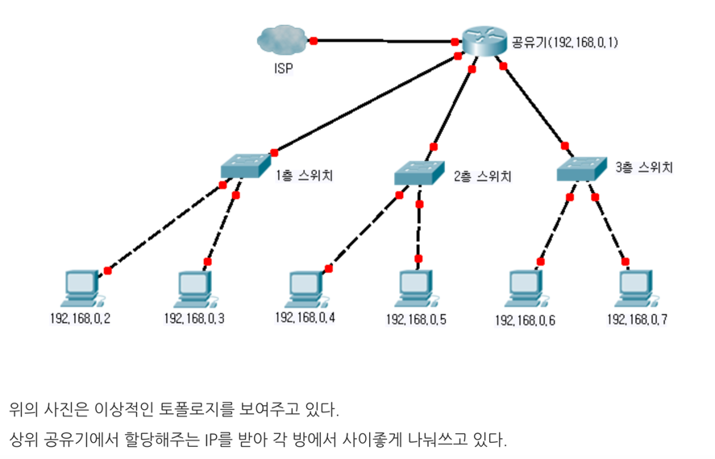
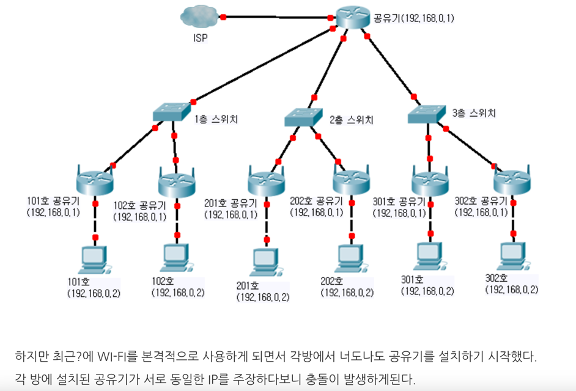
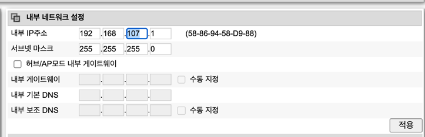
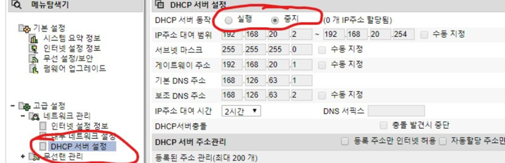

# 원룸 네트워크 트러블 슈팅 
- 2월23일, 자고 일어나니 와이파이 불량 (인터넷 x)
-  -> 공유기 초기화 진행 : 해결
- 2월24일, 자고 일어나니 다시 와이파이 불량 
- -> IP 충돌로 원인 진단 해결 진행

## 원인 
원룸이나 빌라에서 살게 되면 신축이나 좋은 건물이 아닌 이상, 인터넷을 각 방에서 공유해서 쓰게된다.이때 DHCP라는 기능으로 일정한 기간동안 IP 대역을 각 방에 할당하며 돌려쓰게 되는데,이러한 방식은 IP 충돌이 발생할 여지가 있어 인터넷이 종종 끊기거나 심하게 느려지게 된다.

이런 환경에서 인터넷을 안정적으로 사용하기 위해서는 2가지 세팅을 해주어야 한다.

## 해결방안

### ❓ IP 대역 변경과 DHCP 기능 해제(허브 모드)는 동시에 적용해야 하나요?
**아니요, 두 가지 방법은 서로 다른 설정 방식이며 동시에 적용할 필요가 없습니다.**

### 1️⃣ IP 대역 변경 (공유기를 라우터 모드로 사용)
- 공유기를 **라우터 모드(NAT 활성화)** 로 사용하면서 **IP 대역을 변경**하는 방법입니다.
- 예를 들어, **기본 공유기의 IP 대역이 `192.168.0.x`** 라면, **추가 공유기의 IP를 `192.168.1.x`** 로 설정하여 **서로 다른 서브넷을 구성**합니다.
- 이렇게 하면 **각 공유기가 개별 네트워크를 형성하며 충돌을 방지**할 수 있습니다.
- **✅ 적용 사례:** 여러 개의 독립적인 네트워크(각 방마다 별도 네트워크)를 운영하고 싶을 때.

---

### 2️⃣ DHCP 기능 해제 및 허브 모드 사용 (공유기를 브리지 모드로 사용)
- 공유기의 **DHCP 기능을 해제하고, 브리지 모드(허브 모드)로 설정**하는 방법입니다.
- 이 경우 공유기는 **단순한 스위치 역할**을 하며, **상위 공유기(메인 공유기)에서 IP를 직접 할당**받습니다.
- 모든 장치가 **동일한 네트워크(`192.168.0.x`)에서 작동**하게 됩니다.
- **✅ 적용 사례:** 모든 장치를 같은 네트워크에 연결하고 싶을 때.

---

## 🚀 결론: 두 가지 방법은 목적이 다름
| 사용 목적 | 권장 설정 |
|-----------|-----------|
| 개별 네트워크(IP 대역을 다르게 운영) | **라우터 모드(NAT 활성화) & IP 대역 변경** |
| 모든 장치를 같은 네트워크에서 사용 | **브리지 모드(DHCP 해제 & 허브 모드)** |

즉, 상황에 따라 **하나만 적용하면 됩니다!** 👍

### 01. IP 대역 변경
IP 대역 변경: 기본적으로 공유기는 192.168.0.1과 같은 IP 대역을 사용합니다. 그러나 여러 공유기가 동일한 IP 대역을 사용할 경우 IP 충돌이 발생할 수 있습니다. 이를 방지하기 위해 각 공유기의 IP 대역을 서로 다르게 설정하여 충돌을 피하는 방법입니다. 예를 들어, 한 공유기는 192.168.0.1, 다른 공유기는 192.168.1.1로 설정하는 방식입니다.

### 02. DHCP 기능 해제 후 공유기를 허브모드로 사용하기
DHCP 기능 해제 및 허브 모드 사용: 공유기의 DHCP(Dynamic Host Configuration Protocol) 기능은 네트워크에 연결된 장치에 자동으로 IP 주소를 할당합니다. 그러나 여러 공유기가 각자 DHCP 기능을 활성화한 상태로 동일한 네트워크에 연결되면 IP 주소 충돌이 발생할 수 있습니다. 이를 방지하기 위해 각 방의 공유기에서 DHCP 기능을 해제하고, 공유기를 허브 모드로 전환하여 상위 공유기에서 IP 주소를 일괄적으로 할당받도록 설정하는 방법입니다.

- 기존에 WAN 포트에 연결되어 있던 랜선을 **LAN 포트(예: 1번 포트)**로 변경해야 하는 이유
- 일반적인 공유기의 동작 원리 (NAT 라우팅 모드)
  * 공유기는 WAN 포트를 통해 상위 네트워크(인터넷)에 연결
  * 하지만 여러 개의 공유기가 각자 NAT 라우팅을 하면 IP 충돌이나 이중 NAT 문제가 발생 가능

## 결론

두개의 방식을 동시에 진행하였지만, 1번은 초기화가 진행되어야 해서 (적용 누르면 바로 진행)
2번을 수행하고 1번을 적용했다. 
-> 그후 iptime 관리자에 접속이 되지 않는데, 둘 중 하나만 하면 되었다.

### 허브 모드(스위치 모드)에서의 동작

허브 모드는 공유기를 하나의 **스위치(허브)**처럼 동작하게 만듭니다. 즉, 공유기가 IP를 따로 할당하지 않고, **상위 공유기(메인 공유기 또는 ISP 제공 장비)**에서 직접 IP를 받도록 하는 방식입니다.

#### WAN 포트를 사용하면 안 되는 이유

- 공유기의 WAN 포트는 NAT를 통해 별도의 네트워크를 생성하려고 합니다.
- 허브 모드에서는 NAT가 필요 없고, 기존 네트워크를 그대로 확장해야 합니다.
- WAN 포트에 연결하면 공유기가 또 다른 서브 네트워크를 만들어버려 IP 할당 충돌이 생길 수 있습니다.

#### LAN 포트를 사용해야 하는 이유

- 공유기의 LAN 포트에 연결하면 공유기는 단순한 네트워크 스위치처럼 동작합니다.
- 이 방식으로 연결하면 공유기가 자체적으로 IP를 할당하지 않고, 상위 공유기에서 IP를 직접 받아 안정적인 네트워크 구성이 가능합니다.
- 결과적으로 같은 네트워크 내에서 IP 충돌 없이 인터넷을 원활하게 사용할 수 있습니다.

---
# [ 보충 ]
# 💡 공유기 모드 vs 허브 모드 
원룸이나 빌라 환경에서 공유기를 **브리지 모드(허브 모드)** 로 설정하는 것이 일반적으로 **더 안정적**이지만, 몇 가지 문제점이 있을 수 있음.

## ✅ 브리지 모드(허브 모드)의 장점
1. **IP 충돌 방지**
    - 여러 개의 공유기가 각각 DHCP를 실행하면 **IP 충돌**이 발생할 수 있음.
    - 브리지 모드를 사용하면 **상위 공유기(메인 공유기)에서 IP를 관리하므로 충돌을 방지**할 수 있음.

2. **일관된 네트워크 환경**
    - NAT을 여러 번 거치지 않으므로 속도 저하가 줄어듦.
    - 같은 네트워크 대역을 사용하므로 장치 간 통신이 원활해짐 *(예: 프린터, NAS 등 연결 시)*.

3. **ISP(인터넷 제공업체)와의 충돌 방지**
    - 원룸이나 빌라에서는 건물 자체에서 **하나의 인터넷 회선을 공유**하는 경우가 많음.
    - 이때 개별 공유기가 각각 NAT을 수행하면 ISP에서 **추가 연결을 차단하거나 속도를 제한**할 수 있음.
    - **브리지 모드로 설정하면 ISP에서 한 대의 기기가 연결된 것으로 인식**하므로 이런 문제를 줄일 수 있음.

---

## ⚠ 하지만 브리지 모드(허브 모드)에도 단점이 있음
1. **보안 문제**
    - 공유기가 NAT을 하지 않기 때문에, **PC가 직접 인터넷에 노출될 가능성**이 있음.
    - 특히 **공유 네트워크(빌라, 원룸)** 환경에서는 다른 세대의 사용자가 같은 네트워크를 공유할 수 있음 → **보안 위험 증가**.

2. **IP 할당 문제**
    - 상위 공유기(혹은 ISP)의 DHCP 서버에서 **할당할 수 있는 IP 개수가 제한**될 수 있음.
    - 많은 기기가 연결되면 **IP를 못 받아 인터넷이 안 될 가능성**이 있음.

3. **개인 네트워크(사설망) 구축이 어려움**
    - 브리지 모드에서는 **별도의 내부 네트워크(192.168.x.x)를 구성하기 어렵기 때문에,**  
      특정 장치(예: IoT 기기, NAS, 프린터)를 개별 관리하기 어려울 수 있음.

---

## 🔥 그럼 원룸/빌라 환경에서 어떻게 설정하는 게 좋을까?

👉 **본인의 인터넷 사용 목적에 따라 설정을 다르게 하면 됨!**

| 사용 목적 | 권장 모드 | 설명 |
|----------|-----------|--------------------------------|
| **단순 인터넷 사용 (웹 서핑, 유튜브)** | **브리지 모드(허브 모드)** | 상위 공유기에서 IP 할당, 충돌 없이 안정적 사용 |
| **보안이 중요한 경우 (회사 업무, VPN)** | **라우터 모드(NAT 활성화)** | 내부 네트워크 생성, 외부 접근 차단 |
| **스마트홈/IoT 기기 사용** | **라우터 모드(NAT 활성화)** | 내부 네트워크(192.168.x.x)를 구축해야 함 |
| **여러 기기(PC, 스마트폰, 태블릿)를 안정적으로 연결** | **라우터 모드(NAT 활성화)** | 개별 IP 관리 가능, 충돌 방지 |

👉 **즉, 그냥 인터넷만 쓴다면 브리지 모드가 괜찮지만, 보안이나 개인 네트워크가 필요하면 NAT 모드가 더 좋음!**

---

## ✅ 현재 네트워크 설정에서 해결 방법
- **보안이 걱정된다면**
    - 🔹 공유기를 **라우터 모드(NAT 활성화)** 로 변경해서 **개인 네트워크(192.168.107.x)를 생성**하는 것이 더 안전함.

- **IP 충돌을 피하면서도 내부 네트워크를 사용하려면?**
    - 🔹 공유기를 **라우터 모드로 설정한 후, IP 대역을 192.168.107.x처럼 변경**
    - 🔹 이렇게 하면 상위 공유기와 충돌 없이 내부 네트워크를 가질 수 있음.

---

## 💡 요약
✅ 브리지 모드는 **속도와 안정성** 면에서는 유리하지만, **보안이나 확장성이 부족할 수 있음.**  
✅ 원룸/빌라에서는 **"단순 인터넷 사용" 목적이라면 브리지 모드**가 적합하지만, **보안이 필요하거나 여러 기기를 관리하려면 라우터 모드가 더 나음.**  
✅ **현재 네트워크가 공인 IP(222.xxx.xx.xxx)를 직접 사용 중이므로, 보안이 걱정된다면 NAT 모드로 변경하는 것이 좋음.**

