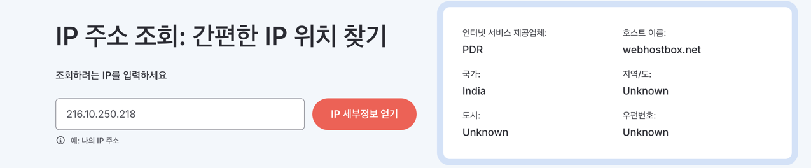
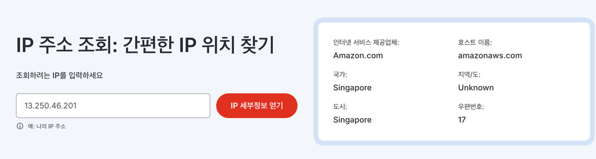

# log analysis

---
### 대응방안
```angular2html
✅ ELK Stack 사용해서 로그 분석
이전에 ESXi 서버에서 ELK Stack 구축을 고려
이런 공격을 실시간 감지하려면 ELK로 로그 수집 → Kibana 시각화 → 탐지 알림 설정
```


### 🔍 로그 분석

1. **IP 주소 (13.250.46.201)에서 GET 요청 발생**
    - 특정 IP가 `/bin.zip`, `/app.zip`, `/db.zip` 등의 ZIP 파일을 요청하고 있음.
    - 서버 내부에 존재할 가능성이 있는 ZIP 파일명을 자동으로 입력하면서 파일을 다운로드하려는 시도로 보임.

2. **파일 이름 패턴**
    - `bin.zip`, `app.zip`, `db.zip`, `users.zip`, `ftp.zip`, `admin.zip`, `db_backup.zip` 등
    - 일반적으로 중요한 데이터나 소스 코드, 백업 파일들이 저장될 가능성이 있는 파일명들.
    - 이 패턴은 **자동화된 스캐너(예: Gobuster, DirBuster, Ffuf)**를 이용해 특정 파일이 있는지 탐색하는 방식과 유사함.

3. **Spring Security에서 요청을 차단**
    - `DEBUG - o.s.security.web.FilterChainProxy - Securing GET /file.zip`
    - Spring Security가 요청을 감지하고 차단하는 과정이 보임.
    - 하지만 파일이 실제로 존재한다면 다운로드가 가능할 수도 있음, 즉 서버 설정을 점검해야 함.

---


## 해킹 로그 내용  

- 정말 다양한 나라의 국가들로 부터 다양한 공격이 들어오고 있다.



```
-02-26 04:17:37 - INFO  - d.f.f.GlobalRequestLoggingFilter - Request from IP: 216.10.250.218 - POST /hello.world
2025-02-26 04:17:37 - INFO  - d.f.f.GlobalRequestLoggingFilter - Request from IP: 216.10.250.218 - POST /hello.world
2025-02-26 04:17:38 - INFO  - d.f.f.GlobalRequestLoggingFilter - Request from IP: 216.10.250.218 - GET /vendor/phpunit/phpunit/src/Util/PHP/eval-stdin.php
2025-02-26 04:17:38 - INFO  - d.f.f.GlobalRequestLoggingFilter - Request from IP: 216.10.250.218 - GET /vendor/phpunit/phpunit/Util/PHP/eval-stdin.php
2025-02-26 04:17:39 - INFO  - d.f.f.GlobalRequestLoggingFilter - Request from IP: 216.10.250.218 - GET /vendor/phpunit/src/Util/PHP/eval-stdin.php
2025-02-26 04:17:39 - INFO  - d.f.f.GlobalRequestLoggingFilter - Request from IP: 216.10.250.218 - GET /vendor/phpunit/Util/PHP/eval-stdin.php
2025-02-26 04:17:39 - INFO  - d.f.f.GlobalRequestLoggingFilter - Request from IP: 216.10.250.218 - GET /vendor/phpunit/phpunit/LICENSE/eval-stdin.php
2025-02-26 04:17:40 - INFO  - d.f.f.GlobalRequestLoggingFilter - Request from IP: 216.10.250.218 - GET /vendor/vendor/phpunit/phpunit/src/Util/PHP/eval-stdin.php
2025-02-26 04:17:40 - INFO  - d.f.f.GlobalRequestLoggingFilter - Request from IP: 216.10.250.218 - GET /phpunit/phpunit/src/Util/PHP/eval-stdin.php
2025-02-26 04:17:41 - INFO  - d.f.f.GlobalRequestLoggingFilter - Request from IP: 216.10.250.218 - GET /phpunit/phpunit/Util/PHP/eval-stdin.php
2025-02-26 04:17:41 - INFO  - d.f.f.GlobalRequestLoggingFilter - Request from IP: 216.10.250.218 - GET /phpunit/src/Util/PHP/eval-stdin.php
2025-02-26 04:17:42 - INFO  - d.f.f.GlobalRequestLoggingFilter - Request from IP: 216.10.250.218 - GET /phpunit/Util/PHP/eval-stdin.php
2025-02-26 04:17:42 - INFO  - d.f.f.GlobalRequestLoggingFilter - Request from IP: 216.10.250.218 - GET /lib/phpunit/phpunit/src/Util/PHP/eval-stdin.php
2025-02-26 04:17:43 - INFO  - d.f.f.GlobalRequestLoggingFilter - Request from IP: 216.10.250.218 - GET /lib/phpunit/phpunit/Util/PHP/eval-stdin.php
2025-02-26 04:17:43 - INFO  - d.f.f.GlobalRequestLoggingFilter - Request from IP: 216.10.250.218 - GET /lib/phpunit/src/Util/PHP/eval-stdin.php
2025-02-26 04:17:43 - INFO  - d.f.f.GlobalRequestLoggingFilter - Request from IP: 216.10.250.218 - GET /lib/phpunit/Util/PHP/eval-stdin.php
2025-02-26 04:17:44 - INFO  - d.f.f.GlobalRequestLoggingFilter - Request from IP: 216.10.250.218 - GET /lib/vendor/phpunit/phpunit/src/Util/PHP/eval-stdin.php
2025-02-26 04:17:44 - INFO  - d.f.f.GlobalRequestLoggingFilter - Request from IP: 216.10.250.218 - GET /laravel/vendor/phpunit/phpunit/src/Util/PHP/eval-stdin.php
2025-02-26 04:17:44 - INFO  - d.f.f.GlobalRequestLoggingFilter - Request from IP: 216.10.250.218 - GET /www/vendor/phpunit/phpunit/src/Util/PHP/eval-stdin.php
2025-02-26 04:17:45 - INFO  - d.f.f.GlobalRequestLoggingFilter - Request from IP: 216.10.250.218 - GET /ws/vendor/phpunit/phpunit/src/Util/PHP/eval-stdin.php
2025-02-26 04:17:45 - INFO  - d.f.f.GlobalRequestLoggingFilter - Request from IP: 216.10.250.218 - GET /yii/vendor/phpunit/phpunit/src/Util/PHP/eval-stdin.php
2025-02-26 04:17:45 - INFO  - d.f.f.GlobalRequestLoggingFilter - Request from IP: 216.10.250.218 - GET /zend/vendor/phpunit/phpunit/src/Util/PHP/eval-stdin.php
2025-02-26 04:17:46 - INFO  - d.f.f.GlobalRequestLoggingFilter - Request from IP: 216.10.250.218 - GET /ws/ec/vendor/phpunit/phpunit/src/Util/PHP/eval-stdin.php
2025-02-26 04:17:46 - INFO  - d.f.f.GlobalRequestLoggingFilter - Request from IP: 216.10.250.218 - GET /V2/vendor/phpunit/phpunit/src/Util/PHP/eval-stdin.php
2025-02-26 04:17:47 - INFO  - d.f.f.GlobalRequestLoggingFilter - Request from IP: 216.10.250.218 - GET /tests/vendor/phpunit/phpunit/src/Util/PHP/eval-stdin.php
2025-02-26 04:17:47 - INFO  - d.f.f.GlobalRequestLoggingFilter - Request from IP: 216.10.250.218 - GET /test/vendor/phpunit/phpunit/src/Util/PHP/eval-stdin.php
2025-02-26 04:17:48 - INFO  - d.f.f.GlobalRequestLoggingFilter - Request from IP: 216.10.250.218 - GET /testing/vendor/phpunit/phpunit/src/Util/PHP/eval-stdin.php
2025-02-26 04:17:48 - INFO  - d.f.f.GlobalRequestLoggingFilter - Request from IP: 216.10.250.218 - GET /api/vendor/phpunit/phpunit/src/Util/PHP/eval-stdin.php
2025-02-26 04:17:48 - INFO  - d.f.f.GlobalRequestLoggingFilter - Request from IP: 216.10.250.218 - GET /demo/vendor/phpunit/phpunit/src/Util/PHP/eval-stdin.php
2025-02-26 04:17:49 - INFO  - d.f.f.GlobalRequestLoggingFilter - Request from IP: 216.10.250.218 - GET /cms/vendor/phpunit/phpunit/src/Util/PHP/eval-stdin.php
2025-02-26 04:17:49 - INFO  - d.f.f.GlobalRequestLoggingFilter - Request from IP: 216.10.250.218 - GET /crm/vendor/phpunit/phpunit/src/Util/PHP/eval-stdin.php
2025-02-26 04:17:50 - INFO  - d.f.f.GlobalRequestLoggingFilter - Request from IP: 216.10.250.218 - GET /admin/vendor/phpunit/phpunit/src/Util/PHP/eval-stdin.php
2025-02-26 04:17:50 - INFO  - d.f.f.GlobalRequestLoggingFilter - Request from IP: 216.10.250.218 - GET /backup/vendor/phpunit/phpunit/src/Util/PHP/eval-stdin.php
2025-02-26 04:17:50 - INFO  - d.f.f.GlobalRequestLoggingFilter - Request from IP: 172.31.4.109 - GET /
2025-02-26 04:17:50 - INFO  - d.f.f.GlobalRequestLoggingFilter - Request from IP: 216.10.250.218 - GET /blog/vendor/phpunit/phpunit/src/Util/PHP/eval-stdin.php
2025-02-26 04:17:51 - INFO  - d.f.f.GlobalRequestLoggingFilter - Request from IP: 216.10.250.218 - GET /workspace/drupal/vendor/phpunit/phpunit/src/Util/PHP/eval-stdin.php
2025-02-26 04:17:51 - INFO  - d.f.f.GlobalRequestLoggingFilter - Request from IP: 216.10.250.218 - GET /panel/vendor/phpunit/phpunit/src/Util/PHP/eval-stdin.php
2025-02-26 04:17:52 - INFO  - d.f.f.GlobalRequestLoggingFilter - Request from IP: 216.10.250.218 - GET /public/vendor/phpunit/phpunit/src/Util/PHP/eval-stdin.php
2025-02-26 04:17:52 - INFO  - d.f.f.GlobalRequestLoggingFilter - Request from IP: 216.10.250.218 - GET /apps/vendor/phpunit/phpunit/src/Util/PHP/eval-stdin.php
2025-02-26 04:17:53 - INFO  - d.f.f.GlobalRequestLoggingFilter - Request from IP: 216.10.250.218 - GET /app/vendor/phpunit/phpunit/src/Util/PHP/eval-stdin.php
2025-02-26 04:17:56 - INFO  - d.f.f.GlobalRequestLoggingFilter - Request from IP: 216.10.250.218 - GET /index.php
2025-02-26 04:17:57 - INFO  - d.f.f.GlobalRequestLoggingFilter - Request from IP: 216.10.250.218 - GET /containers/json

```

- 여긴 누군지 모르겠고 

```angular2html
2025-02-26 06:46:57 - INFO  - d.f.f.GlobalRequestLoggingFilter - Request from IP: 172.31.4.109 - GET /assets../.git/config
2025-02-26 06:46:57 - INFO  - d.f.f.GlobalRequestLoggingFilter - Request from IP: 172.31.4.109 - GET /
2025-02-26 06:46:58 - INFO  - d.f.f.GlobalRequestLoggingFilter - Request from IP: 172.31.4.109 - GET /src/.git/config
2025-02-26 06:46:59 - INFO  - d.f.f.GlobalRequestLoggingFilter - Request from IP: 172.31.4.109 - GET /.env.backup
2025-02-26 06:46:59 - INFO  - d.f.f.GlobalRequestLoggingFilter - Request from IP: 172.31.4.109 - GET /.env.ci
2025-02-26 06:47:00 - INFO  - d.f.f.GlobalRequestLoggingFilter - Request from IP: 172.31.4.109 - GET /.env
2025-02-26 06:47:01 - INFO  - d.f.f.GlobalRequestLoggingFilter - Request from IP: 172.31.4.109 - GET /.env.live
2025-02-26 06:47:02 - INFO  - d.f.f.GlobalRequestLoggingFilter - Request from IP: 172.31.4.109 - GET /www/.git/config
2025-02-26 06:47:03 - INFO  - d.f.f.GlobalRequestLoggingFilter - Request from IP: 172.31.4.109 - GET /public/.git/config
2025-02-26 06:47:04 - INFO  - d.f.f.GlobalRequestLoggingFilter - Request from IP: 172.31.4.109 - GET /api/.git/config
2025-02-26 06:47:05 - INFO  - d.f.f.GlobalRequestLoggingFilter - Request from IP: 172.31.4.109 - GET /.env.development.local
2025-02-26 06:47:05 - INFO  - d.f.f.GlobalRequestLoggingFilter - Request from IP: 172.31.4.109 - GET /backup/.git/config
```



```angular2html
2025-02-26 09:45:12 - DEBUG - o.s.security.web.FilterChainProxy - Securing GET /webapps.zip
2025-02-26 09:45:12 - DEBUG - o.s.s.w.s.HttpSessionRequestCache - Saved request http://3.37.171.152/webapps.zip?continue to session
2025-02-26 09:45:12 - INFO  - d.f.f.GlobalRequestLoggingFilter - Request from IP: 13.250.46.201 - GET /backups.zip
2025-02-26 09:45:12 - DEBUG - o.s.security.web.FilterChainProxy - Securing GET /backups.zip
2025-02-26 09:45:12 - DEBUG - o.s.s.w.s.HttpSessionRequestCache - Saved request http://3.37.171.152/backups.zip?continue to session
2025-02-26 09:45:12 - INFO  - d.f.f.GlobalRequestLoggingFilter - Request from IP: 13.250.46.201 - GET /dbase.zip
2025-02-26 09:45:12 - DEBUG - o.s.security.web.FilterChainProxy - Securing GET /dbase.zip
2025-02-26 09:45:12 - DEBUG - o.s.s.w.s.HttpSessionRequestCache - Saved request http://3.37.171.152/dbase.zip?continue to session
2025-02-26 09:45:12 - INFO  - d.f.f.GlobalRequestLoggingFilter - Request from IP: 13.250.46.201 - GET /backup_3.zip
2025-02-26 09:45:12 - DEBUG - o.s.security.web.FilterChainProxy - Securing GET /backup_3.zip
2025-02-26 09:45:12 - DEBUG - o.s.s.w.s.HttpSessionRequestCache - Saved request http://3.37.171.152/backup_3.zip?continue to session
2025-02-26 09:45:12 - INFO  - d.f.f.GlobalRequestLoggingFilter - Request from IP: 13.250.46.201 - GET /public_html.zip
2025-02-26 09:45:12 - DEBUG - o.s.security.web.FilterChainProxy - Securing GET /public_html.zip
2025-02-26 09:45:12 - DEBUG - o.s.s.w.s.HttpSessionRequestCache - Saved request http://3.37.171.152/public_html.zip?continue to session
2025-02-26 09:45:12 - INFO  - d.f.f.GlobalRequestLoggingFilter - Request from IP: 13.250.46.201 - GET /data.zip
2025-02-26 09:45:12 - DEBUG - o.s.security.web.FilterChainProxy - Securing GET /data.zip
2025-02-26 09:45:12 - DEBUG - o.s.s.w.s.HttpSessionRequestCache - Saved request http://3.37.171.152/data.zip?continue to session
2025-02-26 09:45:12 - INFO  - d.f.f.GlobalRequestLoggingFilter - Request from IP: 13.250.46.201 - GET /htdocs.zip
2025-02-26 09:45:12 - DEBUG - o.s.security.web.FilterChainProxy - Securing GET /htdocs.zip
2025-02-26 09:45:12 - DEBUG - o.s.s.w.s.HttpSessionRequestCache - Saved request http://3.37.171.152/htdocs.zip?continue to session
2025-02-26 09:45:12 - INFO  - d.f.f.GlobalRequestLoggingFilter - Request from IP: 13.250.46.201 - GET /html.zip
2025-02-26 09:45:12 - DEBUG - o.s.security.web.FilterChainProxy - Securing GET /html.zip
2025-02-26 09:45:12 - DEBUG - o.s.s.w.s.HttpSessionRequestCache - Saved request http://3.37.171.152/html.zip?continue to session
2025-02-26 09:45:12 - INFO  - d.f.f.GlobalRequestLoggingFilter - Request from IP: 13.250.46.201 - GET /backup.zip
2025-02-26 09:45:12 - DEBUG - o.s.security.web.FilterChainProxy - Securing GET /backup.zip
2025-02-26 09:45:12 - DEBUG - o.s.s.w.s.HttpSessionRequestCache - Saved request http://3.37.171.152/backup.zip?continue to session
2025-02-26 09:45:12 - INFO  - d.f.f.GlobalRequestLoggingFilter - Request from IP: 13.250.46.201 - GET /www.zip
2025-02-26 09:45:12 - DEBUG - o.s.security.web.FilterChainProxy - Securing GET /www.zip
2025-02-26 09:45:12 - DEBUG - o.s.s.w.s.HttpSessionRequestCache - Saved request http://3.37.171.152/www.zip?continue to session
2025-02-26 09:45:12 - INFO  - d.f.f.GlobalRequestLoggingFilter - Request from IP: 13.250.46.201 - GET /website.zip
2025-02-26 09:45:12 - DEBUG - o.s.security.web.FilterChainProxy - Securing GET /website.zip
2025-02-26 09:45:12 - DEBUG - o.s.s.w.s.HttpSessionRequestCache - Saved request http://3.37.171.152/website.zip?continue to session
2025-02-26 09:45:12 - INFO  - d.f.f.GlobalRequestLoggingFilter - Request from IP: 13.250.46.201 - GET /uploads.zip
2025-02-26 09:45:12 - DEBUG - o.s.security.web.FilterChainProxy - Securing GET /uploads.zip
2025-02-26 09:45:12 - DEBUG - o.s.s.w.s.HttpSessionRequestCache - Saved request http://3.37.171.152/uploads.zip?continue to session
2025-02-26 09:45:12 - INFO  - d.f.f.GlobalRequestLoggingFilter - Request from IP: 13.250.46.201 - GET /wwwroot.zip
2025-02-26 09:45:12 - DEBUG - o.s.security.web.FilterChainProxy - Securing GET /wwwroot.zip
2025-02-26 09:45:12 - DEBUG - o.s.s.w.s.HttpSessionRequestCache - Saved request http://3.37.171.152/wwwroot.zip?continue to session
2025-02-26 09:45:12 - INFO  - d.f.f.GlobalRequestLoggingFilter - Request from IP: 13.250.46.201 - GET /public.zip
2025-02-26 09:45:12 - DEBUG - o.s.security.web.FilterChainProxy - Securing GET /public.zip
2025-02-26 09:45:12 - DEBUG - o.s.s.w.s.HttpSessionRequestCache - Saved request http://3.37.171.152/public.zip?continue to session
2025-02-26 09:45:12 - INFO  - d.f.f.GlobalRequestLoggingFilter - Request from IP: 13.250.46.201 - GET /test.zip
2025-02-26 09:45:12 - DEBUG - o.s.security.web.FilterChainProxy - Securing GET /test.zip
2025-02-26 09:45:12 - DEBUG - o.s.s.w.s.HttpSessionRequestCache - Saved request http://3.37.171.152/test.zip?continue to session
2025-02-26 09:45:12 - INFO  - d.f.f.GlobalRequestLoggingFilter - Request from IP: 13.250.46.201 - GET /bak.zip
2025-02-26 09:45:12 - DEBUG - o.s.security.web.FilterChainProxy - Securing GET /bak.zip
2025-02-26 09:45:12 - DEBUG - o.s.s.w.s.HttpSessionRequestCache - Saved request http://3.37.171.152/bak.zip?continue to session
2025-02-26 09:45:12 - INFO  - d.f.f.GlobalRequestLoggingFilter - Request from IP: 13.250.46.201 - GET /backup_1.zip
2025-02-26 09:45:12 - DEBUG - o.s.security.web.FilterChainProxy - Securing GET /backup_1.zip
2025-02-26 09:45:12 - DEBUG - o.s.s.w.s.HttpSessionRequestCache - Saved request http://3.37.171.152/backup_1.zip?continue to session
2025-02-26 09:45:12 - INFO  - d.f.f.GlobalRequestLoggingFilter - Request from IP: 13.250.46.201 - GET /api.zip
2025-02-26 09:45:12 - DEBUG - o.s.security.web.FilterChainProxy - Securing GET /api.zip
2025-02-26 09:45:12 - INFO  - d.f.f.GlobalRequestLoggingFilter - Request from IP: 13.250.46.201 - GET /backup_2.zip
2025-02-26 09:45:12 - DEBUG - o.s.security.web.FilterChainProxy - Securing GET /backup_2.zip
2025-02-26 09:45:12 - DEBUG - o.s.s.w.s.HttpSessionRequestCache - Saved request http://3.37.171.152/backup_2.zip?continue to session
2025-02-26 09:45:12 - INFO  - d.f.f.GlobalRequestLoggingFilter - Request from IP: 13.250.46.201 - GET /web.zip
2025-02-26 09:45:12 - INFO  - d.f.f.GlobalRequestLoggingFilter - Request from IP: 13.250.46.201 - GET /temp.zip
2025-02-26 09:45:12 - DEBUG - o.s.security.web.FilterChainProxy - Securing GET /temp.zip
2025-02-26 09:45:12 - DEBUG - o.s.s.w.s.HttpSessionRequestCache - Saved request http://3.37.171.152/temp.zip?continue to session
2025-02-26 09:45:12 - INFO  - d.f.f.GlobalRequestLoggingFilter - Request from IP: 13.250.46.201 - GET /database.zip
2025-02-26 09:45:12 - DEBUG - o.s.security.web.FilterChainProxy - Securing GET /database.zip
2025-02-26 09:45:12 - DEBUG - o.s.s.w.s.HttpSessionRequestCache - Saved request http://3.37.171.152/database.zip?continue to session
2025-02-26 09:45:12 - INFO  - d.f.f.GlobalRequestLoggingFilter - Request from IP: 13.250.46.201 - GET /backup_4.zip
2025-02-26 09:45:12 - DEBUG - o.s.security.web.FilterChainProxy - Securing GET /backup_4.zip
2025-02-26 09:45:12 - DEBUG - o.s.s.w.s.HttpSessionRequestCache - Saved request http://3.37.171.152/backup_4.zip?continue to session
2025-02-26 09:45:12 - INFO  - d.f.f.GlobalRequestLoggingFilter - Request from IP: 13.250.46.201 - GET /dump.zip
2025-02-26 09:45:12 - DEBUG - o.s.security.web.FilterChainProxy - Securing GET /dump.zip
2025-02-26 09:45:12 - DEBUG - o.s.s.w.s.HttpSessionRequestCache - Saved request http://3.37.171.152/dump.zip?continue to session
2025-02-26 09:45:12 - INFO  - d.f.f.GlobalRequestLoggingFilter - Request from IP: 13.250.46.201 - GET /inetpub.zip
2025-02-26 09:45:12 - DEBUG - o.s.security.web.FilterChainProxy - Securing GET /inetpub.zip
2025-02-26 09:45:12 - DEBUG - o.s.s.w.s.HttpSessionRequestCache - Saved request http://3.37.171.152/inetpub.zip?continue to session
2025-02-26 09:45:12 - INFO  - d.f.f.GlobalRequestLoggingFilter - Request from IP: 13.250.46.201 - GET /package.zip
2025-02-26 09:45:12 - DEBUG - o.s.security.web.FilterChainProxy - Securing GET /package.zip
2025-02-26 09:45:12 - DEBUG - o.s.s.w.s.HttpSessionRequestCache - Saved request http://3.37.171.152/package.zip?continue to session
2025-02-26 09:45:12 - INFO  - d.f.f.GlobalRequestLoggingFilter - Request from IP: 13.250.46.201 - GET /bin.zip
2025-02-26 09:45:12 - DEBUG - o.s.security.web.FilterChainProxy - Securing GET /bin.zip
2025-02-26 09:45:12 - DEBUG - o.s.s.w.s.HttpSessionRequestCache - Saved request http://3.37.171.152/bin.zip?continue to session
2025-02-26 09:45:12 - INFO  - d.f.f.GlobalRequestLoggingFilter - Request from IP: 13.250.46.201 - GET /app.zip
2025-02-26 09:45:12 - DEBUG - o.s.security.web.FilterChainProxy - Securing GET /app.zip
2025-02-26 09:45:12 - DEBUG - o.s.s.w.s.HttpSessionRequestCache - Saved request http://3.37.171.152/app.zip?continue to session
2025-02-26 09:45:12 - DEBUG - o.s.security.web.FilterChainProxy - Securing GET /web.zip
2025-02-26 09:45:12 - DEBUG - o.s.s.w.s.HttpSessionRequestCache - Saved request http://3.37.171.152/web.zip?continue to session
2025-02-26 09:45:12 - DEBUG - o.s.s.w.s.HttpSessionRequestCache - Saved request http://3.37.171.152/api.zip?continue to session
2025-02-26 09:45:12 - INFO  - d.f.f.GlobalRequestLoggingFilter - Request from IP: 13.250.46.201 - GET /output.zip
2025-02-26 09:45:12 - DEBUG - o.s.security.web.FilterChainProxy - Securing GET /output.zip
2025-02-26 09:45:12 - DEBUG - o.s.s.w.s.HttpSessionRequestCache - Saved request http://3.37.171.152/output.zip?continue to session
2025-02-26 09:45:12 - INFO  - d.f.f.GlobalRequestLoggingFilter - Request from IP: 13.250.46.201 - GET /upload.zip
2025-02-26 09:45:12 - DEBUG - o.s.security.web.FilterChainProxy - Securing GET /upload.zip
2025-02-26 09:45:12 - DEBUG - o.s.s.w.s.HttpSessionRequestCache - Saved request http://3.37.171.152/upload.zip?continue to session
2025-02-26 09:45:12 - INFO  - d.f.f.GlobalRequestLoggingFilter - Request from IP: 13.250.46.201 - GET /src.zip
2025-02-26 09:45:12 - DEBUG - o.s.security.web.FilterChainProxy - Securing GET /src.zip
2025-02-26 09:45:12 - DEBUG - o.s.s.w.s.HttpSessionRequestCache - Saved request http://3.37.171.152/src.zip?continue to session
2025-02-26 09:45:12 - INFO  - d.f.f.GlobalRequestLoggingFilter - Request from IP: 13.250.46.201 - GET /users.zip
2025-02-26 09:45:12 - DEBUG - o.s.security.web.FilterChainProxy - Securing GET /users.zip
2025-02-26 09:45:12 - DEBUG - o.s.s.w.s.HttpSessionRequestCache - Saved request http://3.37.171.152/users.zip?continue to session
2025-02-26 09:45:12 - INFO  - d.f.f.GlobalRequestLoggingFilter - Request from IP: 13.250.46.201 - GET /tmp.zip
2025-02-26 09:45:12 - DEBUG - o.s.security.web.FilterChainProxy - Securing GET /tmp.zip
2025-02-26 09:45:12 - DEBUG - o.s.s.w.s.HttpSessionRequestCache - Saved request http://3.37.171.152/tmp.zip?continue to session
2025-02-26 09:45:12 - INFO  - d.f.f.GlobalRequestLoggingFilter - Request from IP: 13.250.46.201 - GET /db.zip
2025-02-26 09:45:12 - DEBUG - o.s.security.web.FilterChainProxy - Securing GET /db.zip
2025-02-26 09:45:12 - DEBUG - o.s.s.w.s.HttpSessionRequestCache - Saved request http://3.37.171.152/db.zip?continue to session
2025-02-26 09:45:12 - INFO  - d.f.f.GlobalRequestLoggingFilter - Request from IP: 13.250.46.201 - GET /conf/conf.zip
2025-02-26 09:45:12 - DEBUG - o.s.security.web.FilterChainProxy - Securing GET /conf/conf.zip
2025-02-26 09:45:12 - DEBUG - o.s.s.w.s.HttpSessionRequestCache - Saved request http://3.37.171.152/conf/conf.zip?continue to session
2025-02-26 09:45:12 - INFO  - d.f.f.GlobalRequestLoggingFilter - Request from IP: 13.250.46.201 - GET /dbdump.zip
2025-02-26 09:45:12 - DEBUG - o.s.security.web.FilterChainProxy - Securing GET /dbdump.zip
2025-02-26 09:45:12 - DEBUG - o.s.s.w.s.HttpSessionRequestCache - Saved request http://3.37.171.152/dbdump.zip?continue to session
2025-02-26 09:45:12 - INFO  - d.f.f.GlobalRequestLoggingFilter - Request from IP: 13.250.46.201 - GET /old.zip
2025-02-26 09:45:12 - DEBUG - o.s.security.web.FilterChainProxy - Securing GET /old.zip
2025-02-26 09:45:12 - DEBUG - o.s.s.w.s.HttpSessionRequestCache - Saved request http://3.37.171.152/old.zip?continue to session
2025-02-26 09:45:12 - INFO  - d.f.f.GlobalRequestLoggingFilter - Request from IP: 13.250.46.201 - GET /dbadmin.zip
2025-02-26 09:45:12 - DEBUG - o.s.security.web.FilterChainProxy - Securing GET /dbadmin.zip
2025-02-26 09:45:12 - DEBUG - o.s.s.w.s.HttpSessionRequestCache - Saved request http://3.37.171.152/dbadmin.zip?continue to session
2025-02-26 09:45:12 - INFO  - d.f.f.GlobalRequestLoggingFilter - Request from IP: 13.250.46.201 - GET /Release.zip
2025-02-26 09:45:12 - DEBUG - o.s.security.web.FilterChainProxy - Securing GET /Release.zip
2025-02-26 09:45:12 - DEBUG - o.s.s.w.s.HttpSessionRequestCache - Saved request http://3.37.171.152/Release.zip?continue to session
2025-02-26 09:45:12 - INFO  - d.f.f.GlobalRequestLoggingFilter - Request from IP: 13.250.46.201 - GET /ftp.zip
2025-02-26 09:45:12 - DEBUG - o.s.security.web.FilterChainProxy - Securing GET /ftp.zip
2025-02-26 09:45:12 - DEBUG - o.s.s.w.s.HttpSessionRequestCache - Saved request http://3.37.171.152/ftp.zip?continue to session
2025-02-26 09:45:12 - INFO  - d.f.f.GlobalRequestLoggingFilter - Request from IP: 13.250.46.201 - GET /admin.zip
2025-02-26 09:45:12 - DEBUG - o.s.security.web.FilterChainProxy - Securing GET /admin.zip
2025-02-26 09:45:12 - DEBUG - o.s.s.w.s.HttpSessionRequestCache - Saved request http://3.37.171.152/admin.zip?continue to session
2025-02-26 09:45:12 - INFO  - d.f.f.GlobalRequestLoggingFilter - Request from IP: 13.250.46.201 - GET /db_backup.zip
2025-02-26 09:45:12 - DEBUG - o.s.security.web.FilterChainProxy - Securing GET /db_backup.zip
2025-02-26 09:45:12 - DEBUG - o.s.s.w.s.HttpSessionRequestCache - Saved request http://3.37.171.152/db_backup.zip?continue to session

```


