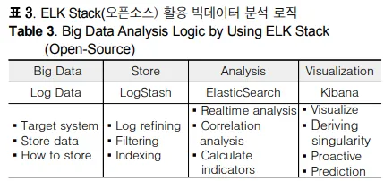

# ELK (open source)




**Elasticsearch:**
- **용도**: Elasticsearch는 실시간 분석을 위한 분산 검색 및 분석 엔진입니다.
- **기능**: 대용량의 데이터를 안정적으로 저장하고, 신속하게 검색 및 집계할 수 있습니다.
- **활용**: 로그, 지표, 트랜잭션 등의 다양한 유형의 데이터를 색인화하고 검색하는 데 사용됩니다.

**Logstash:**
- **용도**: Logstash는 다양한 소스에서 로그 데이터를 수집하고, 변환하며, Elasticsearch 또는 다른 저장소로 전송하는 역할을 합니다.
- **기능**: 다양한 입력 소스로부터 데이터를 수집하고, 그 데이터를 필터링, 변환, 가공한 후, 목적지로 전송합니다.
- **활용**: 다양한 형식의 로그 데이터를 통합하여 표준화된 형태로 Elasticsearch로 전송하여 분석하거나 저장합니다.

**Kibana:**
- **용도**: Kibana는 Elasticsearch에 저장된 데이터를 시각화하고 대시보드를 만들 수 있는 웹 인터페이스입니다.
- **기능**: Elasticsearch에서 검색된 데이터를 그래프, 차트, 맵 등 다양한 시각적 형태로 표현할 수 있습니다.
- **활용**: 로그 데이터의 추세, 이벤트, 경고 등을 실시간으로 모니터링하고 분석할 때 사용됩니다.


### [ 디렉토리 구조 ]
- 목표 : 침해대응 관제 시스템 구성하기 (+실시간, +ML)

```
docker
├── compose.yml
├── logstash
│   ├── pipeline
│   │   ├── logstash.conf
├── kibana
│   ├── config
│   │   ├── kibana.yml
```

## 1️⃣ Docker에서 ELK 실행

- 📌01. Docker Compose 설정 (compose.yml)
```
version: "3"
networks:
  elk:
    driver: bridge

services:
  # 🟢 Elasticsearch 설정
  elasticsearch:
    container_name: elasticsearch
    image: elasticsearch:7.17.16
    ports:
      - "9200:9200"
      - "9300:9300"
    volumes:
      - ./elasticsearch:/usr/share/elasticsearch/data
    environment:
      - discovery.type=single-node
      - xpack.security.enabled=true
      - xpack.security.transport.ssl.enabled=true
      - ELASTIC_USERNAME=elastic
      - ELASTIC_PASSWORD=elastic123!@#
    networks:
      - elk

  # 🟡 Logstash 설정
  logstash:
    container_name: logstash
    image: docker.elastic.co/logstash/logstash:7.17.16
    ports:
      - "5000:5000"
      - "9600:9600"
    volumes:
      - ./logstash/pipeline/logstash.conf:/usr/share/logstash/pipeline/logstash.conf
    depends_on:
      - elasticsearch
    networks:
      - elk

  # 🔵 Kibana 설정
  kibana:
    container_name: kibana
    image: kibana:7.17.16
    ports:
      - "5601:5601"
    volumes:
      - ./kibana/config/kibana.yml:/usr/share/kibana/config/kibana.yml
    depends_on:
      - elasticsearch
    networks:
      - elk
```
- 📌02. Kibana 설정 (kibana.yml)

```
server.name: kibana
server.host: "0"
elasticsearch.hosts: http://elasticsearch:9200
elasticsearch.username: "elastic"
elasticsearch.password: "elastic123!@#"
```
- 📌 03.Logstash 설정 (logstash.conf)
```
input {
  tcp {
    port => 5000
    codec => json_lines
  }
}

output {
  elasticsearch {
    hosts => "elasticsearch:9200"
    user => "elastic"
    password => "elastic123!@#"
    index => "logstash-%{+YYYY.MM.dd}"
  }
}
```

- 도커 컴포즈 실행 
```angular2html
docker compose up -d
http://localhost:5601에서 Kibana 접속 확인
```

## 2️⃣ Spring Boot에서 Logstash 사용
- 📌 Gradle 의존성 추가 (build.gradle)
```
implementation 'net.logstash.logback:logstash-logback-encoder:7.4'
```
- 📌 Logstash 설정 (logback-spring.xml)
```
<appender name="LOGSTASH" class="net.logstash.logback.appender.LogstashTcpSocketAppender">
    <destination>localhost:5000</destination>
    <encoder class="net.logstash.logback.encoder.LogstashEncoder"/>
</appender>

<logger name="INFO_LOG" level="DEBUG">
    <appender-ref ref="LOGSTASH"/>
</logger>
```
- 📌 로그 기록 코드 추가
```
// 클라이언트 IP 까지 따와서 로깅을 남김
@Component
@Order(Ordered.HIGHEST_PRECEDENCE)
public class GlobalRequestLoggingFilter implements Filter {
private static final Logger log = LoggerFactory.getLogger(GlobalRequestLoggingFilter.class);

@Override
public void doFilter(ServletRequest request, ServletResponse response, FilterChain chain)
throws IOException, ServletException {
HttpServletRequest req = (HttpServletRequest) request;
String clientIP = req.getRemoteAddr(); // 클라이언트 IP 가져오기
log.info("Request from IP: {} - {} {}", clientIP, req.getMethod(), req.getRequestURI());
chain.doFilter(request, response);
}
        }
```

## 3️⃣ Kibana에서 로그 확인
1.	Kibana 접속 → http://localhost:5601
2.	Analytics > Discover 메뉴 클릭
3.	Create index pattern → logstash-* 추가
4.	@timestamp 선택 후 저장
5.	로그 확인 🚀

```angular2html
✅ 요약
	1.	docker-compose.yml을 사용해 ELK 스택 실행
	2.	logstash.conf로 Logstash 입력/출력 설정
	3.	logback-spring.xml을 설정해 Spring Boot 로그를 Logstash로 전송
	4.	Kibana에서 logstash-* 인덱스 패턴을 생성해 로그 확인
```
