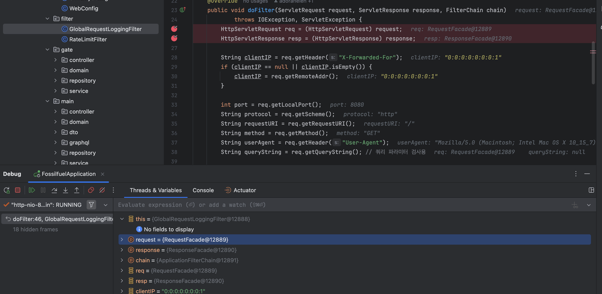

# 디버깅(Debugging)과 IntelliJ 디버깅

## 디버깅이란?
디버깅은 프로그램에서 발생하는 버그를 찾아내고 수정하는 과정입니다. 개발 과정에서 코드를 실행하며 논리적 오류나 런타임 에러를 파악하여 해결합니다.

### 디버깅의 주요 단계
1. **버그 재현**: 문제를 정확히 재현하여 발생 조건을 이해합니다.
2. **원인 분석**: 문제의 원인을 코드나 데이터에서 찾아냅니다.
3. **수정 및 테스트**: 문제를 수정하고 다시 실행하여 해결 여부를 확인합니다.
4. **회귀 테스트**: 수정이 다른 기능에 영향을 주지 않았는지 확인합니다.

---

## IntelliJ에서 디버깅하기

IntelliJ IDEA는 강력한 디버깅 도구를 제공합니다. 디버깅을 통해 코드를 한 줄씩 실행하거나 변수 상태를 실시간으로 확인할 수 있습니다.

### 1. 디버깅 준비
- **Breakpoint 설정**:
    - 코드의 중단점을 설정하려면 실행 라인 번호 옆을 클릭합니다. 붉은 점이 나타나며, 이 라인에서 디버깅이 멈춥니다.

### 2. 디버깅 시작
- **디버깅 모드로 실행**:
    - `Shift + F9`를 눌러 디버깅 모드로 실행합니다.
    - 실행 중 Breakpoint에서 코드가 멈추고 IntelliJ의 Debug 창에 제어가 넘어옵니다.

### 3. 디버깅 창의 주요 기능
- **Variables 탭**: 현재 메서드에서 사용 중인 변수와 값이 표시됩니다.
- **Watches 탭**: 특정 변수를 추가로 관찰하고 값의 변화를 추적합니다.
- **Call Stack**: 현재 호출된 메서드의 호출 경로를 보여줍니다.
- **Breakpoints**: 설정한 중단점 목록을 관리할 수 있습니다.

### 4. 디버깅 명령어
- **Step Over (F8)**: 현재 라인을 실행하고 다음 라인으로 이동합니다.
- **Step Into (F7)**: 메서드 내부로 진입하여 디버깅을 계속합니다.
- **Step Out (Shift + F8)**: 현재 메서드를 빠져나와 호출한 메서드로 돌아갑니다.
- **Resume (F9)**: 중단점을 건너뛰고 프로그램 실행을 계속합니다.

### 5. Expression Evaluation
- 디버깅 중에 특정 표현식의 값을 평가하려면:
    - `Alt + F8`을 눌러 "Evaluate Expression" 창을 엽니다.
    - 표현식을 입력하고 결과를 확인합니다.

### 6. 로그 활용
- Breakpoint를 설정할 때 **Log Message to Console** 옵션을 활성화하면 프로그램이 중단되지 않고 로그를 출력합니다.

---

## 디버깅 팁
1. **작은 단위 테스트**: 문제를 격리하고 작은 코드 단위에서 테스트를 진행하세요.
2. **문제 상황 기록**: 재현 가능한 상황을 기록해 협업 시 명확한 정보를 제공하세요.
3. **디버그 메시지 활용**: 적절한 로그를 추가해 실행 흐름을 추적하세요.

IntelliJ IDEA의 디버깅 기능은 복잡한 문제를 파악하고 해결하는 데 매우 유용하며, 이를 잘 활용하면 디버깅 시간을 크게 단축할 수 있습니다.