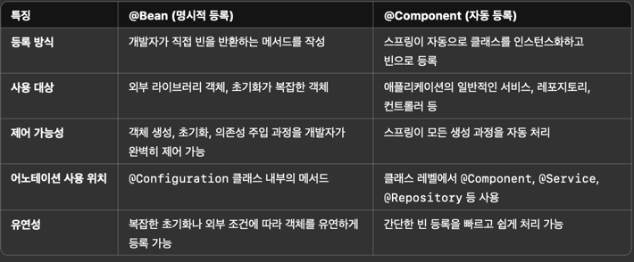

# @스프링 

### @Bean :
- Spring Framework에서 @Bean으로 정의된 메서드는 기본적으로 싱글톤(Singleton)
### @Component :
- Spring의 기본 Bean 스코프는 싱글톤(Singleton)이므로, 별도로 스코프를 변경하지 않는 한, @Component로 등록된 클래스는 기본적으로 싱글톤

### => @Autowired 로 주입 (class 내부)

- @Component는 class level에 선언되고 @Bean은 method 레벨에 선언

스프링 부트에서 **빈(Bean)**은 애플리케이션 컨텍스트에서 관리하는 객체로, 애플리케이션의 구성 요소를 생성, 주입, 관리, 소멸하는 중요한 역할을 합니다. 이를 더 잘 이해하려면 빈의 생애주기와 스프링에서 제공하는 다양한 빈 스코프(scope)를 아는 것이 중요합니다. 아래는 기본적인 개념부터 고급 레벨까지 빈과 관련된 내용을 정리한 것입니다.

⸻

1. 스프링 빈이란?

스프링 빈은 스프링 IoC(제어의 역전) 컨테이너에 의해 생성되고 관리되는 객체입니다. 다음 세 가지 조건을 만족하면 스프링 빈으로 관리됩니다:
1.	스프링 컨테이너에 의해 생성 및 관리됨.
2.	@Component, @Service, @Repository, @Controller 등의 어노테이션이나 @Bean 정의로 등록됨.
3.	빈의 생명주기를 컨테이너가 관리함.

⸻

2. 빈의 생성 시점

(1) 애플리케이션 시작 시점
•	대부분의 빈은 스프링 애플리케이션이 실행될 때 컨텍스트 초기화 과정에서 생성됩니다.
•	예를 들어 @Component나 @Configuration에 의해 등록된 빈은 애플리케이션 컨텍스트가 시작될 때 생성됩니다.

@Component
public class MyComponent {
public MyComponent() {
System.out.println("MyComponent 빈 생성됨!");
}
}

이 경우 애플리케이션이 시작되면 컨테이너가 자동으로 MyComponent를 생성합니다.

⸻

(2) 지연 초기화(Lazy Initialization)
•	**@Lazy**를 사용하면 빈이 컨테이너 초기화 시점이 아닌, 빈이 실제로 사용될 때 생성됩니다.

@Component
@Lazy
public class MyLazyComponent {
public MyLazyComponent() {
System.out.println("MyLazyComponent 빈 생성됨!");
}
}

	•	사용하지 않으면 생성되지 않으므로 메모리나 초기화 시간을 절약할 수 있습니다.
	•	주로 애플리케이션 성능 최적화에 사용됩니다.

⸻

3. 빈의 소멸 시점

빈의 소멸은 컨테이너가 종료될 때 발생합니다. @PreDestroy 또는 빈 생명주기 인터페이스를 구현하여 소멸 과정을 처리할 수 있습니다.

(1) @PreDestroy

@Component
public class MyComponent {
@PreDestroy
public void cleanUp() {
System.out.println("MyComponent 빈이 소멸됩니다.");
}
}

(2) DisposableBean 인터페이스

@Component
public class MyDisposableComponent implements DisposableBean {
@Override
public void destroy() throws Exception {
System.out.println("MyDisposableComponent 소멸!");
}
}

⸻

4. 빈의 생애주기(Lifecycle)

스프링 빈은 다음 과정을 거칩니다:
1.	빈 생성
•	빈의 생성자가 호출되고 객체가 메모리에 로드됩니다.
2.	의존성 주입(DI, Dependency Injection)
•	@Autowired 또는 생성자/Setter를 통해 빈의 의존성이 주입됩니다.
3.	초기화(Initialization)
•	빈이 준비되기 전 @PostConstruct 또는 InitializingBean 인터페이스의 afterPropertiesSet() 메서드가 호출됩니다.
4.	사용(Ready-to-use)
•	빈이 애플리케이션에서 사용됩니다.
5.	소멸(Destruction)
•	컨테이너가 종료될 때 빈이 소멸되며 @PreDestroy 또는 DisposableBean.destroy() 메서드가 호출됩니다.

⸻

5. 스프링 빈의 스코프(Scope)

빈의 생애주기를 결정하는 스코프는 크게 다섯 가지가 있습니다:

(1) Singleton (기본값)
•	정의: 애플리케이션 컨텍스트당 하나의 인스턴스만 생성됨.
•	생성 시점: 컨텍스트 초기화 시.
•	사용 예: 대부분의 서비스나 DAO 빈에 적합.

@Scope("singleton")
@Component
public class SingletonBean {
}

⸻

(2) Prototype
•	정의: 요청할 때마다 새로운 빈 인스턴스가 생성됨.
•	생성 시점: 빈이 요청될 때.
•	사용 예: 상태를 가지는 비즈니스 객체.

@Scope("prototype")
@Component
public class PrototypeBean {
}

주의: Prototype 빈은 소멸 콜백(@PreDestroy)이 호출되지 않습니다. 수동으로 관리해야 합니다.

⸻

(3) Request (웹 애플리케이션)
•	정의: HTTP 요청마다 하나의 빈 인스턴스가 생성되고 요청이 끝나면 소멸됨.
•	사용 예: 요청에 따라 다른 데이터를 처리하는 경우.

@Scope("request")
@Component
public class RequestScopedBean {
}

⸻

(4) Session (웹 애플리케이션)
•	정의: HTTP 세션마다 하나의 빈 인스턴스가 생성됨.
•	사용 예: 사용자 세션 데이터를 저장할 때.

@Scope("session")
@Component
public class SessionScopedBean {
}

⸻

(5) Application
•	정의: 서블릿 컨텍스트(Application Context)당 하나의 빈 인스턴스가 생성됨.
•	사용 예: 애플리케이션 전역 데이터를 저장할 때.

@Scope("application")
@Component
public class ApplicationScopedBean {
}

⸻

6. 고급 레벨: BeanPostProcessor 활용

스프링은 BeanPostProcessor를 통해 빈의 초기화 전후에 추가 작업을 수행할 수 있습니다.

BeanPostProcessor 예제

@Component
public class CustomBeanPostProcessor implements BeanPostProcessor {

    @Override
    public Object postProcessBeforeInitialization(Object bean, String beanName) throws BeansException {
        System.out.println("Before Initialization: " + beanName);
        return bean;
    }

    @Override
    public Object postProcessAfterInitialization(Object bean, String beanName) throws BeansException {
        System.out.println("After Initialization: " + beanName);
        return bean;
    }
}

⸻

7. 빈의 조건부 생성

스프링 부트에서 조건부 빈 생성을 위해 @Conditional 또는 **@Profile**을 사용할 수 있습니다.

@Conditional 예제

@Configuration
public class AppConfig {

    @Bean
    @ConditionalOnProperty(name = "feature.enabled", havingValue = "true")
    public MyFeatureBean myFeatureBean() {
        return new MyFeatureBean();
    }
}

⸻

요약
1.	빈 생성 시점: 기본적으로 애플리케이션 컨텍스트 초기화 시 생성.
2.	빈 소멸 시점: 컨텍스트 종료 시 호출.
3.	스코프: Singleton, Prototype, Request, Session, Application.
4.	고급 관리: BeanPostProcessor, 조건부 빈 생성, 빈 생명주기 어노테이션 활용.

