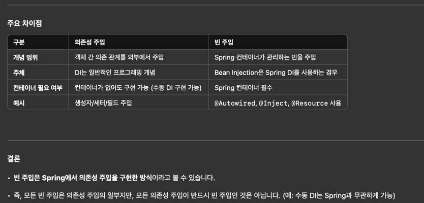

# DI

좋아, 더 쉽게 설명해볼게. **“의존성 주입(Dependency Injection)”**과 **“빈 주입(Bean Injection)”**의 차이를 아주 간단히 구분해보자.

⸻

1. 의존성 주입 (Dependency Injection)
   •	의미: 어떤 객체가 필요로 하는 **다른 객체(의존성)**를 외부에서 주입해주는 개념이야.
   •	이건 Spring이 아니더라도, 프로그래밍에서 의존성을 관리하는 일반적인 방식이야.

예: 의존성 주입의 기본 개념 (Spring이 없어도 사용 가능)

public class Car {
private Engine engine; // Car는 Engine이 필요함 (의존성)

    // 생성자 주입
    public Car(Engine engine) {
        this.engine = engine;
    }
}

	•	여기서 Engine 객체는 외부에서 Car에 전달되어야 해. 이게 의존성 주입이야.

⸻

2. 빈 주입 (Bean Injection)
   •	의미: Spring 컨테이너가 관리하는 **빈(Bean)**을 다른 객체에 주입하는 방식이야.
   •	Spring 컨테이너는 @Component나 @Bean 같은 애너테이션을 통해 객체를 관리하고, 필요한 곳에 주입해줘.

예: 빈 주입 (Spring의 DI 사용)

@Component
public class Engine {
// Spring이 이 클래스를 관리하는 Bean으로 등록
}

@Component
public class Car {
private final Engine engine;

    // 빈 주입 (@Autowired 사용)
    @Autowired
    public Car(Engine engine) {
        this.engine = engine; // Spring이 Engine 빈을 찾아서 넣어줌
    }
}

	•	여기서는 Engine 객체가 Spring 컨테이너에 의해 관리되고, Car에 자동으로 주입되는 걸 볼 수 있어.
이게 “빈 주입”이야.

⸻

핵심 차이
1.	의존성 주입 (DI)
•	의존성을 외부에서 넣어주는 “일반적인 개념”
•	Spring과 상관없이 사용 가능
2.	빈 주입 (Bean Injection)
•	Spring 컨테이너가 관리하는 “Spring 빈”을 다른 곳에 주입
•	Spring 컨테이너가 있어야 동작

⸻

비교 그림

의존성 주입	빈 주입
Car는 Engine이라는 의존성을 필요로 함.	Spring이 관리하는 Engine 빈을 주입함.
외부에서 주입할 객체를 직접 생성하거나 관리함.	Spring 컨테이너가 빈을 생성하고 관리함.
Spring이 없어도 구현 가능.	Spring 컨테이너가 필수.

⸻

요약
•	의존성 주입: 객체가 필요한 의존성을 외부에서 넣어주는 일반 개념.
•	빈 주입: Spring에서 의존성 주입을 할 때 Spring 컨테이너가 관리하는 빈을 주입하는 방식.

이제 조금 더 이해가 될까? 😊