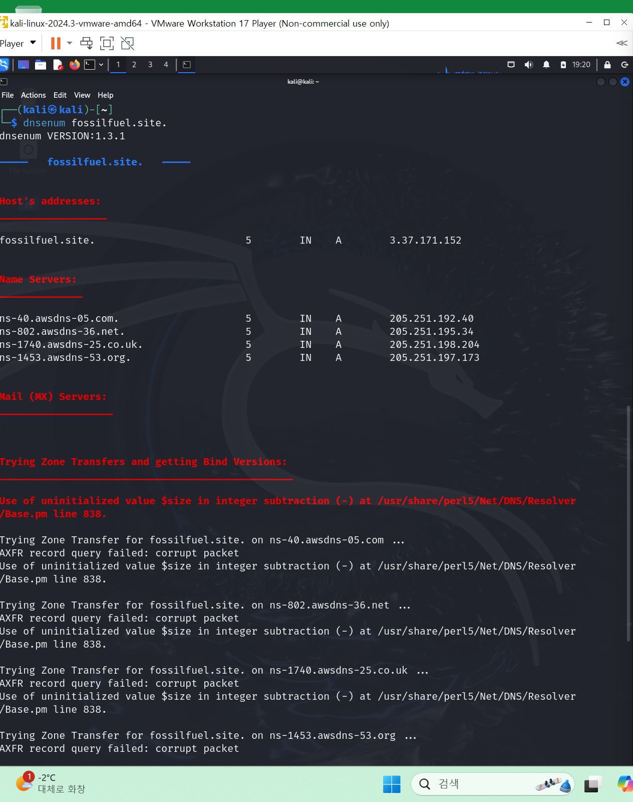

## 모의 침투 프레임워크

- 칼리리눅스를 활용한 모의 침투 테스트와 와 보안 진단 (에이콘 출판)

01. 대상 범위 설정
02. 정보 수집
03. 대상 발견
04. 대상 탐색
05. 취약성 매핑
06. 사회공학
07. 대상 익스플로잇
08. 권한 상승
09. 유지 보수 접근
10. 문서화 및 보고

[출처] [칼리리눅스 모의해킹] 5. 모의해킹 방법(모의해킹 순서)
* 프레임 워크(방법론) 및 체크리스트|작성자 평범한 회사원

## 모의 침투 체크리스트
### 모의해킹은 서비스 사업이다.

- => 고객은 Needs 파악이 제일 중요하다.
- 01. 고객의 요구사항을 수집한다.
    * 회사 이름이나 주소, 모의 해킹 테스트를 의뢰한 이유(목표 등)
- 02. 테스트 계획 수립 
    * 리소스 할당, 비용분석, 비밀유지

## DNS 정보 수집 
- DNS 란 우리가 www.domain.com 을 입력하면 이를 127.01.01 등 IP주소로 변환함
- 실제 도메인은 하나가 아님, 서브 도메인이 여럿 혹은 무수히 존재함
- 중요 이유 : 해커는 취약한 서브 도메인을 타고 취약점을 찾아 침투함 
    * 관리자가 잘 모르는 서브 도메인이 존재하면 취약점 조치나 패치가 미흡함

### dnsenum (Kali-linux tool)

- 호스트 IP 주소, 도메인의 DNS 서버, 도메인 MX 레코드, 서브 도메인
- └─$ dnsenum fossilfuel.site  
- 결과 해석
    * 01 호스트 주소 : **fossilfuel.site**의 IP 주소: 3.37.171.152
    * 02 **fossilfuel.site**의 네임 서버:
    - ns-40.awsdns-05.com (IP: 205.251.192.40)
    - ns-802.awsdns-36.net (IP: 205.251.195.34)
    - ns-1453.awsdns-53.org (IP: 205.251.197.173)
    - ns-1740.awsdns-25.co.uk (IP: 205.251.198.204)
    * 03 메일 서버 : 결과에 표시된 메일 서버가 없음
    * 04 존 전송 시도 : 차단 당함

### whois (Kali-linux tool)
- └─$ whois fossilfuel.site
    * 도메인 정보 (등록일, 업데이트 날짜, 만료일 전부 파싱)

