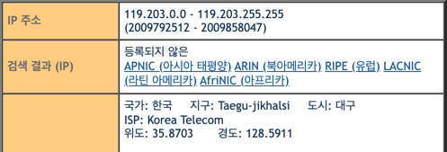
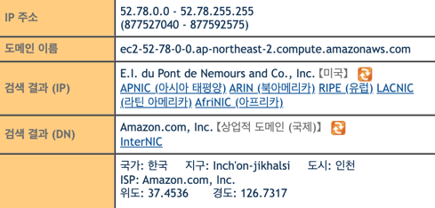
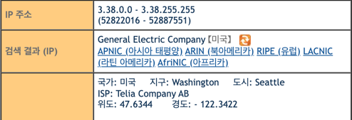
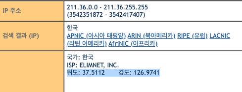
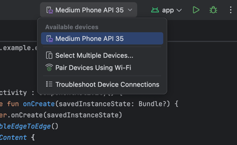
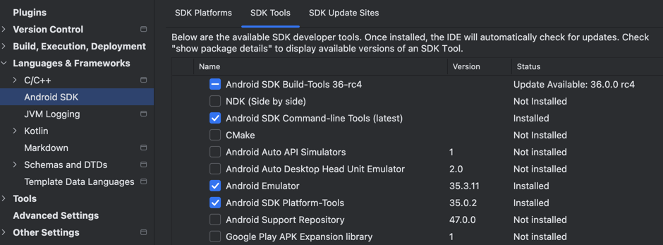

# 네이버 아이디 해킹 사건

> => 02월 08일 발견 및 조치, IP 추적 & 포렌식 시도 

## 01. 침해사고 발생 
- 어머니, 네이버 로그인 불가능 
- 휴대폰 인증을 통해서 접속 -> 정지 상태(계정)
- 소명 후 원인 파악 -> 해킹 & 악성 글 작성으로 정지

## 02. 초기 대응
- 비밀번호 변경

## 03. 사고 조사 (데이터 수집&데이터 분석)

# 3-1. 네트워크 (IP 추적)
### 로그인 기록
로그인 기록은 최근 3개월
#### 일반 로그인 ✓
- **기간**: 2024. 12. 02. - 2025. 02. 0

| 일시               | 로그인 IP       | 국가      | 기기     |
|--------------------|-----------------|-----------|----------|
| 2025. 01. 14. 14:36 | 211.36.133.75   | 대한민국  | PC (웹) |
| 2025. 01. 14. 12:52 | 3.38.110.221    | -         | PC (웹) |
| 2025. 01. 14. 11:12 | 3.37.87.166     | -         | PC (웹) |
| 2025. 01. 14. 10:50 | 52.78.94.83     | -         | PC (웹) |
| 2025. 01. 14. 09:56 | 119.203.160.215 | 대한민국  | PC (웹) |
| 2025. 01. 14. 09:25 | 3.34.254.129    | -         | PC (웹) |

---

### 정보 수정 이력
비밀번호 변경(최근 6개월 내) 및 연락처 수정 이력 (52번 인천, 3.38번 미국)

| 일시                  | 변경 내용   | 변경 방법                                 | 변경 IP        |
|-----------------------|-------------|-------------------------------------------|--------------|
| 2025. 02. 08. 13:33   | 휴대전화    | -                                         | 집            |
| 2025. 02. 08. 13:34   | 비밀번호    | 보호조치 해제 시 비밀번호 변경            | 집            |
| 2025. 02. 08. 13:26   | 비밀번호    | 비밀번호 찾기 > 본인명의 휴대전화로 인증 | 집            |
| 2025. 01. 14. 12:52   | 비밀번호    | 내정보(네이버ID) > 보안설정 > 비밀번호 변경 | 3.38.110.221 |
| 2025. 01. 14. 10:50   | 비밀번호    | 내정보(네이버ID) > 보안설정 > 비밀번호 변경 | 52.78.94.83  |

### IP 분석

- VPN을 사용해서 IP 추적을 어렵게 만들고 있음 
- 오전 09시 25분 VPN 통해 미국에서 접속 : 3.34.254.129
- 오전 09시 56분 대구에서 접속 : 119.203.160.215
- 오전 10시 50분 인천에서 접속 & 비밀번호 변경(1차) : 52.78.94.83
- 오전 11시 12분 VPN 통해 미국에서 접속 : 3.37.87.166
- 오후 12시 52분 VPN 통해 미국에서 접속 & 비밀번호 변경(2차) : 3.38.110.221
- 오후 14시 36분 서울(한강대교)에서 접속 : 211.36.133.75
  * 위도 경도가 한강대교 고정이라 유동 IP 라고 생각됨 










# 3-2. 모바일 포렌식
- 어머니는 컴퓨터를 사용하지 않으시기에, 모바일 해킹의 가능성을 고려했다.
> 안드로이드 OS에서 1월 13일의 모든 로그를 확인하는 방법

- 01 안드로이드 스튜디오 설치


- 02 연결 (USB & 개발자 모드)
  * 안드로이드 기기에서 개발자 옵션 → USB 디버깅 활성화


- 03 ADB 설치 (SDK)
  * adb devices (아래에 있는 해당 경로에서) 로 디바이스 연결 확인
> /Users/사용자 이름/Library/Android/sdk/platform-tools



- 04 포렌식 환경 설정
> .bash_profile 파일 생성, 안에 환경변수 입력하고 실행

- 05 포렌식 진행 
```plaintext
2️⃣ 1월 13일의 시스템 로그 조회:
$ adb logcat -b system -v time | grep "01-13"

3️⃣ 로그를 파일로 저장하려면:
$ adb logcat -b system -v time | grep "01-13"

해킹 흔적이 있는지 더 자세히 분석하려면 보안 로그(security)와 이벤트 로그(events) 도 확인
$ adb logcat -b events -v time | grep "01-13"
$ adb logcat -b security -v time | grep "01-13"

[위 명령어들은, 수행은 하되 무한 로딩 같은 느낌으로 멈춰있었고]

$ adb shell dmesg | tail -n 50
🚨 dmesg: klogctl: Permission denied 오류 발생

=> 루트 권한이 없어서 dmesg 로그를 확인할 수 없다
=> Android에서는 보안 정책상 비루트(rootless) 상태에서 커널 로그 접근을 제한
=> ✅ 해결 방법 (Root 권한 필요) : 루팅을 해야한다.


📌 결론:
	•	dmesg 로그는 루트 권한이 필요하므로 비루트 상태에서는 접근 불가.
	•	대체 방법으로 logcat, dumpsys, /proc 파일 시스템을 활용해야 함.
* 로그캣은 시간이 오래걸림 (무한로딩)
```


### 결론 (실패) 
- 권한 부족 =>루팅 
- 석사학위논문 참고
  * 안드로이드 스마트폰 논리적 포렌식 기법 (고려대, 노호승, 2014)

---

## 안드로이드 스마트폰의 논리적 포렌식 기법 연구(2014)

### 연구 배경 및 목적

스마트폰은 개인 정보를 많이 포함하고 있어 법적 증거로 활용될 수 있지만, 다양한 제조사와 운영체제 버전으로 인해 포렌식 분석이 어렵다. 특히, 안드로이드는 개방형 운영체제로 지속적인 업데이트와 루팅 난이도의 증가로 인해 기존 포렌식 기법 적용이 어렵다. 기존 연구는 주로 해외 기종을 대상으로 진행되어 국내 스마트폰에 대한 연구가 부족한 상황이다.

### 연구 내용

논문에서는 국내 주요 제조사의 안드로이드 스마트폰을 대상으로 루트 권한을 획득하는 방법과 물리적 이미지 획득 방법을 연구했다. 특히, ADB(Android Debug Bridge), 루팅, 콘텐츠 프로바이더 등을 활용한 논리적 포렌식 기법을 구현하고, 삼성, LG, 팬텍 기기의 테스트를 수행했다.

### 결론 및 의의

안드로이드 포렌식은 기종과 운영체제에 따라 접근 방식이 달라야 하며, 국내 기종에 맞춘 연구가 필요하다. 본 연구는 다양한 국내 기기를 대상으로 한 실험을 통해 포렌식 기법을 검증하고, 향후 보다 발전된 분석 방법을 연구하는 데 기여할 수 있다.

---