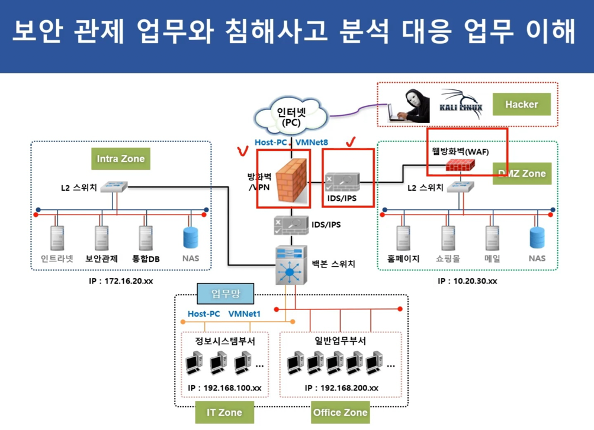

# 모의해킹 기획안 

## 01. 네트워크 환경 구성
공격자와 방어자를 분리된 네트워크에 배치
- 공격자 네트워크: (통신사 공유기)
- 방어자 네트워크: (ipTime 공유기)

### 1-2 네트워크 통신 구성
공격자가 방어자에게 접근할 수 있는 경로 설정

1.	포트 포워딩:
- ipTime 에서 특정 포트를 열어 방어자(Window)로 트래픽을 전달(부하).
  * 예: 개인용 공유기에서 **22번 포트(SSH)나 80번 포트(HTTP)**를 방어자의 IP로 포워딩.
  *  (포트를 열어 외부 접근을 허용하고 공격을 허용)

2. VPN 구성:
- 두 네트워크를 VPN으로 연결하여, 공격자가 VPN 터널을 통해 방어자 네트워크에 접근하도록 설정.
  * 필수는 아님


## 02. 모의해킹 구성
```bash
공격자 (Mac)
•	기본 OS에서 공격 도구 설치 및 실행.
•	Docker 기반 Kali Linux로 가볍게 공격 환경 구성.
•	네트워크 브리지 설정으로 방어자와 통신.

방어자 (Windows)
•	Windows에서 방어와 분석 도구 실행.
•	VMware로 Ubuntu Server를 추가하여 웹 서버 운영.
•	포트 포워딩 및 IDS로 실제 방어 실습.
```


### 2-1 공격자 환경 

공격자 환경 (Mac)
```bash
기본 OS = macOS

도커 기반 Kali Linux:

도구 설치:
nmap, tcpdump, hydra, netcat, metasploit.
	  + Wireshark: 네트워크 패킷 분석.
	  + Metasploit Framework: 취약점 공격 및 모의 침투.
	  + Burp Suite: 웹 공격 실습.
	  
	  
	•	도구:
	•	네트워크 스캐닝: Nmap, Masscan
	•	취약점 분석: Nessus, OpenVAS
	•	웹 취약점 테스트: Burp Suite, OWASP ZAP
	•	익스플로잇 도구: Metasploit Framework
	•	패킷 분석: Wireshark, tcpdump
	•	브루트포싱: Hydra, John the Ripper	  
```

### 2-2 방어자 환경 
방어자 환경 (Windows)
```bash
기본 OS: Windows 10/11
- 주로 방어와 서버 운영 테스트를 위한 환경.
- 실습 중 네트워크 로그 분석과 서버 방어 논리 설계.

VMware:
Ubuntu 또는 CentOS를 설치하여 방어자 서버 역할을 수행

Spring 웹 서버:
- Windows에서 Spring 기반 웹 서버를 실행하여 공격 대상 제공.
- 포트 8080 또는 443으로 외부에서 접근 가능하도록 설정.

네트워크 설정:
- 포트 포워딩: 
  * Windows Defender Firewall에서 특정 포트를 열어 공격 실습.
- 방화벽 및 IDS:
  * 추가적으로 Snort 또는 Suricata 같은 IDS 설치 가능.

	•	도구:
	•	IDS/IPS: Snort, Suricata
	•	방화벽: Windows Defender Firewall 설정
	•	로깅 및 모니터링: Sysmon, ELK Stack
	•	악성코드 분석: Cuckoo Sandbox
	•	패킷 분석: Wireshark
```

## 03. 시나리오 

### 공격 목표
1.	네트워크 침투:
- 	공격자가 Nmap으로 방어자 네트워크의 열린 포트 탐색.
- 방어자가 의도적으로 열어둔 포트(예: 80, 443)를 공격.
2. 취약점 악용:
- Metasploit을 사용해 방어자 시스템에 존재하는 취약점(예: SMB 취약점)을 악용.
- SQL Injection, XSS 등의 웹 공격.
3. 패스워드 크래킹:
- Hydra로 SSH 또는 RDP 패스워드 크래킹 시도.
4. DDoS 시뮬레이션:
- LOIC/HOIC와 같은 도구로 방어자 네트워크에 DDoS 트래픽 유입.

```bash
  공격자 입장에서:
  •	네트워크 탐지, 취약점 스캔, 익스플로잇 및 후속 공격 수행.
  방어자 입장에서:
  •	공격 탐지, 로그 분석, 차단 및 보안 정책 강화.
```
