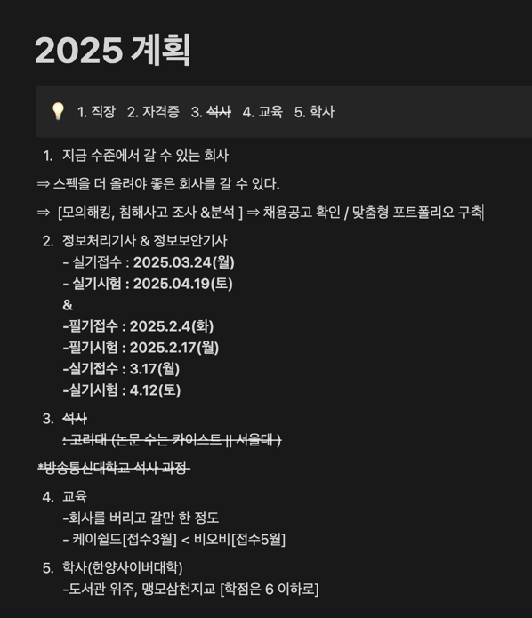

# A. 순서
01. 정보보안기사 필기 (2월)
  * 케이쉴드 주니어 접수 (3월 예상)
02. 정보처리기사 실기 (4월)
  * 차세대 보안리더 BOB 접수 (5월)




# B. 네트워크 보안 시스템 파악

## 방화벽(Firewall) 및 네트워크 침입 탐지 시스템(IDS/IPS) 확인 방법


### 1. 방화벽 확인 방법

#### a. 라우터 또는 네트워크 장비 확인
1. **네트워크 경로 추적**: `traceroute` 명령어로 네트워크 경로를 확인하고, 중간에 방화벽이나 라우터 장비가 있는지 파악합니다.

    ```bash
    traceroute <destination>   # Linux/Mac
    tracert <destination>      # Windows
   
      결과에서 네트워크 장비의 IP 주소를 기록한 후, 관리 인터페이스에 접근해 방화벽 모델을 확인할 수 있습니다.

    ```

2. **라우터 관리 페이지 접속**:
    - 네트워크 관리용 라우터에 접속.
    - 일반적으로 네트워크 방화벽 설정이 라우터에서 관리됩니다.
    - 접근 주소: 192.168.1.1 또는 192.168.0.1 (관리자 계정 필요).

3. **장비 모델 확인**:
   라우터 또는 네트워크 장비의 제조사와 모델을 통해 방화벽 기능이 있는지 확인할 수 있습니다.
    - Cisco, Fortinet, Palo Alto Networks, Check Point 등이 일반적인 기업 방화벽 브랜드입니다.

#### b. 서버 내부에서 확인
1. **활성 방화벽 확인**:
    - Linux 서버에서는 `iptables` 또는 `firewalld` 명령어로 방화벽 상태를 확인할 수 있습니다.
        ```bash
        sudo iptables -L -n -v
        sudo firewall-cmd --list-all
        ```
    - Windows 서버에서는 PowerShell을 사용:
        ```powershell
        Get-NetFirewallRule
        ```

2. **방화벽 소프트웨어**:
   서버 내부에서 방화벽 소프트웨어나 에이전트가 설치되어 있는지 확인합니다.
    - 설치된 소프트웨어 목록을 확인:
        ```bash
        dpkg -l | grep firewall    # Ubuntu/Debian
        rpm -qa | grep firewall    # CentOS/Red Hat
        ```
    - Windows: 프로그램 및 기능 또는 `Get-Command`.

### 2. 네트워크 침입 탐지 시스템(IDS/IPS) 확인 방법

#### a. 서버에서 로그 확인
1. **네트워크 보안 로그**:
   IDS/IPS가 로그를 기록하는 경우, 일반적으로 다음 경로에서 확인 가능합니다.
    - `/var/log/snort/` (Snort)
    - `/var/log/suricata/` (Suricata)

2. **실행 중인 프로세스 확인**:
   IDS/IPS가 실행 중인 프로세스를 확인하려면:
    ```bash
    ps aux | grep snort
    ps aux | grep suricata
    ```

#### b. 네트워크 장비 확인
- 네트워크 장비가 IDS/IPS 기능을 제공하는 경우, 장비 관리 인터페이스에 로그인하여 설정을 확인할 수 있습니다.
- 대표적인 IDS/IPS 장비:
    - Snort
    - Suricata
    - Cisco Firepower
    - Palo Alto Networks

### 3. 네트워크 스캔 및 분석 (승인 필요)

#### a. 네트워크 장비 식별
Nmap 같은 네트워크 스캔 도구를 사용하여 방화벽이나 IDS를 탐지할 수 있습니다.
```bash
sudo nmap -sS -O <target-ip>

-sS: SYN 스캔.

-O: 운영체제 탐지.

```
#### b. IDS/IPS 탐지 확인
- 패턴 기반 탐지: 특정 트래픽이 차단되거나 로그에 기록된다면 IDS/IPS가 활성화되어 있을 가능성이 높습니다.
- 테스트 도구 사용: Snort 또는 Suricata의 룰을 테스트할 수 있는 트래픽을 생성.


# C. 정보수집 -> 해킹 -> 보안

## 정보수집 (Information Gathering)

### 1. Whois, DNS 조사
- **Whois 정보 조회**
    ```bash
    whois <domain_name>
    ```
  예:
    ```bash
    whois example.com
    ```

- **DNS 레코드 조사**
    ```bash
    dig <domain_name>
    ```
  특정 레코드 조사:
    ```bash
    dig <domain_name> ANY
    dig <domain_name> MX
    dig <domain_name> A
    ```

- **DNS 존 전송 테스트**
    ```bash
    dig <domain_name> AXFR @<dns_server>
    ```

- **NSLOOKUP 사용**
    ```bash
    nslookup <domain_name>
    ```
  특정 서버 지정:
    ```bash
    nslookup
    server <dns_server>
    set type=MX
    <domain_name>
    ```

### 2. IP 주소 추적
- **Ping을 사용한 네트워크 연결 테스트**
    ```bash
    ping <IP_or_domain>
    ```

- **Traceroute로 경로 추적**
    ```bash
    traceroute <IP_or_domain>
    ```
  ICMP 패킷 사용:
    ```bash
    traceroute -I <IP_or_domain>
    ```

- **GeoIP 조회**
    ```bash
    geoiplookup <IP>
    ```

### 3. 목록화 (Enumeration)
- **포트 스캔 (Nmap)**
    ```bash
    nmap -sV -p- <IP_or_domain>
    ```
  OS 탐지:
    ```bash
    nmap -O <IP>
    ```

- **Netcat으로 포트 열기 확인**
    ```bash
    nc -zv <IP> <port_range>
    ```

- **SNMP 스캐닝**
    ```bash
    snmpwalk -v 2c -c <community_string> <IP>
    ```

## 해킹 (Hacking)

### 1. 스니핑 (Sniffing)
- **Wireshark 설치 후 실행**
    ```bash
    wireshark
    ```

- **Tcpdump로 네트워크 패킷 캡처**
    ```bash
    tcpdump -i <interface> -w capture.pcap
    ```

- **특정 포트 필터링**
    ```bash
    tcpdump -i <interface> port 80
    ```

### 2. 스푸핑 (Spoofing)
- **ARP 스푸핑 (arpspoof)**
    ```bash
    arpspoof -i <interface> -t <target_IP> <gateway_IP>
    ```

- **IP 스푸핑 (hping3)**
    ```bash
    hping3 -a <fake_IP> <target_IP>
    ```

### 3. 터널링 (Tunneling)
- **SSH 터널링**
    ```bash
    ssh -L <local_port>:<remote_host>:<remote_port> <user>@<host>
    ```

### 4. 세션 하이재킹
- **Cookie 조작 (Burp Suite 활용)**
    - Burp Suite에서 세션 쿠키를 수정하여 하이재킹 시도.
- **Ettercap을 통한 세션 하이재킹**
    ```bash
    ettercap -T -i <interface> -M arp:remote /<target_IP>/ /<gateway_IP>/
    ```

### 5. 무선 랜 보안
- **airmon-ng로 무선 랜 인터페이스 설정**
    ```bash
    airmon-ng start <interface>
    ```

- **airodump-ng로 무선 네트워크 스캔**
    ```bash
    airodump-ng <monitor_interface>
    ```

- **WEP/WPA 크랙 (aircrack-ng)**
    ```bash
    aircrack-ng -b <BSSID> <capture_file>
    ```

### 6. DoS & DDoS
- **hping3로 SYN Flood**
    ```bash
    hping3 -S --flood -p <port> <target_IP>
    ```

- **LOIC (Low Orbit Ion Cannon)**
    - 도구 설치 후 GUI 기반 실행.

## 보안 (Security)

### 1. 방화벽
- **UFW 설정**
    ```bash
    ufw enable
    ufw allow <port>
    ufw deny <port>
    ufw status
    ```

- **iptables 규칙 설정**
    ```bash
    iptables -A INPUT -p tcp --dport <port> -j ACCEPT
    iptables -A INPUT -p tcp --dport <port> -j DROP
    ```

### 2. 네트워크 장비의 보안 설정
- **SSH 기본 포트 변경**
    ```bash
    sudo nano /etc/ssh/sshd_config
    # Port 22 -> Port <custom_port>
    sudo systemctl restart sshd
    ```

- **SNMP 비활성화**
    ```bash
    sudo systemctl stop snmpd
    sudo systemctl disable snmpd
    ```

### 3. 침입 탐지 및 모니터링
- **Fail2Ban 설치 및 설정**
    ```bash
    sudo apt install fail2ban
    sudo nano /etc/fail2ban/jail.local
    ```

- **Suricata 설치**
    ```bash
    sudo apt install suricata
    suricata -c /etc/suricata/suricata.yaml -i <interface>
    ```

- **Logwatch를 통한 로그 모니터링**
    ```bash
    sudo apt install logwatch
    logwatch --detail High --mailto <email> --range today
    ```
