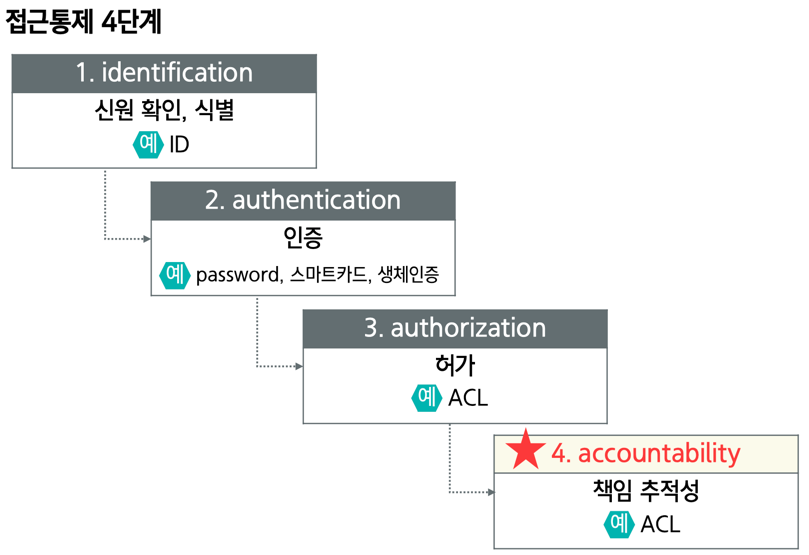
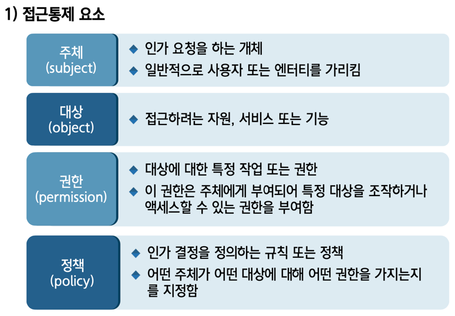
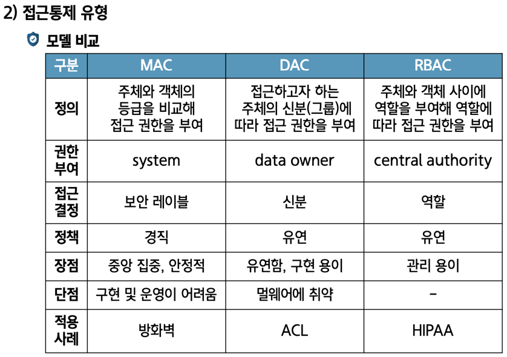

## 어플리케이션 보안 (1주차)
- 01 : 정보시스템 개요
    * 인프라 : 온프레미스(On-Premises) / 클라우드(클라우드 컴퓨팅)
    * 소프트웨어 : 시스템 / 어플리케이션

- 02 : 어플리케이션 이해
    * 데스크톱 어플리케이션(desktop applications)
    * 웹 어플리케이션(web applications)
    * 모바일 어플리케이션(mobile applications)

- 03 : 어플리케이션 보안
    * 1 : 인증(authentication)과 인가(authorization)
    * 2 : 데이터 보호(data protection)
    * 3 : 입력 유효성 검사(validation)
    * 4 : 보안 패치 관리
    * 5 : 로깅(logging) 및 모니터링(monitoring)
    * 6 : 비상 대응 계획(emergency response plan)

## 어플리케이션 보안 (2주차)

### 01. 접근통제 개념
- 접근통제 주요 원칙과 접근통제 4단계
- 1-1 직무분리 : 사용자나 역할이 필요한, 최소한의 권한만을 가지도록 
- 1-2 최소 권한(least privilege)
- 1-3 감사와 모니터링(auditing and monitoring)

### 02. 접근통제 모델
- 접근통제 요소와 접근통제 유형(MAC, DAC, RBAC)

- 2-1 mandatory access control(MAC)
  * 의무적 접근 제어 :
  * 사용자는 직접 권한을 지정하지 않으며,
    시스템이 라벨 또는 보안 등급에 따라 접근을 강제로 관리함

- 2-2 discretionary access control(DAC)
  * 자유적 접근 제어 : 
  * 개인 또는 단체가 자원을 관리하고 권한을 부여함
  * 사용자가 파일 또는 폴더에 대한 소유권을 가짐

- 2-3 role-based access control(RBAC)
  * 역할 기반 접근 제어 : 
  * 이 방식은 사용자 역할에 기반하여 권한을 관리함

### 03. 접근통제 솔루션
- 인증 시스템
  * 아이덴티티 및 액세스 관리(identity and access management, IAM)
  * 엔터프라이즈 액세스 관리(enterprise access management, EAM)
  * 단일 로그인(single sign-on, SSO)
  * 개별 계정 관리 시스템(individual account management system)

- 접근 통제 시스템 
  * 네트워크 접근통제(network access control)
  * DB 접근통제(database access control)
  * 서버 접근통제(server access control)