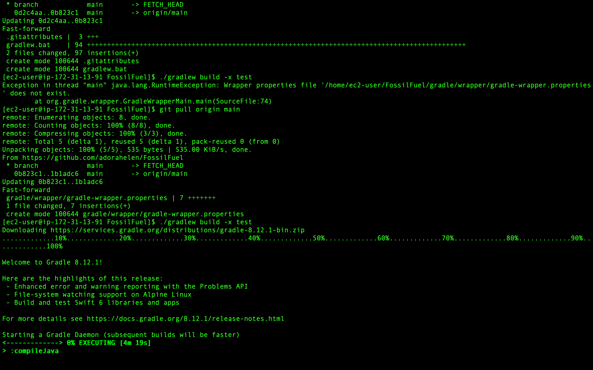
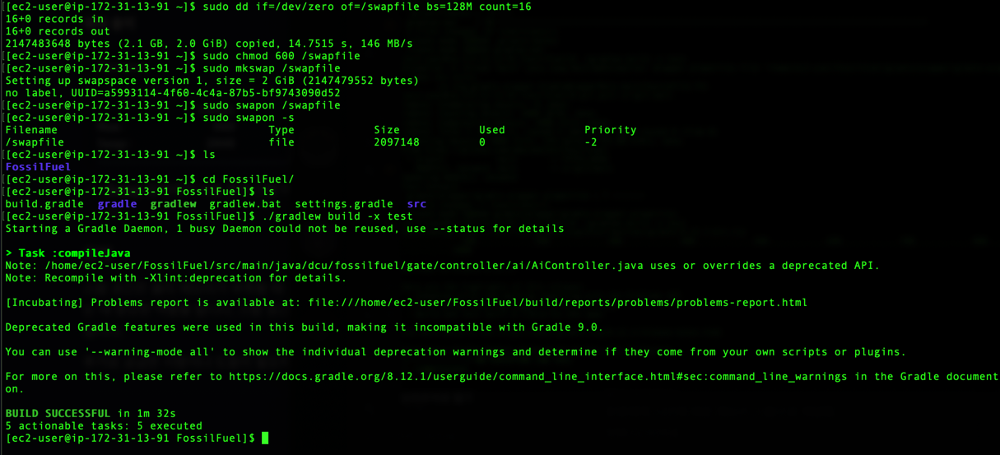

# EC2 프리티어 메모리 부족 현상 해결

### 문제상황 (빌드 무한로딩)


### 해결 (스왑 메모리 적용)


## 방법
   ```bash

# 스왑 파일 생성
sudo dd if=/dev/zero of=/swapfile bs=128M count=16

# 스왑 파일 권한 설정
sudo chmod 600 /swapfile

# 스왑 파일을 스왑 공간으로 설정
sudo mkswap /swapfile

# 스왑 파일 활성화
sudo swapon /swapfile

## 재부팅시 위 설정 사라짐 -> 하단 명령어 [재부팅 후에도 스왑 파일이 자동으로 활성화]
# /etc/fstab 파일에 스왑 파일 등록
echo '/swapfile none swap sw 0 0' | sudo tee -a /etc/fstab

```

## 스왑 메모리와 운영체제의 메모리 관리

### 운영체제의 메모리 관리

운영체제(OS)는 컴퓨터 시스템의 자원을 관리하고, 사용자와 소프트웨어 간의 인터페이스를 제공하는 중요한 소프트웨어입니다. 메모리 관리는 운영체제의 핵심 기능 중 하나로, 효율적인 메모리 할당과 자원 관리를 통해 시스템의 성능을 최적화합니다.

### 물리 메모리와 스왑 메모리

1. **물리 메모리 (RAM)**:
    - Random Access Memory (RAM)는 컴퓨터 시스템에서 현재 사용 중인 데이터와 프로그램을 저장하는 일시적인 저장 장치입니다.
    - 물리 메모리는 빠른 속도로 데이터 접근이 가능하여, CPU가 데이터를 신속하게 처리할 수 있도록 합니다.

2. **스왑 메모리 (Swap Space)**:
    - 스왑 메모리는 물리 메모리가 부족할 때 사용되는 디스크 공간입니다.
    - 운영체제는 비활성 메모리 페이지를 스왑 공간으로 이동시켜 물리 메모리를 확보하고, 필요한 경우 스왑 공간에 있는 데이터를 다시 불러옵니다.
    - 스왑 메모리는 디스크에 위치하기 때문에 물리 메모리보다 느리지만, 시스템의 안정성을 유지하는 데 중요합니다.

### 스왑 메모리 작동 원리 (설정해두면 시스템이 자동으로 사용)

1. **메모리 부족 상황**:
    - 물리 메모리가 부족해지면 시스템은 활성 메모리를 최대한 활용하려고 시도합니다.
    - 이때 여전히 메모리 요구를 충족하지 못하면 스왑 공간을 사용하게 됩니다.

2. **비활성 페이지 이동**:
    - 시스템은 현재 사용하지 않는 메모리 페이지(즉, 비활성 메모리)를 스왑 공간으로 이동시킵니다.
    - 이를 통해 물리 메모리를 확보하여 더 많은 활성 메모리 요청을 처리할 수 있습니다.

3. **스왑 사용**:
    - 스왑 공간에 이동된 페이지는 필요할 때 다시 물리 메모리로 이동됩니다.
    - 스왑 사용은 디스크 I/O를 발생시키므로 물리 메모리보다 느리지만, 시스템의 안정성을 유지하는 데 도움이 됩니다.

### 스왑 공간 설정 및 확인

#### 스왑 파일 생성 및 활성화 과정

1. **스왑 파일 생성**:
   ```bash
   sudo dd if=/dev/zero of=/swapfile bs=128M count=16
   ```
    - 2GB 크기의 스왑 파일을 생성합니다.

2. **스왑 파일의 권한 설정**:
   ```bash
   sudo chmod 600 /swapfile
   ```
    - 스왑 파일의 권한을 설정하여 루트 사용자만 읽고 쓸 수 있도록 합니다.

3. **스왑 공간 설정**:
   ```bash
   sudo mkswap /swapfile
   ```
    - 스왑 파일을 스왑 공간으로 설정합니다.

4. **스왑 파일 활성화**:
   ```bash
   sudo swapon /swapfile
   ```
    - 스왑 파일을 활성화하여 시스템에서 사용할 수 있도록 합니다.

5. **스왑 파일 확인**:
   ```bash
   sudo swapon -s
   ```
    - 활성화된 스왑 파일의 상태를 확인합니다.
   ```plaintext
   Filename             Type        Size    Used    Priority
   /swapfile            file        2097148 0       -2
   ```

### 스왑 사용 확인

스왑 사용 상태를 확인하려면 `free -m` 명령어를 사용하여 현재 스왑 메모리 사용량을 확인할 수 있습니다.

```bash
free -m
```

#### 예제 출력
```plaintext
              total        used        free      shared  buff/cache   available
Mem:            949         434         399           0         116         387
Swap:          2048           0        2048
```

- **Swap** 항목에서 사용 중인 스왑 메모리(used)와 사용 가능한 스왑 메모리(free)를 확인할 수 있습니다.

### 요약

스왑 공간은 물리 메모리가 부족할 때 운영체제에서 자동으로 사용되며, 시스템의 안정성과 성능을 유지하는 데 중요한 역할을 합니다. 스왑 공간을 설정하고 모니터링하여 시스템이 원활하게 작동하도록 할 수 있습니다.

---