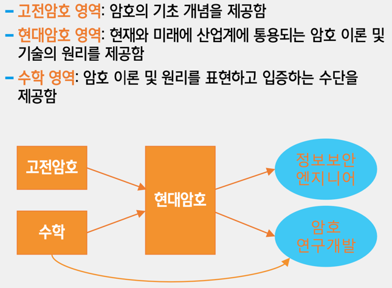
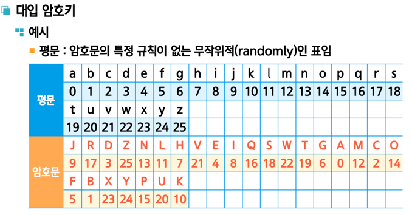
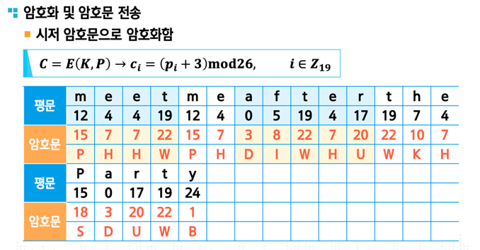
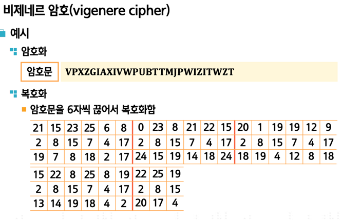

# 암호학 

## (1주차) 
#### 고전암호 20%, 현대암호 70%, 수학 10%

- 고전암호 영역
    * − 암호의 동작 원리인 대치, 전치의 개념을 설명함
    * − 암호 공격 기법의 개념을 이해할 수 있게 함

- 현대암호 영역
    * −대칭키 암호 및 비대칭키 암호 알고리듬의 동작 원리를 설명함
    * − 암호 기술을 응용한 해시, 난수발생, 키 관리의 원리와 특징
  
- 수학 영역
    * − 확률론과 정수론의 이론을 설명함
    * − 암호의 원리와 성능을 입증하고 평가하는 방법을 설명함

### 1. 고전암호
#### 1-1 고전암호 모델 : 대칭키 암호 시스템 
    * 평문(plaintext) : 𝑷=(𝒑𝟏 𝒑𝟐 ... 𝒑𝑳)
    * 암호문(ciphertext) : 𝑪=(𝒄𝟏 𝒄𝟐 ... 𝒄𝑴)
    * 암호키(cryptographic key) : 𝑲=(𝒌𝟏 𝒌𝟐 ... 𝒌𝑵)
    * 암호화(encryption) 알고리듬 : 기호 표기 : 𝑬 (∙)
    * 복호화(decryption) 알고리듬 : 기호 표기 : 𝑫 (∙)

- ex:  입력이 평문 𝑷이고 파라미터가 암호키 𝑲이며 출력이 암호문 𝑪인 함수
    * 𝑪 = 𝑬(𝑲, 𝑷)
- ex : 입력이 암호문 𝑪이고 파라미터가 암호키 𝑲이며 출력이 평문 𝑷인 함수
    *  암호화 알고리듬의 역함수로 표현, D(E(P)) = D(D-1(P)) = P 
    *  역함수란? f : X->Y 일때, 역함수는 f-1 : Y->X 를 의미한다.

- 사용되는 알고리즘 
  * 대입(substitution) 암호화 알고리듬 : 평문의 각 문자를 임의의 변환 규칙에 따라 얻은 문자로 대체함
  * 전치(transposition) 암호화 알고리듬 : 평문의 각 문자열의 위치를 임의의 이동 규칙에 따라 변경함
  * 실용적 암호화 알고리듬 : 대부분의 암호 시스템은 대입과 전치를 복합적으로 사용

#### 1-2 대입 암호 == 단일알파벳 암호(monoalphabet cipher)
- ex : 시저 암호, 아핀 암호(키2개), 비제네르 암호, 플레이페어 암호
- 대입 암호의 키는 평문 알파벳을 암호문의 알파벳으로 변환하는 문자-대- 문자 대입 매핑 표이며 26개의 원소로 구성됨
- 대입 암호(시저 암호와 아핀 암호 포함)는 하나의 평문 문자에 하나의 암호문 문자가 대응함

#### 1-3 전치 암호 
- 스키테일 암호, 레일펜스 암호, 행렬전치 암호
