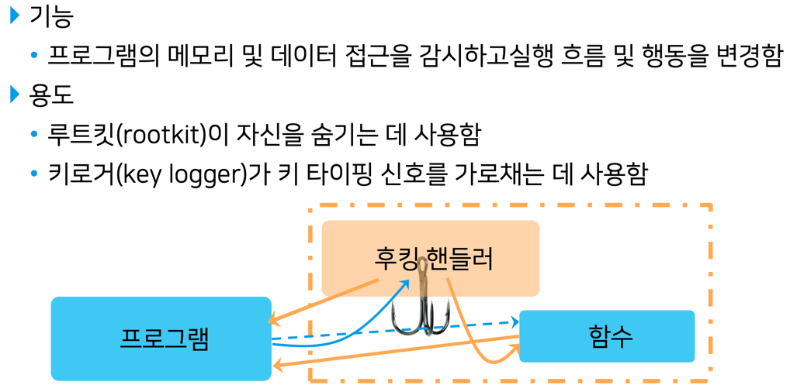
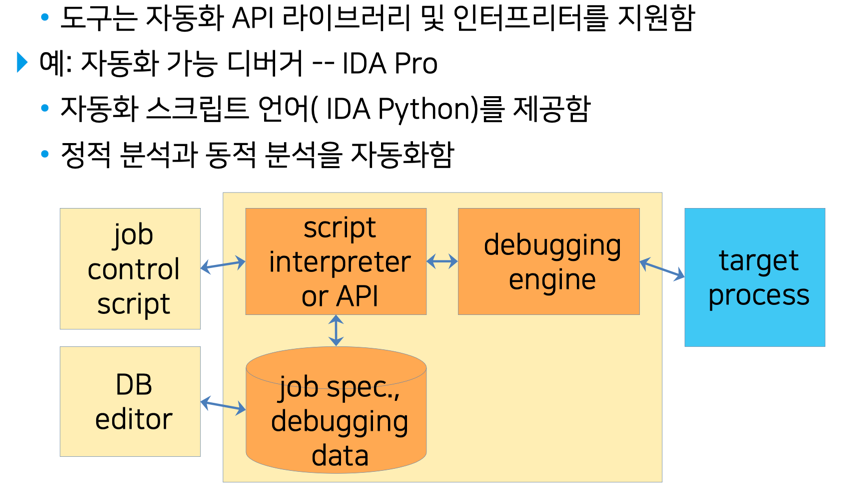
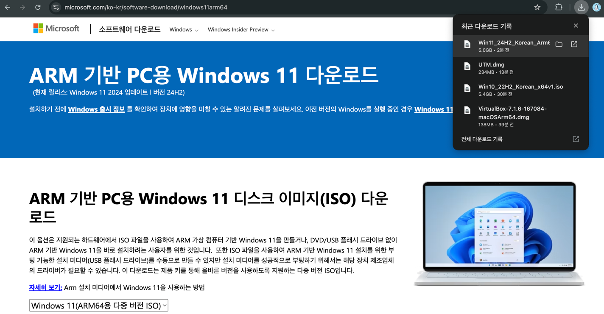

# 해킹보안 소프트웨어 

## 1주차

### 1.해킹보안 SW / 2.가상머신(VM) / 3. python 환경
- 정의 : 해킹 위협(취약점)을 찾아내는 도구로 사용되는 소프트웨어
- 기술 : 디버거, 후킹(hooking), 코드 주입, 퍼징(fuzzing), 공격 도구 자동화, 에뮬레이션 기술 
    * 해킹보안 SW 개발 기술 == 해킹도구 SW 개발 기술

#### 1-1 디버거 
- 정의 : 프로그램 실행 코드, 프로세스 메모리 내용, CPU 레지스터 내용을 보거나 임의의 값으로 변경함으로써 프로그램의 버그 및 결함을 찾아냄
- 역할 : 해커가 해킹 대상을 들여다 보고 약점을 찾는 눈의 역할
  * 소프트웨어결함탐색, 익스플로잇개발, 퍼징보조, 악성SW수사지원(포렌식)
  
#### 1-2 후킹(hooking)
- 정의 : 함수 호출, 메시지 등을 가로채어 기능을 변경 또는 확장

#### 1-3 코드 주입(injection)
- 정의 : 입력 데이터에 악성 코드를 삽입하여 프로그램의 행동이나 실행 결과를 변경
    * 합법적 용도
      • 프로그램 행동을 동적으로 확장 및 변경하여 서비스를 다양화
    * 불법적 용도
      • 데이터에 불법적으로 액세스하여 파괴하거나 권한 상승을 노림

#### 1-4 퍼징(fuzzing)
- 정의 : 비정상적인 데이터를 의도적으로 프로그램에 입력하여 프로그램의 버그를 찾아내는 프로그램 시험 기술이나 해킹에 악용 가능함
    * OS나 응용(app)의 파일 취급 기능에 있는 버그 및 취약점을 찾아냄
    * 버퍼 오버플로, 정수 오버플로 등의 취약점을 찾아냄
- 종류 : 생성(creating) 퍼저, 변형(modifying) 퍼저

#### 1-5 도구 자동화 (tool automation)
- 정의 : SW 시험 및 해킹 도구의 기능을 제어하는 프로그램을 코딩하여 도구를 자동적으로 운전함

#### 1-6 에뮬레이터(emulator)
- 정의 : 타깃의 기능을 모방하여 동일한 서비스를 제공하는 일종의 가상머신
- 용도 : 악성 코드를 안전하게 실행하며 리버스엔지니어링 및 분석할 수 있게 함

#### 2-1 VM (Oracle-VirtualBox, BroadCom-Vmware)

- 트러블 슈팅과정 (MacOnWindow.md 참조)