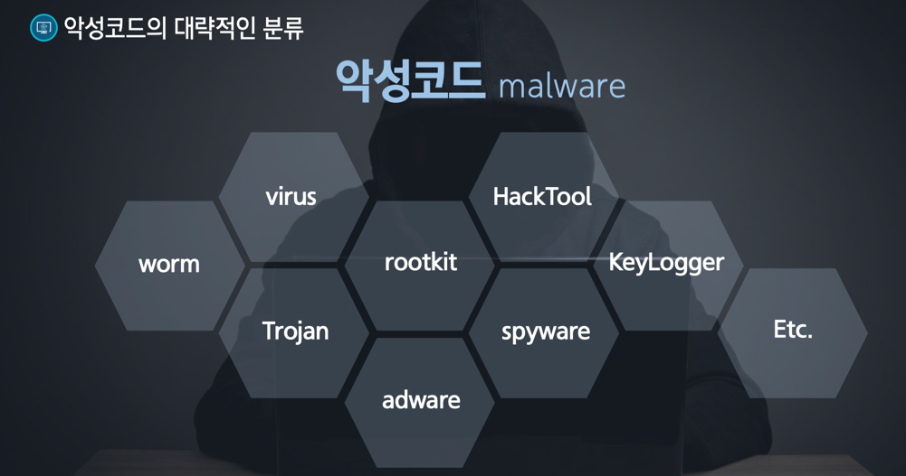
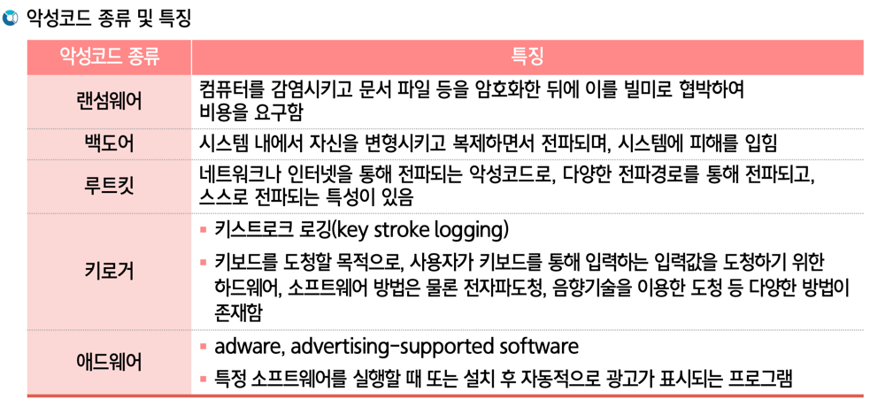
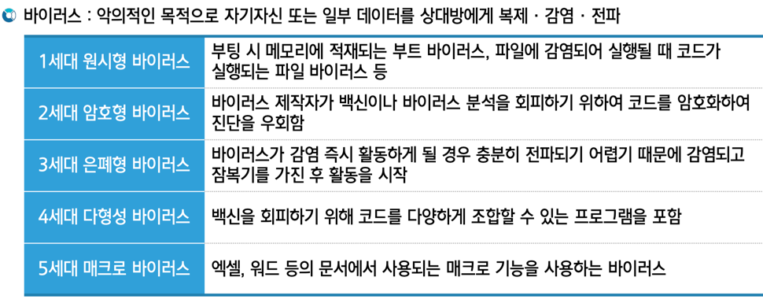
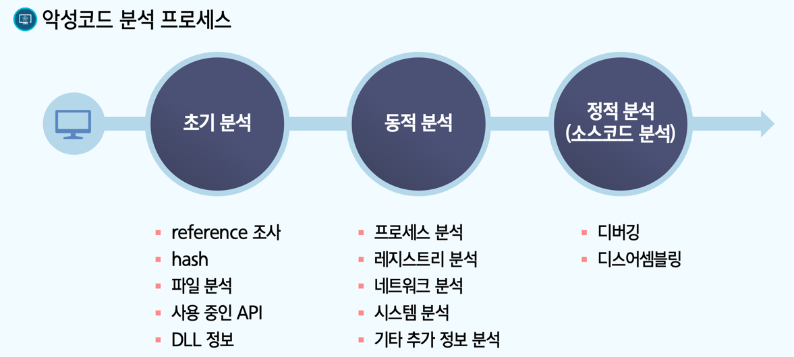
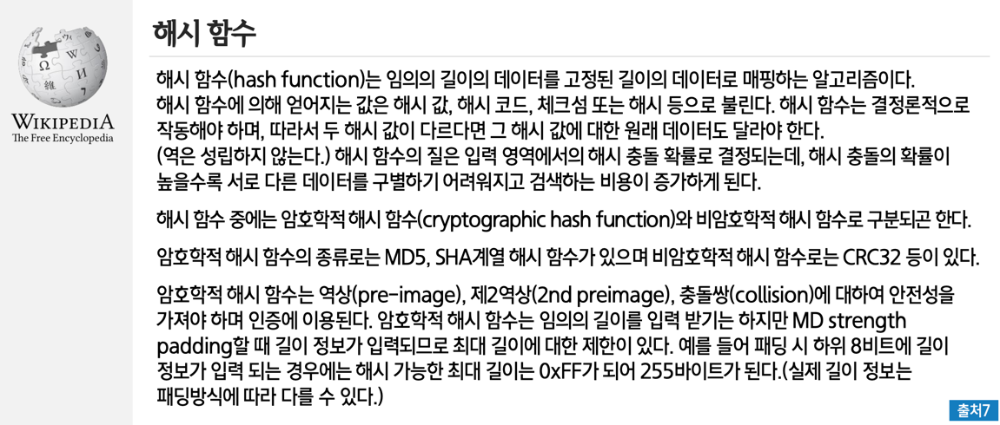
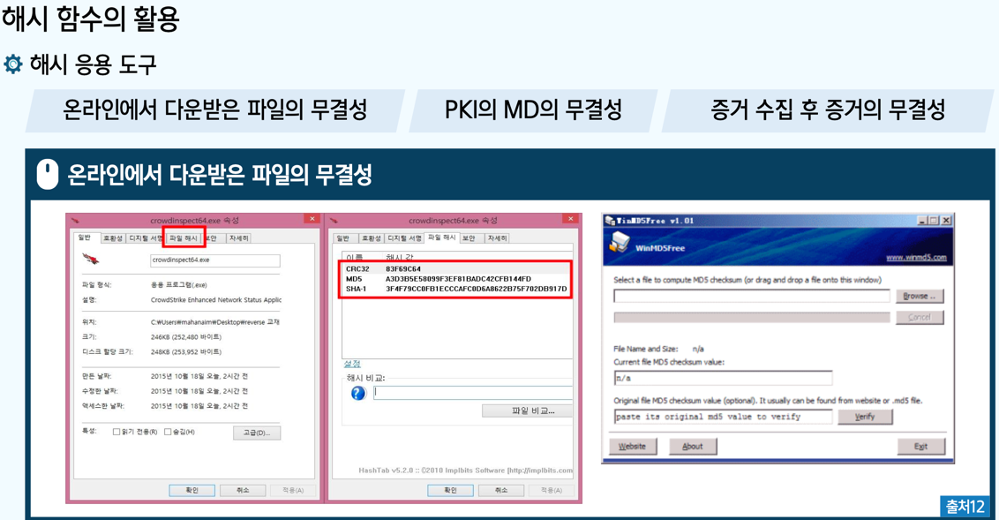

## 악성코드 분석 방법 (1주차)

- 악성코드[Malware] : 악의적인 행동이나 목적을 위해 작성된 실행 가능한 코드

- *악성코드/바이러스 <- 1세대부터 5세대 등으로 나뉘어짐

## 악성코드 분석 방법 (2주차)

#### 프로세스 [초기분석 -> 동적분석 -> 정적분석:소스코드분석]

### 핵심개념
- 안티바이러스 스캐닝 : 기존에 분석된 악성코드인지 아닌지 확인하는 방법
  * 바이러스 토탈(웹사이트)
> VirusTotal Public API (https://www.virustotal.com/ko/documentation/public-api/)

- 해시 함수의 사용 : 항상 같은 출력이 나오기 때문에 입력 메시지에 대한 불변적 증거 값
  * 즉 메시지의 오류나 변조를 탐지할 수 있는 무결성을 제공해 줌
  * 원본 파일의 해시 값과 <-> 위조된 파일의 해시 값을 비교(무결성 깨져있음)
  * => 포렌식 영역, 증거 수집이나 이동 후에 변조 여부를 확인 가능

- 문자열 검색 (Strings.exe, BinText)
  * 실행파일에서 문자열을 찾아 추출함
  * GUI 환경에서 분석할 수 있는 바이너리 도구

- PE 포맷(Portable Executable)
  * 윈도우 운영 체제에서 사용되는 파일 형식 

- 패킹과 난독화된 악성코드 
  * 패킹 : PE 파일의 크기를 줄이거나 내부 코드와 리소스를 감추기 위해 사용하는 기술
  * 대표적인 예 : UPX, ASPack, Upack, PESpin 등

- 정적 분석 실습 

## 어플리케이션 보안 (1주차)
- 01 : 정보시스템 개요
    * 인프라 : 온프레미스(On-Premises) / 클라우드(클라우드 컴퓨팅)
    * 소프트웨어 : 시스템 / 어플리케이션
  

- 02 : 어플리케이션 이해
    * 데스크톱 어플리케이션(desktop applications)
    * 웹 어플리케이션(web applications)
    * 모바일 어플리케이션(mobile applications)

- 03 : 어플리케이션 보안
    * 1 : 인증(authentication)과 인가(authorization)
    * 2 : 데이터 보호(data protection)
    * 3 : 입력 유효성 검사(validation)
    * 4 : 보안 패치 관리
    * 5 : 로깅(logging) 및 모니터링(monitoring)
    * 6 : 비상 대응 계획(emergency response plan)

## 어플리케이션 보안 (2주차)

### 01. 접근통제 개념
### 02. 접근통제 모델
### 03. 접근통제 솔루션