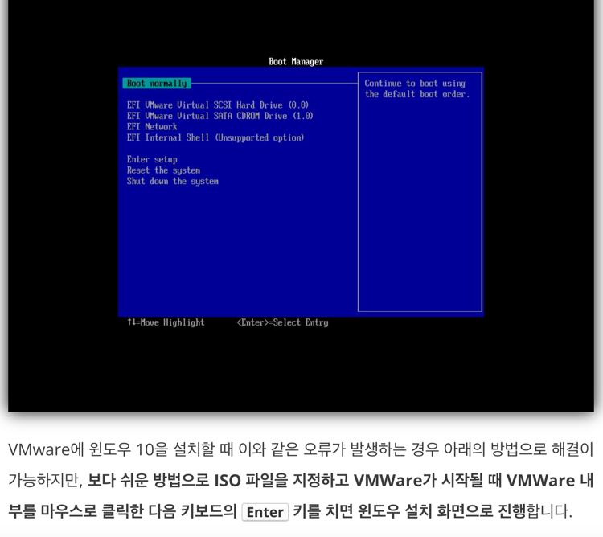
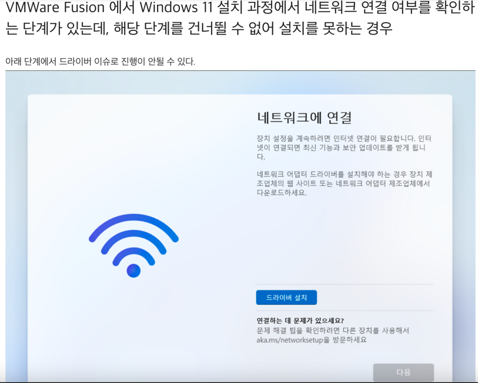
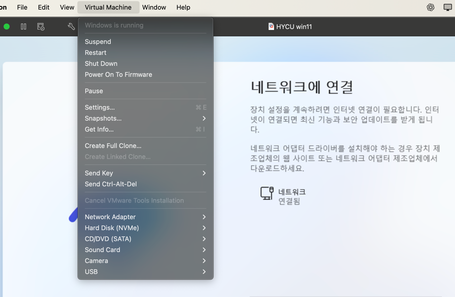
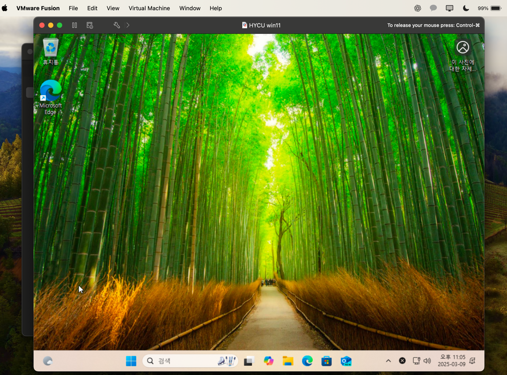

# VM 설치 (윈도우)

- 맥 위에 윈도우를 설치하는 작업이 이렇게 많은 시간을 가져갈 줄 몰랐다.

### 01. 부팅 이미지(ISO, 디스크 이미지)

- x64(64비트 x86)용이지만, 현재 가상 머신이 ARM64(aarch64) 아키텍처
  * window10 이미지는 x86 인데, 노트북은 M3(ARM64) 라서 불가능
  * => 다행히 windows11 은 arm64 이미지가 배포 (O)
  

### 02. VM 
- Oracle -> VirtualBox는 현재 ARM 가상화(M1/M2)를 정식 지원하지 않습니다.
- BroadCOme -> VMware Fusion 지원 (O)

### 03. 부트 매니저 오류



- 진짜로 엔터를 치지않아, 타임아웃이 발생한 상황이었음
- etc
  * 새로 만든 가상 머신 파일이 위치한 폴더로 이동합니다.
  * vmx 파일을 찾아서 텍스트 에디터로 열도록 합니다.
  * 위의 그림과 같이 다음 라인을 찾아서 삭제합니다.
> firmware = "efi"
  * 저장한 후에 다시 가상 머신을 시작하면 제대로 부팅이 될 것입니다.

```
UEFI 보안 부팅은 PC 부팅 시 PC 제조업체에서 신뢰하는 소프트웨어만 사용하도록 보장하는 보안 표준입니다.
 특정 가상 시스템 하드웨어 버전 및 운영 체제의 경우 물리적 시스템과 동일한 방법으로 보안 부팅을 사용할 수 있습니다.
```

### 04. 네트워크 오류





- VMware Tool Install 진행 후 드러이브 설치 및 네트워크 연결 정상화

### 05. 계정 문제

- 기존 계정 로그인시 다양한 인증 진행해야함
  * 새 계정 발급 받아서 아무렇게나 진행
  * 보안용 전자메일 추가는 인증 x, 아무 이메일이나 가능
  
### 06. END



- 칼리 리눅스는 01. 문제만 해결하면 끝이었는데, 정말 힘들었다.
  * (VM window 트러블 슈팅, 3시간 소요;)

