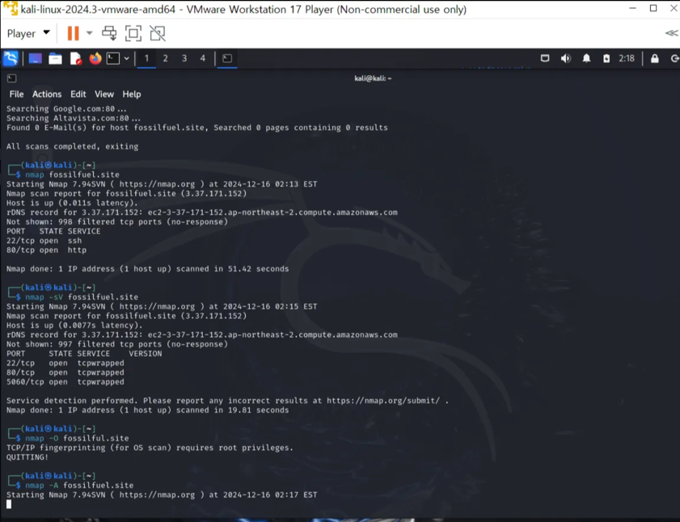

# Kali-linux

수집 (정보) ->
분석 (취약점) ->
침투 (모의해킹) ->
위협 (공격) ->
보고서 작성

- ISP, 웹 방화벽, -> 공격이미지&대상이미지 (한 로컬)

- 취약한 환경 구축
    * Metasploitable (서버)
    * beebox (웹 진단)
    * kioptrix (서버) 
  
## 정보 수집 
- metasploit (In kali)
- 스냅샷을 통한 복구 (이미지)

### $ kali 
1. $ dnsenum fossilfuel.site
   * 네임 서버 조회하는 데 사용
   
2. $ nmap fossilfuel.site
   * 포트 스캔 명령어 (일반 불법, 소유자 합법)
   * 목적[ 보안 점검, 운영 환경 최적화 ]
   * 기본적으로 1,000개의 일반적인 포트를 스캔
   * nmap -O fossilfuel.site (OS탐지) -> 실패
   
3. $ nikto -h fossilfuel.site (웹 서버 취약점 스캔)

### VMWARE & kali-linux 설치
- vmware 
- kali-linux

## etc

| 특징 | **Burp Suite** | **Wireshark** |
| --- | --- | --- |
| **목적** | 웹 애플리케이션 보안 테스트 | 네트워크 트래픽 분석 |
| **사용 사례** | 취약점 테스트 (SQLi, XSS 등) | 패킷 캡처 및 분석 (TCP/IP, HTTP 등) |
| **작동 방식** | HTTP(S) 트래픽 프록시 기반 | 네트워크 인터페이스에서 패킷 캡처 |
| **사용자** | 웹 보안 전문가, 펜테스터 | 네트워크 관리자, 보안 전문가 |
| **난이도** | 중간~고급 (웹 보안 지식 필요) | 고급 (네트워크 프로토콜 지식 필요) |