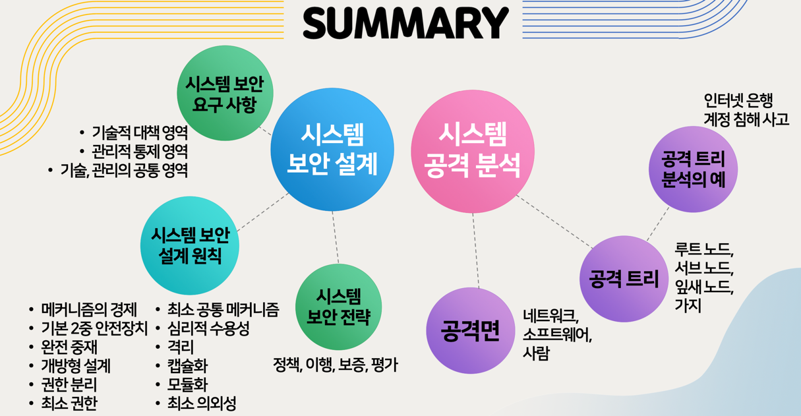

## 시스템 보안 (1주차)

## 시스템 보안 (2주차)

- 기술적 : 접근통제, 식별및인증, 시스템통신보호, 시스템정보무결
- 관리적 : 인사보안, 인식및교육, 비상계획, 위험평가

--- 
- 01 공격면 & 공격 벡터의 정의
  * 공격벡터(Attack Vector) : 구사할 수 있는 기법 및 취약점
  * 공격 벡터의 집합체가 하나의 공격면을 이룸 
- 02 공격면의 종류
  * 네트워크 공격면 : DDoS, 링크단절, 네트워크침입공격
  * 소프트웨어 공격면 : 응용, 유틸리티 및 OS 코드 안에 있는 취약점
  * 인적(Human) 공격면 : 사회공학, 인적사고
- 03 공격면 분석
  * 목적 : 시스템 위협 규모, 심각성 평가
  * 용도 : 공격면이 정의되면 설계자는 공격면을 축소하는 대책을 찾음

---

- 04 공격 트리의 정의
  * 보안사고를 유발하기까지 일련의 공격과정
  

